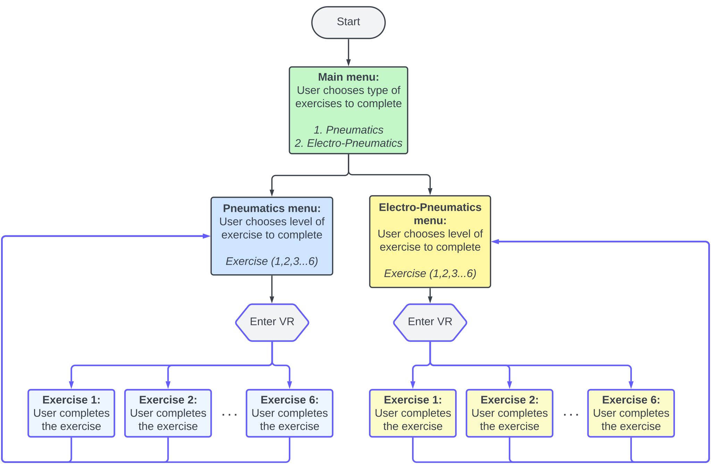
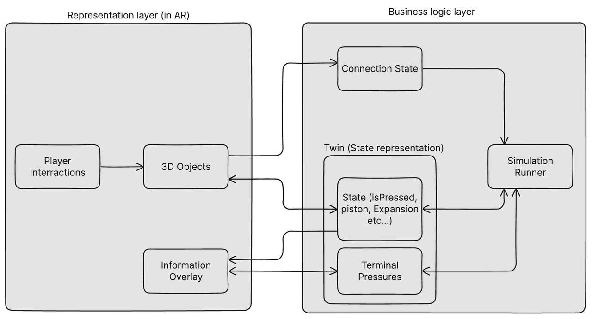
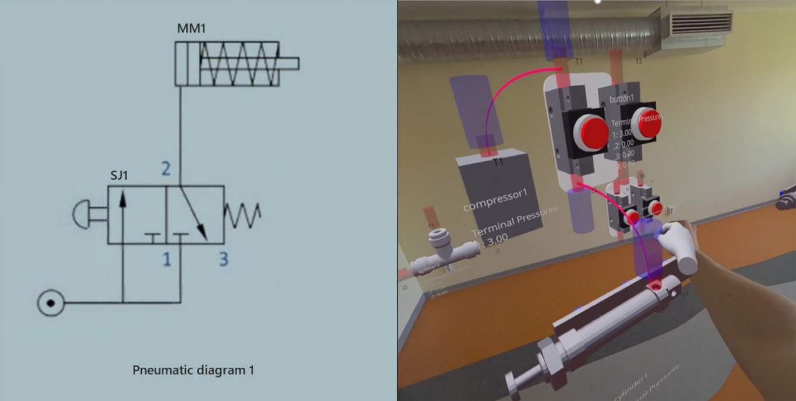

{:.no_toc}

  

    Table of contents
  

  {: .text-delta }
- TOC
{:toc}

 

# AR Environment for Pneumatic Circuit Assembly
{:.no_toc}

## Functionalities

The aim of this XR application is to provide a virtual teaching environment where students can have a hands-on experience available from anywhere to practice and learn the basic concepts of pneumatics before the actual [laboratory](./UseCases/U05_pneumaticslab) work, and in particular:

- **Pneumatics and hydraulics functioning principles**: explore the core concepts (pressure, flow, component operation, etc.) ​
- **Pneumatic components:** become familiar with application of key components like cylinders, directional control valves, pressure regulators, and sensors. ​
- **Circuit design and inspection:** practice building circuits by dragging and dropping components on a virtual workspace, visualize/check the pressure.

## Architecture

The software architecture and logic for the XR application is shown in the Figure 1. This takes into consideration both frontend, representation and interaction layer, and backend with the components’ twin representation, connection state and algorithms dedicated to simulation and exercise verification. Moreover, an initial User Interface (UI) and related interaction flow provided to the students. An initial user interaction flow and task diagram for the application is shown in Figure 2.

**Figure 1.** XR based application logic diagram [1]

**Figure 2.** User interaction flow diagram

## KPIs

A few KPIs were selected for the assessment and validation of the XR application, specifically in comparison to real-world hands-on teaching practices:

- **Completion rate:** percentage of students completing all XR lab exercises.

- **Number of attempts** in completing the exercises.

- **Time spent in VR/AR:** monitor the average time students spend in the environment.

- **Subjective metrics**: Conduct surveys to gauge student satisfaction with the XR learning experience.

## AR Environment for Pneumatic Circuit Assembly

Meta Quest 3 was selected as main interaction and visualization device. A controller/hardware free interaction solution was chosen by leveraging on the Meta Quest hand tracking integration.

Students can interact with the web-based AR application (Figure 3) that presents virtual pneumatic components: pressure sources, valves, cylinders, splitters, and tubes which can be selected, placed, and connected within a mixed-reality workspace visible through a smartphone, tablet, or AR headset.

By working through structured exercises of increasing complexity, students can learn to assemble correct pneumatic configurations, observe real-time simulation feedback (pressure values, cylinder extension, valve states), and troubleshoot faulty circuits. 

The AR format allows safe, repeatable practice without the cost or risk of physical pneumatic rigs.

**Figure 3.** Screenshot of the AR workspace with a pneumatic circuit assembled \[1\]

## Technology Stack

Three key technology layers underpin the workflow: the AR interaction layer (WebXR + @react-three/xr), the 3D rendering and simulation layer (Three.js + Unity-independent physics engine), and the educational interface layer (Next.js + Radix UI).

**Table 3:** Technology Stack

| **Component**        | **Technology**                     | **Version**     | **Purpose**                               |
|----------------------|------------------------------------|-----------------|-------------------------------------------|
| Frontend Framework   | Next.js                            | 14.0.4          | React-based web application framework     |
| 3D Rendering         | Three.js                           | 0.164.1         | WebGL-based 3D graphics library           |
| React 3D Integration | @react-three/fiber                 | 8.16.6          | React renderer for Three.js               |
| XR Framework         | @react-three/xr                    | 5.7.1           | WebXR integration for AR/VR experiences   |
| Legacy XR Support    | @coconut-xr/koestlich & natuerlich | 0.3.12 / 0.0.51 | Additional XR utilities and hand tracking |
| 3D Helpers           | @react-three/drei                  | 9.92.7          | Useful helpers for Three.js/React         |
| State Management     | Jotai + Zustand                    | 2.8.0 / 4.5.2   | Atomic and store-based state management   |
| Styling              | Tailwind CSS                       | –               | Utility-first CSS framework               |
| UI Components        | Radix UI                           | –               | Accessible component primitives           |
| Remote Debugging     | console-remote-client              | 2.1.18          | Remote console for AR device debugging    |

## System Components

The AR layer provides the immersive environment in which students interact with virtual pneumatic components overlaid on their physical surroundings. Using WebXR and hand-tracking APIs, students can grab, move, and connect components using natural hand gestures or device input, without any physical pneumatic hardware.

The simulation engine runs at 60 FPS and calculates pressure propagation through the assembled circuit in real time. Air mass is transferred between components based on connection topology and valve states, and cylinder extension is derived directly from terminal pressure values. This gives students immediate, physically meaningful feedback on their assembly choices. Blender is used for the creation and optimisation of 3D component models, which are exported in GLB format for use in the web-based AR environment. Model polygon counts are reduced to ensure real-time performance on mobile AR devices.

## References

1.  Pizzagalli, S. L.; Mahmood, K.; Boychuk, R.; Otto, T.; Kuts, V. (2025). A workflow for extended reality-based learning in engineering education. Proceedings of the Estonian Academy of Sciences, 74, 2, 103−108. DOI: 10.3176/proc.2025.2.03.
2.  Other Source Links:
- [WebXR Device API Specification](https://www.w3.org/TR/webxr/)
- [React Three Fiber Documentation](https://docs.pmnd.rs/react-three-fiber)
- [@react-three/xr Documentation](https://github.com/pmndrs/xr)
- [Three.js Documentation](https://threejs.org/docs/)