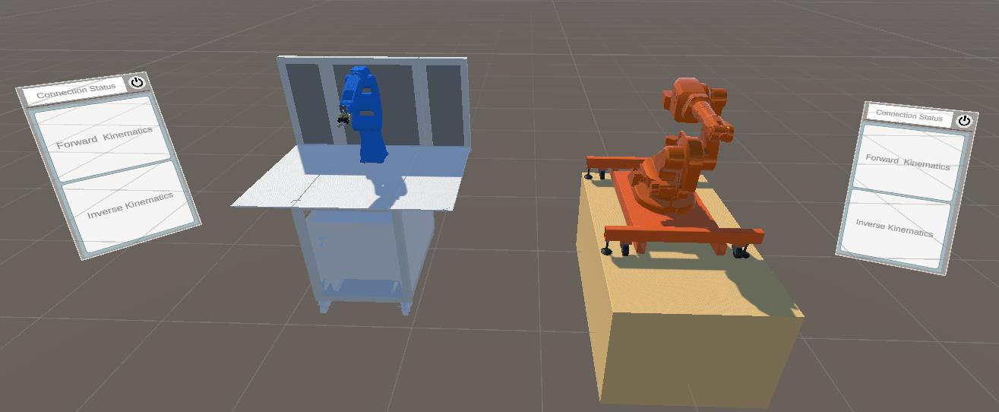

{:.no_toc}
<details open markdown="block">
  <summary>
    Table of contents
  </summary>
  {: .text-delta }
- TOC
{:toc}
</details> 


# XR Robotic Kinematics
{:.no_toc}

## Functionalities

This application leverages XR to enable the safe control and programming of industrial robots by means of a unified immersive user interface. The interface allows the control of the robots based on inverse kinematics (IK) and forward kinematics (FK), while providing an interactive visualisation of the homogeneous matrix transformations and the Denavit–Hartenberg convention for FK.

The XR enviroment consists of two industrial robots and related fixtures composing a [robotic system](../UseCases/U10_robotsystem).


## User Interface

For each robot, three canvas menus are used: Main Menu, FK menu, and IK menu. The menus are shown or hidden dynamically depending on the user's navigation, so that no rotation is executed unintentionally. In FK mode, the user inputs a rotation (as a 4×4 matrix or as an angle) for a chosen joint or the full robot; in IK mode, the user drags a target sphere to the desired end-effector position/orientation and the arm computes and simulates the required path.

The interaction is performed hands-free through Meta Quest 2 hand tracking and a poke-based UI (Pointable Canvas Module).

## Technology

The industrial robots were imported into a Unity-based simulated environment together with their respective stands (Figure 1). The Unity package is [available online]().



***Figure 1:** Final 3D environment, including both robots, their stands, and the interactive main menu canvases \[1\]*


## Imported Resources

### Unity Packages
- XR Plugin management
- Unity UI
- TextMeshPro
- Oculus XR Plugin

### Asset Store
Meta XR all in one SDK
Meta XR Interactions SDK OVR Samples

### Others
ROS TCP connector (https://github.com/Unity-Technologies/ROS-TCP-Connector.git?path=/com.unity.robotics.ros-tcp-connector  install through GIT URL)
STL (https://github.com/karl-/pb_Stl for instructions)
Unity URDF Importer (IVAR Registry)

### Other from scoped registries
Reorderable Unity Events
ROS Robot Programming
Unity MoveIt Integration

### Scoped Registries 
```
NAME: TalTech IVAR Lab Registry
URL: https://npm.dev.ivar.taltech.ee
SCOPE: 
  ee.taltech
  io.extendreality
  com.cysharp
  games.nosoysouce
  (com.jsteinhaauer)
  (com.darrentsung)
```
Or alternatively add this to scoped registries in the project manifest.json file.
```
{
      "name": "IVAR Lab Registry",
      "url": "https://npm.dev.ivar.taltech.ee",
      "scopes": [
       	 "ee.taltech",
        	"com.cysharp",
       	 "io.extendreality",
       	 "games.nosoysauce"
      ]
    }
```


## References

\[1\] Pizzagalli, S. L.; Mahmood, K.; Boychuk, R.; Otto, T.; Kuts, V. (2025). *A workflow for extended reality-based learning in engineering education.* Proceedings of the Estonian Academy of Sciences, 74, 2, 103−108. DOI: 10.3176/proc.2025.2.03.