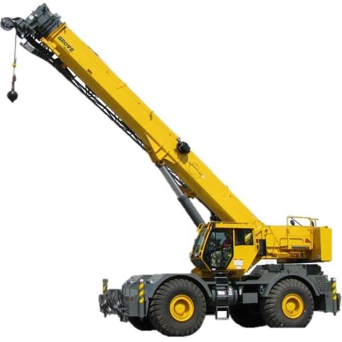
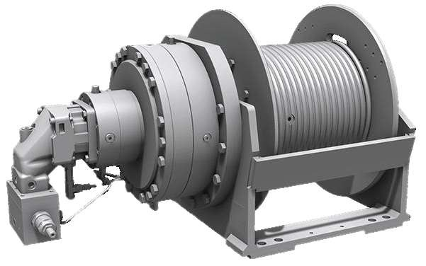
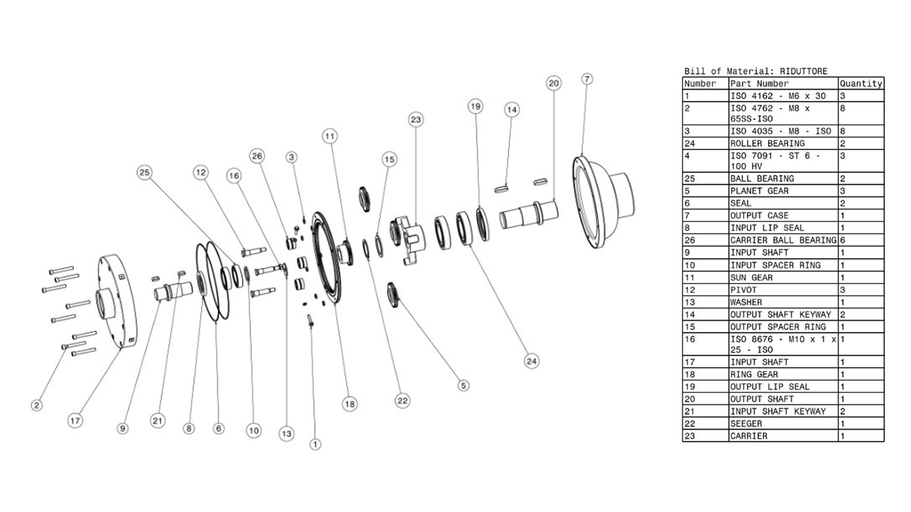

{:.no_toc}

  

    Table of contents
  

  {: .text-delta }
- TOC
{:toc}

 

# Planetary Gearbox for a Mobile-Crane Winch
{:.no_toc}

The planetary gearbox adopted as a use case for Workflows [W01](../Workflows/W01_product_design), [W02](../Workflows/W2_product_analysis), and [W03](../Workflows/W3_virtual_testing) is a reduction unit designed for the winch of a mobile crane. The winch winds a steel rope around a horizontal drum to lift loads; a block-and-tackle system can be used to reduce the required rope tension (Figure 1). 

&nbsp;&nbsp;&nbsp;&nbsp;

Figure 1: Gearbox application scenario: a mobile crane (left) and its winch (right)

## Application requirements

The gearbox design considered the following operating ranges for the lifting system:

| **Parameter** | **Range or limit** |
| --- | --- |
| Lifted load | 10–200 kN |
| Load lifting speed | 0.035–0.5 m/s |
| Maximum rope-winding speed | 2.6 m/s |
| Rope tension | 5,000–30,000 N |
| Winch-drum diameter | 200–400 mm |
| Maximum ring-gear diameter | 310 mm |
| Hydraulic-motor speed | 250–850 rpm |

The rope-tension range refers to a 10 mm steel rope with a safety factor of 2 and a maximum tensile load of 60,000 N. The maximum winding speed prevents rope overlap and excessive wear on the drum. The motor may be a gerotor, radial-piston, or gear motor selected for high-torque, low-speed operation.

## Gearbox architecture and operation

The gearbox is a planetary gear train with a central sun gear, three planet gears, an internally toothed ring gear, and a planet carrier. The ring gear is fixed to the casing, the sun gear receives the input motion from the motor, and the planet carrier provides the output motion to the winch. With the ring gear fixed, the relationship among the angular speeds of the sun, ring, and carrier is defined by the Willis equation.

Three planet gears are positioned symmetrically at 120°. This configuration shares the transmitted load among the planet gears and balances the radial forces acting on the sun gear. Straight-tooth gears are used for the selected application. The sun gear transmits torque to the planets through tooth contact; the planets transmit it to the carrier while meshing with the fixed ring gear.

## Main components and design features

- **Sun gear:** central input gear, connected to the input shaft by a keyed shaft–hub connection and axially retained by a set screw.
- **Planet gears and pins:** three planet gears mounted on pins bolted to the carrier.
- **Ring gear:** internally toothed fixed member, connected to the casing through a groove at the mating interface and bolts.
- **Planet carrier:** output member, connected to the output shaft by a key and axially retained by a Seeger retaining ring.
- **Input and output shafts:** transfer power from the motor to the gear train and from the carrier to the winch. The input shaft uses a single-row ball bearing, while the output shaft uses a single-row cylindrical-roller bearing.
- **Casing:** two parts joined to the ring gear by screws. The split casing facilitates inspection, maintenance, and component replacement.

Figure 2: Exploded view of the planetary gearbox assembly

The design prioritises simple maintenance, reduced machine downtime, and low manufacturing and operating costs. The casing protects the internal components and retains the lubricant. Lip seals at the shaft ends and flat gaskets at the ring-gear interface limit lubricant leakage; upper filling and lower drain plugs support routine maintenance. The gearbox uses splash lubrication: the rotating gears agitate the lubricant inside the casing. The lubricant level is set approximately at the gearbox centreline.

## Digital Model

[**Autodesk Inventor**](../Tools#autodesk-inventor) was used to prepare the models for the planetary gearbox as a mechanical assembly made up of individual parts, such as gears, shafts and other components. This provided an accurate digital representation of the product before it was adapted for the immersive learning application.

The assembly structure prepared in Inventor helped define how the components relate to one another and how they fit together. The separate parts could then be used to illustrate the construction of the planetary gearbox and to support the assembly and disassembly activities. This was particularly useful for creating a learning experience in which students can understand both the appearance of the components and their position within the complete mechanism.

The Inventor models were subsequently prepared for use in the rest of the asset-production workflow. After conversion and export, the geometry was further adapted in [**Blender**](../Tools#blender) to create and prepare much of the three-dimensional content. Blender was also used to prepare animations and to make the models suitable for use in the application. The resulting models and animations were exported in formats that Unity can import, and were then brought into the Unity project. In Unity, they were assigned materials, interactive behaviours and positions within the learning scenes. Blender thus supported the creation and preparation of the visual content, while Unity brought that content together with the XR interaction and educational logic.

Changes to the geometry, appearance or animation of a component can be prepared in Blender and then updated in Unity, where the asset can be tested as part of the complete learning activity. The Blender source files and the converted .glb assets used by the Unity project are [available online](https://github.com/xrlearning/repo/tree/main/UseCases/PlanetaryGearbox/models/). 

