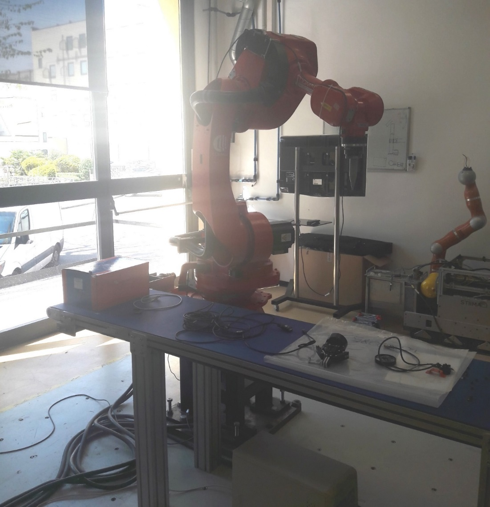
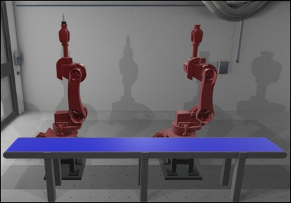
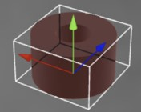
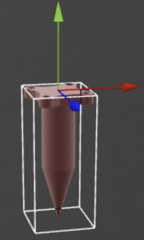

{:.no_toc}
<details open markdown="block">
  <summary>
    Table of contents
  </summary>
  {: .text-delta }
- TOC
{:toc}
</details> 


# PERFORM Lab (Personal Robotics for Manufacturing Laboratory)
{:.no_toc}


## Description

The PERFORM Lab (Personal Robotics for Manufacturing Laboratory) at CNR-STIIMA is devoted to the development and validation of methods for the control of industrial and collaborative robots in advanced manufacturing. The lab is structured as an open space populated by heavy industrial robots, collaborative robots and mobile manipulators, in order to create an ecosystem of interacting autonomous machines.

The lab focuses on thematic areas such as human-robot collaboration, task and motion planning, physical human-robot interaction, rapid sorting, human-robot and robot-robot co-manipulation. These topics have applications in various areas in manufacturing, including waste sorting, assembly and disassembly, and pick and pack.

The PERFORM Lab (Figure 1) consists of several assets placed in the room. Assets are basic elements composing a system, e.g. physical objects like machine tools, parts, conveyors, buffers, but also processes and plans. 



Figure 1: PERFORM Lab

Herein, only a subset of relevant assets is considered:

- COMAU robots, model NS16 (Figure 2)

- bases where the robots are placed (Figure 2)

- workpieces (Figure 3)

- conveyor (Figure 2)

- force sensor

- tool (end effector) (Figure 4)

- robot controller

- desk

### COMAU robot NS16

The characteristics of the robot are defined in the corresponding [URDF](http://wiki.ros.org/urdf/Tutorials) (Unified Robotics Description Format) package that is typically used to model robots in [ROS](http://wiki.ros.org/) (Robot Operating System) applications. In particular, the [XML URDF file](http://wiki.ros.org/urdf/XML) defines the relevant geometric and functional properties of the robot, including the position and rotation of joints and links, the feasible rotation of each joint, etc.

The [URDF package of COMAU NS16](https://github.com/CNR-STIIMA-IRAS/comau-experimental/tree/master/comau_robots/comau_ns16hand) includes [3D meshes](https://github.com/CNR-STIIMA-IRAS/comau-experimental/tree/master/comau_robots/comau_ns16hand/comau_ns16hand_support/meshes) and the XML URDF file (cf. [comau_ns16hand.urdf](https://github.com/CNR-STIIMA-IRAS/comau-experimental/blob/master/comau_robots/comau_ns16hand/comau_ns16hand_support/urdf/comau_ns16hand.urdf)). Each joint can rotate only around Z-axis.

The hierarchy of **Robot_1** consists of the following elements, where the prefix "Robot_1." is added to the joint/link name defined in the URDF file to have a unique identifier:

```
Robot_1 (root)
└ Robot_1.base_link
  └ Robot_1.Joint_1
    └ Robot_1.Link_1
      └ Robot_1.Joint_2
        └ Robot_1.Link_2
          └ Robot_1.Joint_3
            └ Robot_1.Link_3
              └ Robot_1.Joint_4
                └ Robot_1.Link_4
                  └ Robot_1.Joint_5
                    └ Robot_1.Link_5
                      └ Robot_1.Joint_6
                        └ Robot_1.Link_6
```

Finally, the *ForceSensor* is attached to *Link_6* and the *Tool* is attached to the *ForceSensor*.

---

`NOTE 1`
The URDF package adopts the following **conventions** to define the position and rotation of joints and links: Z-up (i.e. Z is the vertical axis); Euler angles XYZ extrinsic (corresponding to ZYX intrinsic)

---


## Online resources

The [scene configuration](https://xrlearning.github.io/repo/UseCases/PerformLab/PERFORM.json) and the [3D models](https://github.com/xrlearning/repo/tree/main/UseCases/PerformLab/models) (Figures 2-4) of the use case are available online. The [lab can be visualized](https://xrlearning.github.io/repo/UseCases/PerformLab/PERFORM.html) using [VEB.js](../Tools#vebjs) tool (Figure 2).

The robot 3D model includes nodes for joints and links according to the information in the URDF file; in addition, links are associated with meshes. 

| Asset               | 3D model                                                                                          |
|---------------------|---------------------------------------------------------------------------------------------------|
| COMAU robot NS16    | [Comau_ns16hand.glb](https://xrlearning.github.io/repo/UseCases/PerformLab/models/Comau_ns16hand.glb) |
| Robot base          | [Base.glb](https://xrlearning.github.io/repo/UseCases/PerformLab/models/Base.glb)                     |
| Controller          | [Controller.glb](https://xrlearning.github.io/repo/UseCases/PerformLab/models/Controller.glb)         |
| Conveyor            | [Conveyor.glb](https://xrlearning.github.io/repo/UseCases/PerformLab/models/Conveyor.glb)             |
| Force Sensor        | [ForceSensor.glb](https://xrlearning.github.io/repo/UseCases/PerformLab/models/ForceSensor.glb)       |
| Lab building        | [Lab.glb](https://xrlearning.github.io/repo/UseCases/PerformLab/models/Lab.glb)                       |
| Table               | [Table.glb](https://xrlearning.github.io/repo/UseCases/PerformLab/models/Table.glb)                   |
| Tool (end effector) | [Tool.glb](https://xrlearning.github.io/repo/UseCases/PerformLab/models/Tool.glb)                     |
| Workpiece           | [Workpiece.glb](https://xrlearning.github.io/repo/UseCases/PerformLab/models/Workpiece.glb)           |

The .glb file of the robot ([Comau_ns16hand.glb](https://xrlearning.github.io/repo/UseCases/PerformLab/models/Comau_ns16hand.glb)) explicitly contains the definition of all its [elements in the hierarchy](#211-comau-robot-ns16). 




Figure 2: COMAU robots and conveyor



Figure 3: Workpiece



Figure 4: Tool (end effector)