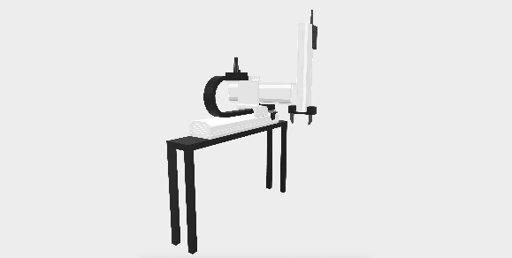
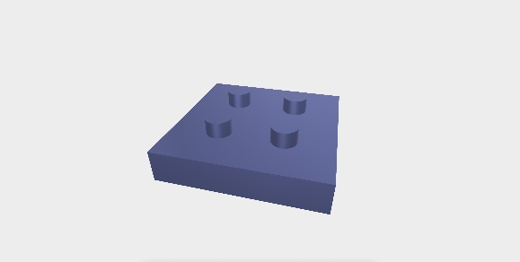
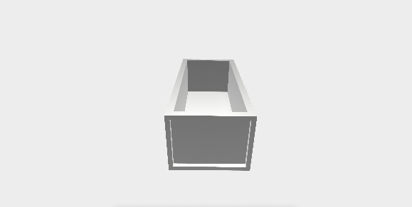
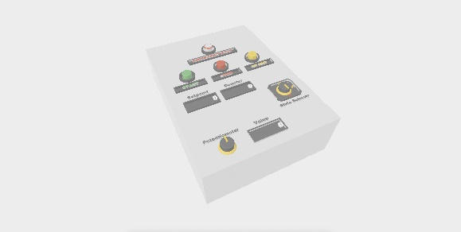
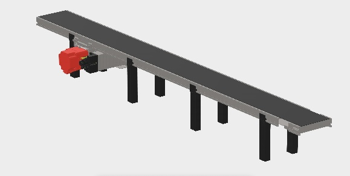
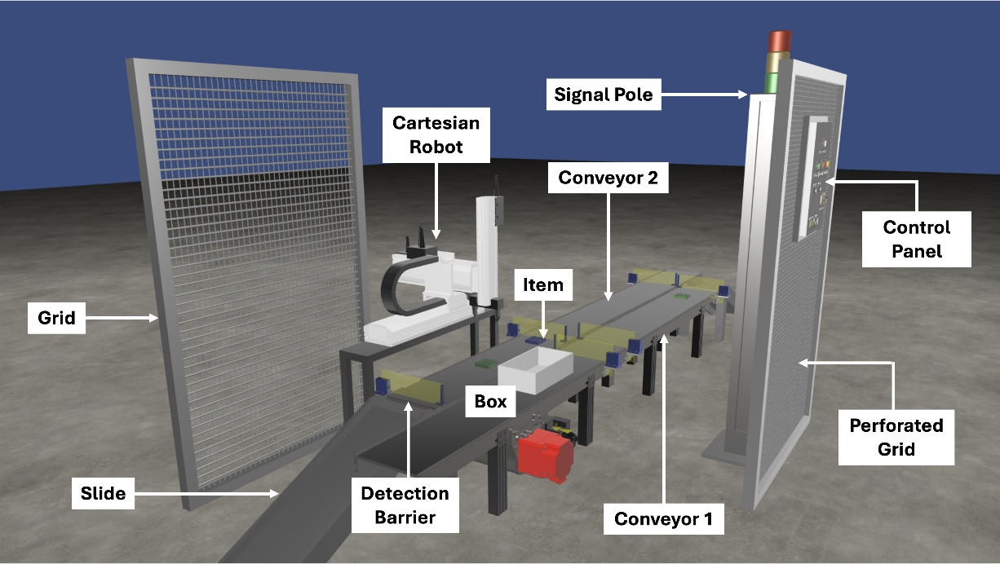

{:.no_toc}

  

    Table of contents
  

  {: .text-delta }
- TOC
{:toc}

 

# Pick & Place Cell
{:.no_toc}

The Pick & Place Cell is an automated manufacturing system designed to execute handling, sorting, and transfer operations in a discrete production environment. The cell's behavior is governed by event-driven logic where sensors and digital actuators interact to determine the system's response to operating conditions. Communication within the system can be managed through industrial protocols like Modbus TCP/IP or MQTT.

The virtual pick&place cell consists of several assets (see Figure 1-Figure 9):

- Conveyors: The scene includes two main conveyor belts, Conveyor 1 and Conveyor 2. Conveyor 1 carries boxes to be filled, while Conveyor 2 transports the items that will be picked up.

- Detection Barriers: Both conveyors are equipped with sensor-receiver pairs that detect the presence, passage, and correct positioning of objects.

- Cartesian Robot: A programmable robotic arm is primarily aimed at picking individual items from Conveyor 2 and place them into boxes on Conveyor 1.

- Objects: The system manipulates two types of objects, i.e. items (Simple-shaped parts that are picked from Conveyor 2 and placed into boxes) and boxes (containers that move along Conveyor 1 to be filled with items by the robot).

- Control Panel: the main user interface. It is equipped with four physical buttons (Start, Stop, Initialization, Emergency) and a three-position State Selector for choosing the operational mode. A potentiometer is also included to select the number of items to be placed in each box.

- Signal Pole: A vertical pole with three lights (red, yellow, green) provides visual feedback on the system's operational status.

- Unloading Slides: Located at the end of each conveyor, these slides enable the physical evacuation of materials once processing is complete.

- Protective Grids: The cell also includes solid grids to protect critical areas and perforated grids that support functional elements like the Control Panel.

Figure 1: Cartesian robotic arm used for pick and place operations.

Figure 2: Basic item shape manipulated by the robot.

Figure 3: Transport box used for item collection.

Figure 4: Control Panel with physical interface (buttons, selectors)

Figure 5: Slide used for unloading processed items

Figure 6: Conveyor belt with motor for item transport

Figure 7: Signal pole indicating system state.

Figure 8: Perforated protective grid supporting the Control Panel

Figure 9: Barrier sensors for object detection on conveyors

The whole cell and each of its assets are shown in Figure 10 and Figure 11.

Figure 10: Full view of the Pick&Place cell.

Figure 11: Full view of the Pick&Place cell, including labels of each asset.

The basic system configuration is designed to operate in distinct production modes:

- State 0: parts enter Conveyor2; parts go through Conveyor2; parts are evacuated if the Mode0 stops.

- State 1: boxes enter Conveyor1; boxes are picked and placed on Conveyor2; boxes exit from Conveyor2.

- State 2: the user selects the number of parts to be put in the box; parts and boxes appear on Conveyor2 and Conveyor1, respectively; both conveyors move; sensors detect parts and boxes; parts picked from Conveyor2 and placed in a box on Conveyor1; Conveyor1 moves.

The [visualization of this use case](https://difactory.github.io/DF/scenes/UC/PickPlaceCell_old.html) in a VR environment is supported by [VEB.js](../Tools#vebjs).
