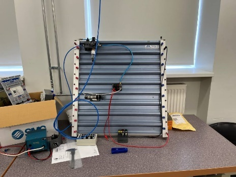
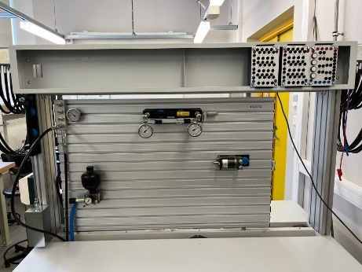
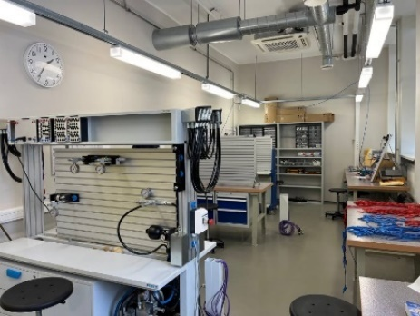
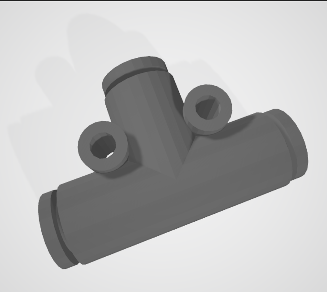
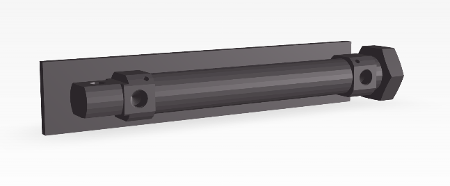
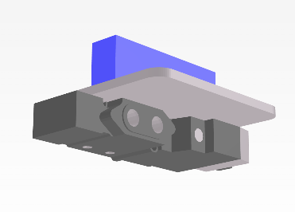

{:.no_toc}

  

    Table of contents
  

  {: .text-delta }
- TOC
{:toc}

 

# Pneumatics Laboratory
{:.no_toc}

## Description

The pneumatics laboratory (Figure 1), located at Tallinn University of Technology (TalTech), is used for hydraulics and pneumatics teaching to provide a hands-on learning experience conducted in groups of students. The lab is divided into 2 segments: Pneumatics and Electro-Pneumatics. Students are expected to arrive at the lab with prior knowledge of safety instructions, pneumatic symbols and pre-drawn schematic diagrams, which are at the base of the exercises.

|  |  |  |

**Figure 1.** Pneumatics laboratory at TalTech with workbenches and components \[1\]

The traditional laboratory procedure for pneumatics circuit assembly is structured as follows: the students assemble the circuit by using the provided components and schematics; the teacher verifies the correctness of the assembly and tests it together with the student; if there is something wrong both go through troubleshooting and a further verification; the class is afterwards concluded.

The use case covers two core circuit types: a single-acting cylinder control circuit and a series AND logic circuit with two valves, with further advanced scenarios planned.

## Digital Model

An XR-based application can provide a virtual teaching environment where students have a hands-on experience available from anywhere to practice and learn the basic concepts before the actual laboratory work. A relevant subset of resources to model the lab consists of a set of pneumatic components (pressure sources, valves, cylinders, splitters, and tubes), the laboratory workbenches, basic theoretical and practical instructions on how to use and connect the components, and a few exercises and schematics.

3D assets were modelled using open-source 3D modelling software (Figure 2). The exercise and basic information were retrieved from the lecture course book and digitalized to allow the display of both component symbols and exercise schematics in the application.

|  |  |  |

**Figure 2.** 3D models of some of the pneumatics components

## References

1.  Pizzagalli, S. L.; Mahmood, K.; Boychuk, R.; Otto, T.; Kuts, V. (2025). A workflow for extended reality-based learning in engineering education. Proceedings of the Estonian Academy of Sciences, 74, 2, 103−108. DOI: 10.3176/proc.2025.2.03.