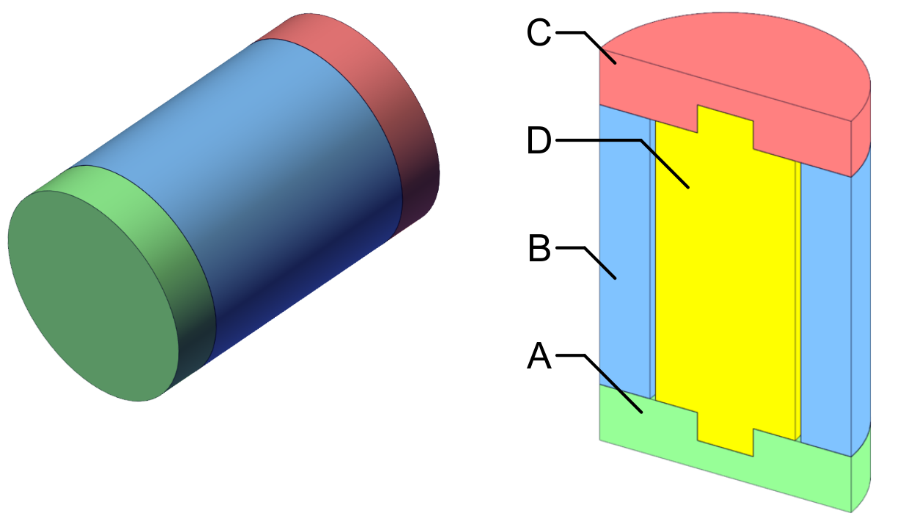

{:.no_toc}

  

    Table of contents
  

  {: .text-delta }
- TOC
{:toc}

 

# Simple Product
{:.no_toc}

## Description

Simple product, adopted as a use case for Workflow [W04](../Workflows/W04_assembly_sequence), is a cylindrical part made of only four components denoted by letters A-D (Figure 1). Due to its simple structure, this product represents an excellent introductory example for mastering Cutset and Bourjault methods for assembly sequence analysis.

Figure 1: Simple product
