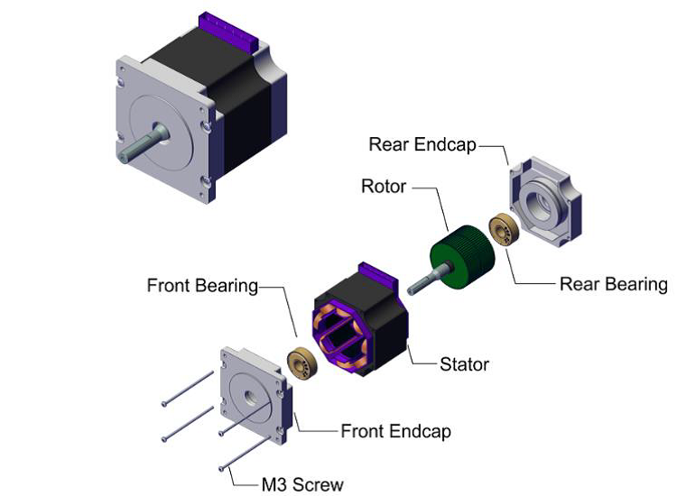
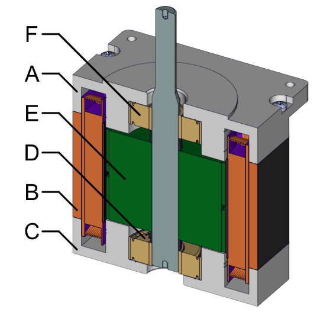

{:.no_toc}

  

    Table of contents
  

  {: .text-delta }
- TOC
{:toc}

 

# Step Motor
{:.no_toc}

## Description

Step motor (Figure 1), adopted as a use case for Workflows [W04](../Workflows/W04_assembly_sequence) and [W08](../Workflows/W08_sequential_control), consists of Rotor, Stator, Front Bearing, Rear Bearing, Front Endcap, Rear Endcap and four M3 Screws.

Figure 1: Step motor

In Workflow W04 the motor is reduced to 6 parts/subassemblies denoted by letters A-E in Figure 2. It is assumed that rotor and stator are introduced into assembly process as subassemblies. Furthermore, since it is evident that the last operation in assembly process should be fixing the assembly using four screws, these parts are not considered during assembly sequence analysis.

Figure 2: Step motor parts and sub-assemblies considered in Workflow W04
