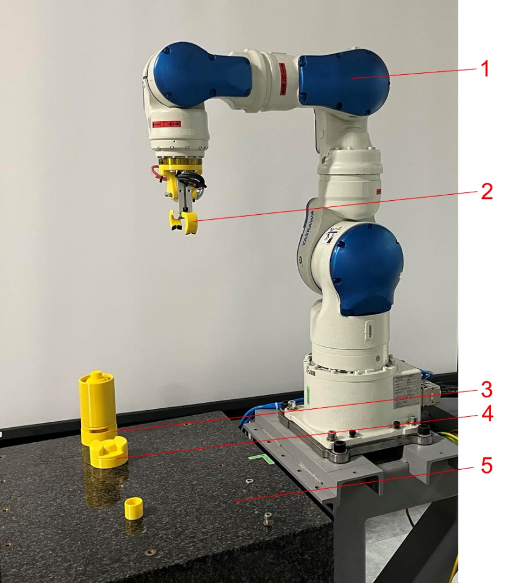

{:.no_toc}
<details open markdown="block">
  <summary>
    Table of contents
  </summary>
  {: .text-delta }
- TOC
{:toc}
</details> 


# Robotic Cell
{:.no_toc}

## Description

The robotic cell, located at the University of Belgrade, Faculty of Mechanical Engineering (Figure 1), consists of an industrial robot Yaskawa Motoman SIA10F with seven degrees of freedom (1) equipped with pneumatic gripper Norgren M/160336/M/12 (2), assembly work holder (3), Front Endcaps magazine (4) and worktable (5). Gripper is controlled by electrically driven monostable 5/2 directional control valve that is activated through robot controller digital output.



Figure 1: Robotic cell

The robotic cell is controlled using industrial robot controller FS100 \[1\] which is open and enables access to robot interfaces and motions using different communication protocols. Open functionality of the controller is achieved through special Yaskawa software solution - *MotoPlus* (Motoman Professional Programming Language for Superior Use), which represents a programming IDE (Integrated Development Environment) enabling applications developed on PC in C language to run as tasks in FS100 controller \[2\]. *MotoPlus* *TCP/IP socket* library, in particular “motoPlus.h” \[3\] is utilized to develop Ethernet-based communication capability of FS100. Using this library communication between the controller and other machines/devices is established in client/server model in which the client, through functions of *TCP/IP socket* library, requests processes from FS100 acting as server. Different processes are available, including retrieving position variable (mpGetPosVarData), retrieving the current position of robot axes in terms of encoder pulse count (mpGetPulsePos), retrieving the current servo speed in pulse counts (mpGetServoSpeed), retrieving digital I/O values (MpReadIO) \[3\].

Robotic cell operation is programmed by teaching using the programming pendant \[4\]. Within the workflow, the interface between VR-based digital shadow and robot controller is established using Ethernet-based UDP (User Datagram Protocol) communication. Although it is connectionless and does not assure reliability of communication, UDP protocol is used due to lower overhead than TCP (Transmission Control Protocol) and, thus, better suitability for real-time operation. During communication VR application acts as a client which obtains information from FS100 using unidirectional communication and requesting the following process through *MotoPlus*:

1.  MpReadIO - retrieves several I/O values at a time. This process has the following arguments \[3\]:

    - *sData* - I/O address range that defines I/O type,

    - *rData* - I/O address in the selected range,

    - *num* - Number of I/O values that are retrieved;

2.  MpGetFBPulsePos - retrieves the feedback position in pulse counts. This process has the following arguments \[3\]:

    - *sData* - the pointer to the data structure which specifies the control group (input),

    - *rData* - the pointer to the data structure which receives the feedback position coordinates in pulses (output).

These processes are utilized within the following functions implemented in robot controller:


```
void ReadIO(char\* cmd, char\* ret, BOOL bTCP)

{

int nType;

int nStartIndex;

int nQty;

int i;

LONG nRet;

MP_IO_INFO dxIOInfo\[128\];

USHORT retData\[128\];

nType = parseParameter(cmd, "a1");

nStartIndex = parseParameter(cmd, "a2");

nQty = parseParameter(cmd, "a3");

for (i=0; i \< nQty; i++)

{

dxIOInfo\[i\].ulAddr = GetIOAddress(nStartIndex + i, nType);

}

nRet = mpReadIO(dxIOInfo, retData, nQty);

if (nRet == OK)

{

outputAndLog("OK", bTCP);

for (i=0; i \< nQty; i++)

sprintf( ret, "%s\r\n%d= %d", ret, dxIOInfo\[i\].ulAddr, retData\[i\]);

}

else

sprintf(ret, "Failed to read I/O data");

}

and

void GetFBPulsePos(char\* cmd, char\* ret, BOOL bTCP)

{

LONG nRet;

MP_CTRL_GRP_SEND_DATA dxSendData;

MP_FB_PULSE_POS_RSP_DATA dxRet;

dxSendData.sCtrlGrp = parseParameter(cmd, "a1");

nRet = mpGetFBPulsePos(&dxSendData, &dxRet);

if (nRet == OK)

{

> sprintf(ret, "%d;%d;%d;%d;%d;%d;%d;%d;\r",
>
> dxRet.lPos\[0\],
>
> dxRet.lPos\[1\],
>
> dxRet.lPos\[2\],
>
> dxRet.lPos\[3\],
>
> dxRet.lPos\[4\],
>
> dxRet.lPos\[5\],
>
> dxRet.lPos\[6\],
>
> dxRet.lPos\[7\]);

}

else

sprintf(ret, "Failed to get feedback pulse position");

}
```

These functions are invoked by the client using *TCP/IP socket* library. The code for calling function ReadIO is 2, and for calling function GetFBPulsePos is 17.

## References

1.  Yaskawa, MOTOMAN FS100 Industrial Robot Controller, YR-FS100, A-03-2017, A-No. 157077, 2017

2.  Yaskawa, FS100 Options Instructions - User’s Manual for New Language Environment MotoPlus, Manual No. HW1480837, 2012

3.  Yaskawa, FS100 Options Instructions - Programmer’s Manual for New Language Environment MotoPlus, Manual No. HW1480839, 2012

4.  Yaskawa, FS100 Operator’s Manual, Manual No. RE-CSO-A043, 2011
