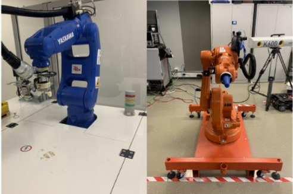
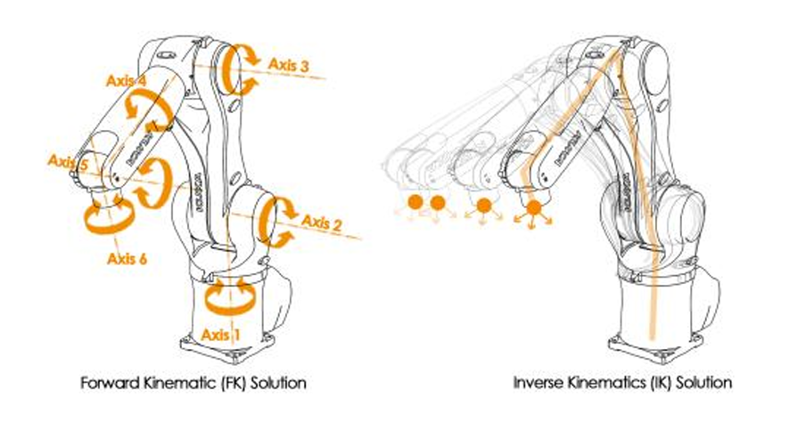
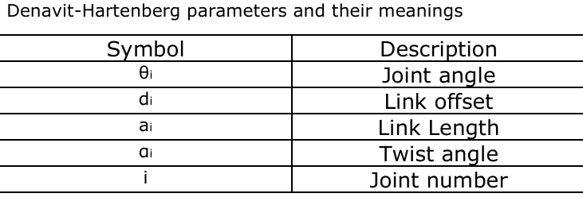
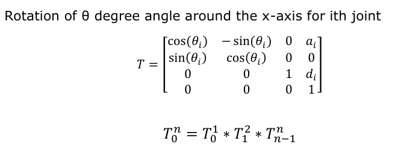
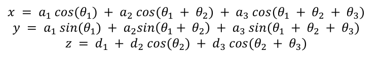

{:.no_toc}

  

    Table of contents
  

  {: .text-delta }
- TOC
{:toc}

 

# Robotic System
{:.no_toc}

## Description

The robotic system, adopted as a use case for [Workflow W06](../Workflows/W06_robotic_arm_kinematics), consists of two industrial robotic arms, i.e. Yaskawa Motoman GP8 and ABB IRB 1600. Both robotic cells are located in the [TalTech IVAR Lab](https://ivar.taltech.ee/equipment), and are extensively used for teaching activities across several courses, as well as for research purposes. Both robots are six-axis articulated industrial robots, each consisting of six rotational joints and six links, as shown in Figure 1.

***Figure 1.** Yaskawa Motoman GP8 (left) and ABB IRB 1600 (right), available TalTech IVAR lab \[3\]*

The two robots are industrial articulated robots that are widely used across various sectors, particularly manufacturing and logistics, for applications such as assembly, welding, packaging, pick-and-place operations, sorting, material handling, and other precision-demanding tasks. The use of industrial robots offers several advantages, including improved precision, accuracy, productivity, and operational efficiency, as well as increased process speed and enhanced worker safety, particularly when performing repetitive or potentially hazardous tasks.

Detailed technical descriptions and specifications of the Yaskawa Motoman GP8 and ABB IRB 1600, comprising six rotational joints and six links, are provided in references \[4\] and \[5\], respectively.

**Forward and Inverse Kinematics of Robotic Arms**

Forward kinematics (FK) and inverse kinematics (IK) are used to achieve certain movements of a robot. On one hand, FK involves calculating the position and orientation of the robot's EE based on given joint parameters, such as angles or displacements, to achieve a specific position and orientation of the EE. On the contrary, IK determines the required joints parameters to achieve a specific position and orientation of the EE. In simpler words, for FK, the robot will move based on given parameters to reach a position for the EE, while in IK the robot knows the end position, where it should reach, and based on this calculates the required parameters to achieve this, and sometimes there is more than one solution, this is because to reach specific points, the robotic arm can be 'elbow up' or 'elbow down' (this is connected with the number of joints present) \[1, 2\]. The difference between FK and IK can be depicted in Figure 2.

**Figure 2.** Difference between FK and IK \[1\]

For FK, using the Denavit-Hartenberg (D-H) parameters to describe the geometry between links, the geometry of the robots must be defined. The four parameters for each joint to describe the geometry between the two links are shown below.

Where the joint angle describe the rotation of the joint (only for rotational joints), the link offset describes the distance from the previous Z-axis to the common normal (only for prismatic/translational joints), the twist angle is the angle between the Z- axes of the two links, and link length is very self-explanatory, the length of the link. With all this data, we can now set up our transformation 4x4 matrix as defined below. With this transformation matrix is possible to move the robot around one joint. To achieve a full robot transformation is necessary to multiply all the transformations matrices for each joint \[2\].

In contrast to FK, in IK it is necessary to know or define the desire end position and orientation of the EE in the space. Once the desired position is defined, setting up the correct equations to calculate the next step is required. Differently than FK, IK is more complex and requires more mathematical solutions rather than visualization. This calculation will get gradually more complex the more joints there are in a robotic arm. Also, it gets more complexity if the space is in 2D or 3D. For a 2D space, only the coordinates x and y are used to calculate the angles, whereas in a 3D space, the z coordinate will be defined and used in the calculations. To showcase this calculation process, let’s take a 3 degree of freedom (DOF) robotic arm: Given the 3 final coordinates for the EE, it is possible to define the following 3 equations \[1, 2\]:

## Digital Model

The virtual models of both robotic cells are illustrated in Figure 3. The 3D models of the robots can be obtained online from the sources provided in references \[4\] and \[5\]. In addition, demonstrations of the developed virtual environments (XR-based scenes) are available through the [TalTech IVAR Lab webpage](https://ivar.taltech.ee/projects), which provides direct links to the corresponding demonstration videos.

**Figure 3.** Virtual models of Yaskawa Motoman GP8 (left) and ABB IRB1600 (right), with their respective stands

The virtual robots are included into an [XR enviroment developed with Unity](../Tools/T02_xrkinematics).

## References

\[1\] Spong, M. W., Hutchinson, S., & Vidyasagar, M. (2020). *Robot Modeling and Control*. John Wiley & Sons.

\[2\] Manolescu, D., & Lindo Secco, E. (2022). *Design of a 3-DOF robotic arm and implementation of D-H forward kinematics*.

\[3\] Pizzagalli, S. L.; Mahmood, K.; Boychuk, R.; Otto, T.; Kuts, V. (2025). *A workflow for extended reality-based learning in engineering education.* Proceedings of the Estonian Academy of Sciences, 74, 2, 103−108. DOI: 10.3176/proc.2025.2.03.

\[4\] Yaskawa Motoman. *GP7 and GP8 Technical Documentation*. <https://www.motoman.com/getmedia/1a40ce78-99c3-4e43-bbce-b9318263f464/GP7_GP8.pdf>

\[5\] ABB Robotics. *Product Manual – IRB 1600/1660*. <https://www.abb.com/global/en/areas/robotics/products/robots/articulated-robots/medium-robots/irb-1600>

