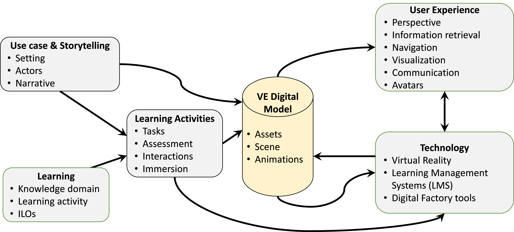
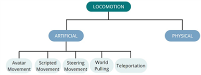
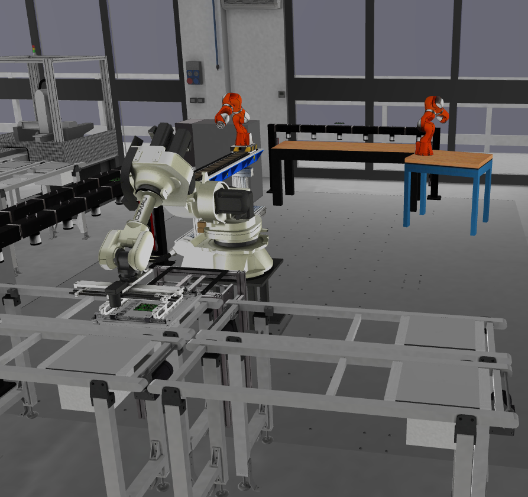
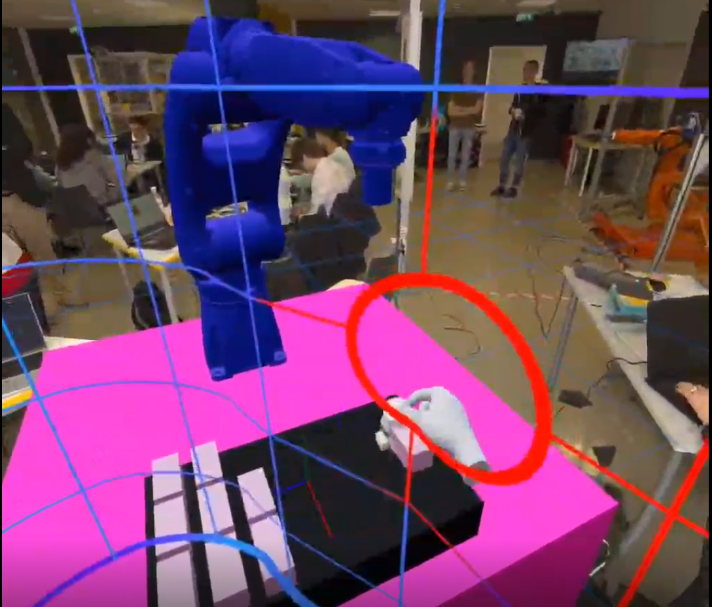
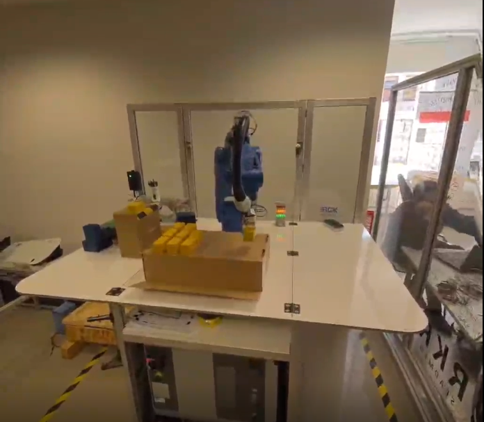
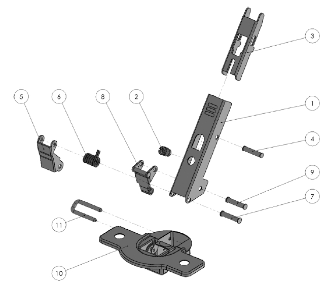
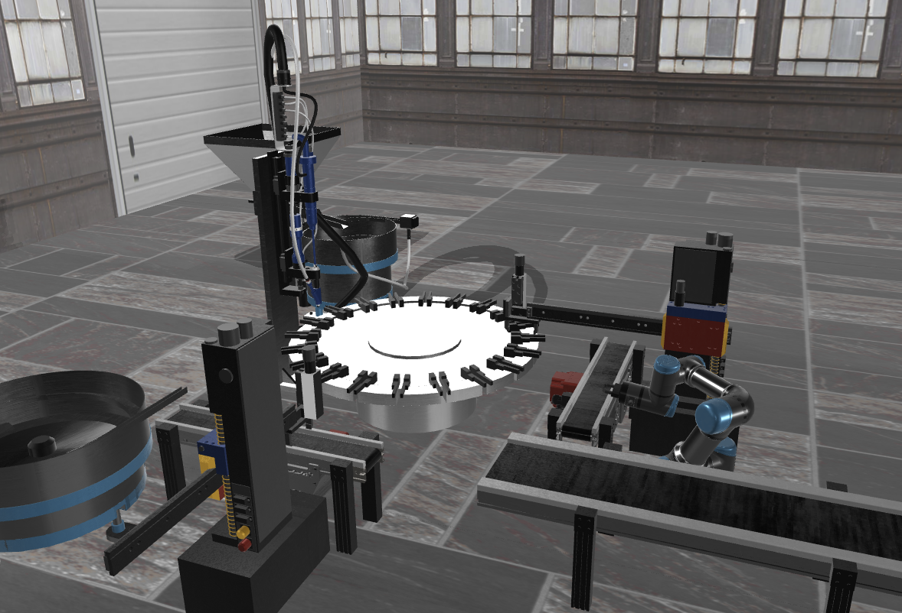

{:.no_toc}

  

    Table of contents
  

  {: .text-delta }
- TOC
{:toc}

# Requirements and specifications for the design of XR-based learning workflows
{:.no_toc}

This document addresses the design, development, testing and assessment of learning workflows in industrial engineering education, taking advantage of XR technologies. Each workflow will be formalised in terms of Learning objectives, Use cases, Tasks, User Experience, and Technology.

The workflows will be designed taking into consideration both pedagogical and technical aspects. Thus, the latest research advances in these fields will be exploited to support the design of the workflow steps and pursue the learning objectives.

A particular focus will also be given to digital tools and the XR interaction paradigms. Free and open frameworks and libraries will be considered to enhance the possibility of being adopted by a broader range of users. XR environments' characteristics and interactions will be designed and assessed considering their use in academic facilities and for autonomous study.

## Framework for XR-Based Learning Workflows

Virtual and augmented reality (VR/AR) have emerged as significant technology trends in higher education, with the potential to enhance teaching, learning, and research experiences in various disciplines in both higher education, and vocational education and training.

Many universities and colleges have recognized the potential of VR/AR and have started exploring their applications \[1\]. They have invested in creating VR/AR labs, developing immersive content, and incorporating these technologies into their curricula. The global market for virtual reality in the education market grew from \$8.67 billion in 2022 to \$11.95 billion in 2023, representing a compound annual growth rate (CAGR) of 37.9% \[2\].

Nevertheless, the widespread adoption and implementation of AR/VR in higher education may still be in the early stages and can vary across institutions because of several significant challenges involved:

- Consistent investment in hardware, software, and infrastructure is required, such as high-quality headsets, computing devices, and network capabilities.

- Accessibility concerns (cost, availability, and physical disabilities) for students need to be addressed.

- Faculty members need to acquire the necessary skills and knowledge to integrate VR/AR into learning activities, including learning the tools, techniques, and pedagogical approaches involved.

- The customization of a virtual environment (VE) scene can require significant effort.

- Developing high-quality VR/AR content that aligns with specific educational objectives can be time-consuming and resource-intensive.

- Lack of standardized platforms and compatibility across devices.

- The need for pedagogical redesign and alignment with learning outcomes.

A popular trend in the adoption of VR in education revolves around serious games or gamification, i.e., the exploitation of a game paradigm to implement learning activities. Furthermore, serious games in education have also been acknowledged for potential impact on the sense of achievement, engagement, and motivation of the students. In addition, the intersection of video games and learning approaches led to the development of frameworks supporting the design of serious games.

The Mechanics, Dynamics, and Aesthetics (MDA) framework \[3\] considers three fundamental design components, i.e., actions, processes, and data that are available in the game (mechanics), run-time behaviour and dynamics of actions (dynamics), and the desirable emotional responses of the player (aesthetics). Focusing on serious games for learning, Winn \[4\] highlighted the need to extend the MDA framework to consider the contributions of designers and players to building the gaming experience. To this aim, the Design, Play and Experience (DPE) framework was proposed Winn2009, consisting of four main layers (Learning, Storytelling, Gameplay, User Experience) that are instantiated for each of the three main components, namely design, play and experience. In addition, DPE points out the relevant role of the adopted technology in making a serious game effective. More recently, Urgo et al. \[5\] specialized the DPE framework for designing learning applications in the field of industrial engineering (DPE-IE) within higher education, providing an implementation and demonstration example of the configuration and analysis of a manufacturing system.

The proposed framework for XR-Based Learning Workflows is based on the DPE-IE framework to foster the use of XR in higher education by reducing development time and assisting educators lacking strong expertise in VR and software development. At the core of the framework (Figure 1), adapted from \[6\], lies the digital model of the Virtual Environment (VE Digital Model) that helps decouple the generation of the case-based contents from the development and configuration of technology-intensive tools.

Figure 1: framework for XR-Based Learning Workflows

The objective of the framework is to enable teachers and supervisors to focus on generating learning contents that instantiate the VE digital model, while software experts develop digital tools and data interfaces.

Figure 1 depicts the data flows and the components of the framework:

- **Learning**: the definition of the content and pedagogy of learning activities in industrial engineering.

- **Use case & Storytelling**: the definition of the stage and story used to convey content that is relevant for the learning goals.

- **Activities**: the definition of tasks to be carried out, particularly in the virtual environment, and the related assessment.

- **User Experience**: the design of interfaces defining what the student/trainee can see and hear.

- **Technology**: specification of the technologies used to implement the Virtual Environment and the related digital tools.

## Design of XR-Based Learning Workflows

This chapter delves into the main details of the framework, defining the guidelines to design and develop the components and paying attention to the requirements for the virtual environment (VE).

### Learning Objectives Definition 

The learning component serves as the foundational element that enables effective and engaging learning experiences in an educational context. It involves defining the kwowledge domain and explicitly list the Intended Learning Outcomes (ILOs) \[7\] that the students will acquire thorugh the workflow. The ILOs can be grouped according to different classes of knowledge, as defined by \[8\]:

1.  **Factual knowledge**, i.e. the basic elements that the learners must know to be acquainted with the discipline or problem under study.

2.  **Conceptual knowledge**, i.e. the framing of the basic elements in a theory or a system and their relations.

3.  **Procedural knowledge**, i.e. the capability to do something, e.g. apply an algorithm, a technique, a method, etc.

4.  **Metacognitive knowledge**, i.e. the knowledge of cognition and awareness of one’s own cognition.

The requirements for the VE include:

- The virtual environment and the interactions must be able to adapt to the specific ILOs.

- Two types of users can participate in the VE, i.e., student (trainee) and teacher (supervisor). The student is the target of the ILOs, while the teacher facilitates the knowledge acquisition.

### Use Case and Storytelling

The storytelling component encompasses the actors, setting, and narrative that is experienced along the workflow and in the virtual environment (VE). This component must be customized for the selected use case scenario.

The setting can be a real industrial site where the user is an engineering student. The narrative may revolve around the need of analyzing, designing, installing or managing an industrial facility that is represented in a realistic environment. The story will guide the user to explore the game environment in an autonomous way while facing challenges that ask to apply engineering methodologies.

The requirements for the VE include:

- The VE must give access to a realistic representation of the industrial context, implementing visualization experiences that also represent the dynamics of the system.

- The VE must provide relevant details such as products, processes, machines, failures, monitoring, etc. This will enable a narrative revolving around the need to analyze, design, install, manage, or maintain industrial products, processes, systems, or facilities.

### Learning Activities

The activities along the workflow must be defined to meet the learning objectives while considering the available technologies. Regarding the XR dimension, it is important to define the mechanics and dynamics of the virtual environment that are designed taking into consideration affective goals such as immersion, intellectual problem-solving, competition, creation, discovery, advancement and completion, application of abilities, and learning.

The activities may be organized in levels with growing complexity according to the type of related knowledge. Each level contributes to reaching specific ILOs and must be associated with an assessment. The initial levels will be mainly aimed at providing fundamental knowledge, while the higher ones build up on the existing knowledge to achieve higher learning objectives. A key issue is balancing the difficulty of the learning activities, i.e. finding the right balance between challenges and the (increasing) abilities of the student/trainee.

The requirements for the VE include:

- The VE must be able to support the execution of tasks with different characteristics based on the ILOs. In addition, the VE should enable the direct learning assessment or be integrated with a learning assessment tool.

- Multiple participants in the VE can stimulate collaboration and team working skills and interactions among students.

- Immersion in the VE must be provided to let the user have a close-to-reality experience, including the simulation/animation of elements involved in industrial processes. For instance, a part is loaded on an assembly station; a workpiece is machined on a lathe; a pallet is moved along a conveyor.

### Technology Selection and Integration

The technology component defines how the workflow must be developed, implemented and integrated with data sources to enable the other components to work correctly.

XR is used to enhance the realism of the experience with reference to industrial scenarios.

The requirements for the VE include:

- The use of open and multi-platform technologies is recommended to support the democratization of the XR learning workflow in higher education.

- In addition to XR, other digital tools may be employed and integrated for learning assessment (e.g. Learning Management Systems) and to generate data consumed by the VE (e.g. simulation of industrial processes).

The digital model of the VE plays a central role in the framework because it integrates data from heterogenous sources. An effective VE digital model must be based on a data model that facilitates the generation of new instances (model-driven reconfigurability).

The VE must be stored and shared in format that is easily accessible by digital tools to enhance interoperability. Standard data exchange formats should be used whenever is possible.

### User Experience Design

The user experience plays a critical role in delivering an industry-related experience and aiding in the attainment and evaluation of the intended learning outcomes. To ensure the effectiveness of the virtual environment, it is essential that the level of detail (LoD) of the virtual environment is comparable with the real industrial facility in terms of both quality and dimensions.

The requirements for the VE include:

- Users may need to retrieve information related to assets in the VE (e.g., ID, description, position, slides, data sheets, 3D files, failure logs of a workstation) through specialized interfaces, such as panels that become visible upon selecting a specific asset.

- Navigation techniques and metaphors must enable the user to freely discover the (industrial) environment.

- Messaging via voice or text chat can enhance communication and collaboration.

- Avatars may play a key role in the virtual environment.

## Technology for XR Learning Workflows

Digital tools and technologies must be selected based on the specific needs of the learning workflows. Several digital tools, including commercial options, are available in the market, but many of these tools fall short of meeting key requirements due to issues such as costly commercial licenses, cumbersome input/output data exchange management, or excessive complexity.

The digital tools can be used as standalone or in integrated way. The use of an integrated digital platform \[9\] is recommended because it can better support the execution of learning workflows by smoothly providing access to different tools that exchange data without adding an overhead of data handling tasks that would divert the attention of the students.

The integration of heterogenous digital tools can be supported by a common, extensible data model that represents industrial assets such as production systems, resources, processes, and products. An example of factory data model \[9\] has been developed as an OWL ontology, as it offers a flexible framework for integrating various knowledge domains while reusing existing technical standards (e.g., Industry Foundation Classes, W3C SSN/SOSA, UML Statechart). More details and examples of the factory data model can be found online in terms of ontology documentation[^1], serialization in JSON format[^2], related queries in SPARQL language[^3].

The remaining part of this chapter is focused on the on the guidelines for the use of XR technology and examples of XR tools.

### XR Overview

#### Benefits

XR technologies provide several key features that are relevant for a learning experience, such as:

- **Accurate simulation** of environments, objects, and phenomena is central to the virtual experience. This involves creating digital worlds that replicate reality or envision imaginative scenarios, offering users a strong sense of presence.

- **Interactivity** enables users to engage and respond within the virtual environment, often using input devices such as controllers, sensory gloves, or through gestures and body movements.

- **Multisensory experiences** enhance immersion, with high-resolution screens or VR headsets delivering realistic visuals, while ambient audio deepens the sense of presence. Some advanced virtual experiences also incorporate sensory feedback, such as simulated touch through tactile gloves or vibrations, providing a more immersive experience.

- **Social interaction** is increasingly important in virtual experiences, allowing users to connect, collaborate, and interact within shared virtual spaces, both for recreational and professional purposes.

The applications of XR in industry are highly promising and can be effectively transferred to academic learning environments. By leveraging XR technologies, students can engage in realistic, immersive training scenarios similar to those used in industrial settings, enabling them to practice complex tasks, operate machinery, and address real-world challenges in a controlled virtual space.

In addition to training, XR can enhance collaborative design, prototyping, and problem-solving within academic curricula. Students can interact with 3D models, facilitating deeper understanding and allowing them to identify potential issues before moving to physical experiments or projects. This technology can also support remote learning and virtual labs, making advanced learning accessible from anywhere.

Lastly, XR offers new ways for students to engage in safety training and hands-on simulations without exposure to real risks, preparing them for professional environments with a higher level of practical experience and awareness.

#### Challenges

Despite the potential of XR, there are still relevant challenges that limit its spread. The quality of the immersive experience sought significantly impacts the investment and management cost, as a more advanced experience typically demands complex technologies and equipment. Another key element that escalates both cost and complexity is the design, development, and creation of virtual environments. Developing virtual models requires frequent updates and revisions. However, as simulation technologies evolve, constant updates are needed, requiring substantial programming efforts, which can pose challenges for users without programming expertise.

Other challenges in the use of XR, particularly with regard to health, are significant. One of the primary concerns is the potential for users to experience discomfort, such as eye strain, disorientation, and nausea—symptoms commonly associated with motion sickness induced by virtual reality. This discomfort is often caused by a disconnect between the user’s real-world movement and their corresponding movement in the virtual environment, which may be controlled through devices like joysticks. When the physical sensations of motion differ from what is perceived in VR, this sensory mismatch can create a conflict, leading to an unpleasant and disorienting experience for the user.

When using head-mounted displays (HMDs) in XR environments, it is recommended to limit sessions to a maximum of 20 minutes. This helps reduce the likelihood of discomfort, such as eye strain and motion sickness, ensuring a safer and more comfortable experience for users.

### XR Guidelines

XR development guidelines and best practices are essential for ensuring a positive user experience, evolving in step with advancing technology. Despite the ongoing innovations, focusing on user experience quality, performance optimization, and content engagement remains central to the success of XR projects.

Best practices arise from the collective experience of developers and users in the XR domain. They provide tried-and-true methodologies for development, helping avoid common pitfalls, improving efficiency, and enhancing usability. By adhering to these standards, developers can accelerate the development process while delivering applications that meet functional needs and provide a high-quality user experience.

The following guidelines are focused on VR applications[^4], but most of the rules and recommendations are valid for general XR applications. The guidelines address various aspects, such as optimizing performance, enhancing user comfort, and ensuring security. In addition, these guidelines assist in making informed decisions regarding technology selection, software design, and the implementation of key features, ensuring that the final product is both functional and user-friendly.

#### Vision

The representation of the virtual world is a crucial component that demands careful consideration and strategic decisions across multiple aspects. These choices impact the overall realism, usability, and immersive quality of the virtual environment, making it essential to focus on elements such as graphics, interaction design, and system performance to ensure a seamless and engaging user experience.

**Comfortable Viewing Distances**

Visual comfort hinges on two key factors: accommodative demand and vergence demand. Accommodative demand is the eye's adaptation to focus on different depth planes, while vergence demand refers to the inward rotation of the eyes needed to converge on an object at a specific depth.

In VR, accommodative demand is fixed since images are displayed on a screen at a constant optical distance, but vergence demand changes as the eyes rotate to focus on objects at varying depths. To minimize eye strain, objects likely to be viewed for extended periods (like menus or focal points) should be placed within a comfortable viewing distance of 0.5 to 1 meter. Objects outside this range generally won't cause discomfort unless prolonged focus is required. Techniques to enhance comfort include blurring the background behind selected menus or objects, simulating natural vision and reducing distractions from the main point of focus.

**Displaying Information**

Traditional "Heads-Up Displays" (HUDs) overlay visual elements on the virtual environment to provide useful information without disrupting the immersive experience. However, it is generally more effective to integrate information into the environment, as HUDs can introduce practical issues and even become annoying.

In the case of VR, the primary issue with HUDs lies in defining their depth plane. A conflict arises when an object in the scene appears closer to the user than the HUD, as the HUD, due to occlusion, is perceived as closer and obscures elements behind it. This contradiction disrupts the sense of immersion.

A better approach is embedding information into the environment. For example, players could access information by moving their heads or interacting with wearable devices. The key is to present information in a way that is clear, comfortable, and does not interfere with the user's ability to see and interact with the virtual world.

#### User input

When it comes to user interaction in virtual environments, controllers can be classified into two main types: mobile device controllers with 3 degrees of freedom (3DOF) and those with positional tracking, offering 6 degrees of freedom (6DOF).

3DOF controllers allow tracking of the device’s orientation but not its position in space. In contrast, 6DOF controllers support both orientation and positional tracking, enabling the use of paired controllers that let users manipulate virtual objects with their hands.

Some general recommendations for user input in VR include maintaining a 1:1 ratio between the controller’s movement in the real world and its virtual representation. Additionally, using a standard button layout, familiar across most VR applications, can enhance usability, even for new users.

**3DOF Controllers**

When using 3DOF controllers, it is generally advised against representing them as hands or similar objects, as this may mislead users into thinking they can grasp or manipulate items directly. These controllers are effective for pointing and selecting user interface elements.

It is beneficial to visualize the controller within the scene and project a laser beam from it toward the selected element. Keeping the ray pointer active while pointing at objects in VR enhances the interaction.

To distinguish between interactive and non-interactive objects, consider varying the brightness of the beam, making it appear more opaque when aimed at non-interactive items. Additionally, providing a visual cue - such as highlighting or slightly zooming in on an object when the cursor hovers over it - can improve user experience in VR.

**6DOF Controllers**

While implementing hand registration can be complex and time-consuming, it can significantly enhance user experience by enabling intuitive interaction with the virtual world. For successful integration, users must perceive the virtual hands as accurate representations of their own. This requires precise alignment of the position and orientation of the virtual hands with the user’s real hands.

Realistic hand models can cause discomfort if they do not match the user's actual hands, so allowing customization of hand appearance can help address this issue. Ethereal or robotic hand models tend to work well, as they adapt credibly to various users.

It is crucial that the intersection between the virtual hands and objects does not disrupt tracking. A common approach is to represent the physical hand colliding with the environment while simultaneously displaying a second set of ethereal or transparent hands. This ensures continuous tracking and visually indicates that the user can’t manipulate objects with these representations.

When it comes to grasping objects in VR, the recommended method is to align the interaction with the object's intended use. For objects designed with a specific grip, they should automatically align with the hand upon contact. If an object lacks a clear way to be held, it should attach to the hand as soon as the grab trigger is activated. In this case, the object’s orientation can be arbitrary, but maintaining its attachment creates a believable interaction.

#### User orientation and positional tracking

User orientation and positional tracking are essential components of the virtual experience, particularly in devices that offer six degrees of freedom.

User orientation involves tracking the direction and angle of the user's head and body within the virtual space, enabling them to look around and perceive their surroundings accurately. In contrast, positional tracking monitors the user's physical movements in three-dimensional space, allowing for actual movement within the virtual environment, thereby enhancing immersion and interactivity.

It is crucial to avoid disabling or altering positional tracking, especially when users are moving in the real world. Any discrepancies between real-world movement and virtual motion can create a sensory conflict, leading to significant discomfort.

Location tracking can be compromised if the user steps outside the designated viewing area. To ensure a seamless experience, it is essential to establish a defined play area for VR. This area is set up during the initial configuration for each user and works in conjunction with the boundary system to keep users safe.

#### User well-being during the experience

The overall user experience in virtual reality (VR) necessitates careful consideration of the fundamental interactions between users and the virtual environment. Allowing users to determine the length of their sessions is essential, given the physical nature of VR, where users wear head-mounted devices and often stand or move around.

Developers should recognize the importance of enabling users to take breaks while engaging with content, ensuring they can pause the experience and resume exactly where they left off. Furthermore, incorporating resting positions within the VR experience can help alleviate fatigue during extended play.

It is vital for developers to conduct regular testing of their VR applications, as this not only enhances comfort but also assesses the overall user experience. Testing with a diverse range of users, including novices, is recommended to capture a broad spectrum of reactions and ensure a comfortable experience for all.

Additionally, users should be gradually introduced to the gaming experience, starting with slower, calmer interactions and providing warnings for more intense content, allowing them to mentally prepare.

#### Locomotion

Locomotion refers to how users navigate virtual worlds and is a critical design feature for any VR application. Providing a comfortable and effective locomotion experience is key to the success of a VR project.

There are two primary types of locomotion, each offering a distinct way of moving users through virtual environments: physical and artificial locomotion.

Physical locomotion mirrors the user's real-world movements within the virtual space.

Artificial locomotion, on the other hand, allows users to move within the virtual world without corresponding physical movement. Incorporating artificial locomotion is advisable even in systems relying on physical movement, ensuring accessibility for users with limited space or mobility issues.

Figure 2: Locomotion types

Artificial Locomotion Types include:

- Avatar Movement: Users control a character’s movement using a combination of thumbsticks, buttons, visors, or motion controllers. This is the most common form of movement in VR, particularly for navigating first-person environments.

- Scripted Movement: The virtual camera follows a predefined motion path, automatically guiding the user's view along a set trajectory.

- Steering Movement: Users control continuous motion without constant input, similar to driving a vehicle where movement persists based on initial user actions.

- Teleportation: This type of movement involves an instant shift in the user's perspective. Its key benefit is eliminating continuous motion, which helps prevent motion sickness, especially for users sensitive to vection. However, teleportion can cause disorientation.

- World Pulling: Users stay stationary while grabbing a point in the virtual world and either pulling or pushing it. This movement causes the virtual environment to shift accordingly, altering the user’s perspective.

To enable user movement within a virtual world using artificial locomotion, input must be processed effectively. Various techniques are used to control movement within virtual space, including:

- **Direction mapping** in VR determines how a user’s movement is aligned with the control stick and the virtual space’s orientation. Allowing users to select their preferred mapping type is crucial for comfort and preventing nausea. Here are some common types of direction mapping:

  - *Head-Relative*. Movement direction continuously aligns with where the user’s head is facing. Pushing the thumbstick forward moves the avatar in the direction the head is oriented, with the movement direction updating in real-time as the user turns their head.

  - *Initial Head-Relative*. Movement starts in the direction the user was facing at the time movement began. If the user turns their head while pushing the thumbstick, the direction of movement remains fixed and does not change with head movement.

  - *Controller-Relative*. Movement is determined by the orientation of the hand controllers. Pushing the thumbstick forward moves the avatar in the direction the controllers are pointing, independent of where the user’s head is facing.

  - *Initial Controller-Relative*. Movement begins in the direction the controllers are facing when the user first pushes the thumbstick. Turning the controller while moving does not change the direction of movement; the initial orientation is maintained.

- **Teleport control**. The execution of teleportation in VR typically involves a series of events to ensure that teleportation is intuitive and avoids the motion sickness issues that can arise with continuous artificial locomotion:

1.  *Activation*: The process begins when the user moves the thumbstick from its neutral (central) position, which triggers the appearance of a targeting beam. If the thumbstick is unavailable, teleportation can also be activated using a standard button on the controller.

2.  *Pointing*: Once the targeting beam appears, the user points it toward the desired destination within the virtual world. This step ensures that the user selects where they wish to be transported.

3.  *Landing Orientation Control* (Optional): Some systems allow users to control their landing orientation, meaning they can adjust the direction they will face upon landing at the teleport location.

4.  *Triggering the Teleport*: The teleportation is finalized when the user presses a button or releases the thumbstick to trigger the movement. The user's perspective instantly shifts to the selected location.

- **Motion Tracked Locomotion**. In VR, locomotion can be achieved without relying on traditional input methods like controller buttons or thumbsticks by using motion controllers to track posture, hand poses, and physical movements. This approach aims to make movement in the virtual world feel more natural, aligning with how users would act in the real world.

In VR design, the decision of whether the camera should collide with the environment is crucial, as it significantly affects user experience and immersion. Here's a breakdown of the two options:

1.  **Cameras without Collision**. In this case, the camera is free to move through any objects or obstacles in the virtual world without any interruption. This approach can create smoother experiences, especially when the focus is on exploration or interactions where the environment should not impede the user’s movement. The main advantages of collision-free cameras are: seamless movement, ease of Implementation (no collision detection systems are needed), better use for applications where physical space isn’t supposed to feel like a solid barrier. However, this can break immersion in realistic scenarios, as the user may pass through walls or objects in ways that don’t feel natural.

2.  **Camera with Collisions**. Cameras with collisions involve detecting when the camera intersects with an object in the virtual environment. When this happens, the camera stops, much like a physical body would when encountering an obstacle. This approach can be important for maintaining realism, especially in games or simulations that focus on physical interactions with the world. However, there is a potential for discomfort if the user continues to move in the real world while the camera is blocked in VR, since this discrepancy can cause discomfort, disorientation, sensory confusion or even motion sickness. Finally, camera collisions require more sophisticated coding, with precise calculations and testing to ensure that the experience remains fluid while respecting the physical constraints of the environment.

As a summary, the following table presents potential issues related to VR locomotion and the types of locomotion that may trigger them.

| **Issue**                                 | **Description**                                                                                               | **Triggered by Locomotion Types**                                                                                           |
|-------------------------------------------|---------------------------------------------------------------------------------------------------------------|-----------------------------------------------------------------------------------------------------------------------------|
| Motion Sickness (Vection)                 | Caused by a mismatch between visual movement and lack of corresponding physical movement, leading to nausea.  | Artificial locomotion (Avatar movement, Steering movement, Scripted movement)                                               |
| Disorientation                            | Users may feel lost or unable to orient themselves due to unnatural navigation or sudden perspective changes. | Teleportation, Steering movement, Scripted movement                                                                         |
| Unnatural Movements                       | Movements that do not align with real-world experience can feel awkward and disorienting.                     | World Pulling, Artificial locomotion (when controls are unintuitive or mismatched with user expectations)                   |
| Collision with Objects                    | Users feel discomfort when their virtual movement is blocked or when they pass through solid objects.         | Camera collisions, Physical locomotion (if collisions are implemented poorly), Teleportation (if landing areas are unclear) |
| Mismatch between Avatar and User Movement | When users' physical movement (e.g., hands or head) doesn’t align properly with their avatar’s movement.      | 3DOF controllers, poorly implemented 6DOF controllers, Physical locomotion (without proper mapping to virtual body)         |
| Field of View Restriction                 | Limited or distorted peripheral vision can cause strain or reduce immersion.                                  | Artificial locomotion (when FOV reduction techniques are used to avoid motion sickness)                                     |
| Fatigue                                   | Prolonged standing or unnatural postures cause physical discomfort.                                           | Physical locomotion, World Pulling (if used frequently or awkwardly), Standing-based experiences without breaks             |
| Headset Weight and Pressure               | Extended sessions lead to discomfort due to the physical pressure of the VR headset.                          | Any locomotion system, though worse with extended use of Physical locomotion and motion-tracked systems                     |

Table 1: issues and types of locomotion

### XR Tools

Many frameworks and libraries are available for developing XR applications (e.g., Unity3D, Unreal Engine, Three.js, Babylon.js, etc.).

#### VEB.js

The prototype web application VEB.js (Virtual Environment based on Babylon.js)[^5] provides a reconfigurable, model-driven virtual environment built on Babylon.js, a comprehensive JavaScript framework and graphics engine for creating 3D applications using HTML5 and WebGL (Web Graphics Library). VEB.js offers high-level functionalities that allow for easy loading and rendering of 3D assets, managing their position and orientation, playing animations, and generating screenshots.

The Babylon.js library provides several benefits, including being free to use, making it ideal for educational purposes. Additionally, since it is a web application, it can operate seamlessly across various platforms, as long as the browser is WebGL-compatible, regardless of the operating system.

VEB.js is capable of importing 3D assets (in gLTF format), scenes and animations defined in .json files or in an OWL ontology through SPARQL queries. Third-party tools, such as OntoGui (see Section 4.1), can be utilized to automatically generate 3D scenes.

Most XR environments offer interactions and animations that can be used to visualize real-time monitoring of assets. Beyond visualization and navigation in virtual environments, the VEB.js web application can also support two-way synchronization due to the modular structure of the project and the flexibility of the JavaScript language. Indeed an embedded MQTT client is capable of publishing and subscribing to data streams.

Figure 3: Screenshot of VEB.js application

#### React and Three.js

A valuable option for the implementation of web-based 3D and XR applications is the adoption of another webGL based framework such as Next.js. This is grounded on React library and allows the creation of full-stack web applications. In combination with the webXR based Three.js library dynamic and interactable 3D and augmented or virtual reality contents can be easily accessed from a compatible web browser therefore not dependent on any specific hardware. Also in this case it is possible to include 3D contents in compatible formats (such gLTF) and create a backend connection to communication protocols such as MQTT and ROS (Robot Operating System) which has been adopted in some of the joint calls and workshop activities (Figure 4).

Figure 4: Screenshot of the proposed XR robot control interface and based on ROS, Next.js and Three.js.

## Examples

The XR-based learning workflows will be applied to enhance-learning in industrial in the following areas:

1.  Design of mechanical products. This cluster will address the use of VR and AR to support the students in analyzing the characteristics of complex mechanical products (e.g., a gearbox) to enhance their design and use during their life-cycle. The focus will be on translating the current way engineering product design concepts are delivered in traditional classrooms and labs into interactive lessons delivered through XR technologies offering enhanced and immersive visual content in an intuitive and harmless way.

2.  Design and analysis of manufacturing processes. XR helps students better understand the execution of manufacturing processes and the impact of related design decisions. Various manufacturing processes will be considered, including manual/automated assembly, robot handling, and machining. A special focus will be on repair and remanufacturing processes to support circular manufacturing approaches.

3.  Design and analysis of manufacturing systems. XR provides synthetic environments that can be useful for the design of manufacturing systems and the analysis of behaviours and performance indicators. In particular, XR environments can help deliver a multi-source data visualization.

Further details for the three areas will be provided in the deliverables of Activites 2.2, 2.3, and 2.4.

This section presents two reference examples that illustrate how the guidelines for interaction in a XR environment can be applied. These examples serve as templates for structuring similar XR-based learning workflows.

### Design and analysis of manufacturing systems

The guidelines outlined in the previous sections can be applied to the design and analysis of manufacturing systems. This process typically presents a complex engineering challenge, requiring multidisciplinary expertise to meet production objectives. Manufacturing systems comprise production resources with distinct functionalities and capabilities, which are defined by their characteristics. However, how these resources are integrated also significantly affects the overall system capabilities. The design of manufacturing systems is guided by key performance indicators (KPIs), which necessitate specific methodologies and tools for accurate evaluation.

#### Learning Objectives

Taking as a reference the taxonomy proposed by Anderson et al. (see Sect.3.1), the types of knowledge that are relevant for manufacturing system design and analysis can be instantiated as follows:

1.  **Factual Knowledge**

    1.  *Knowledge of terminology*: Ability to recognize and differentiate between various types of equipment.

    2.  *Knowledge of specific details and elements*: Ability to identify the properties of objects.

2.  **Conceptual Knowledge**

    1.  *Knowledge of classifications and categories*: Ability to classify equipment based on its function, such as production resources, transportation resources, or buffers.

    2.  *Knowledge of principles and generalizations*: Ability to comprehend the movement of parts within manufacturing cells in the virtual environment.

    3.  *Knowledge of theories, models, and structures*: Ability to recognize different types of manufacturing system architectures, such as flow shop, job shop, and others.

3.  **Procedural Knowledge**

    1.  *Knowledge of subject-specific skills and algorithms*: Ability to apply performance evaluation techniques (e.g., discrete event simulation) to model and assess the performance of a manufacturing system.

    2.  *Knowledge of subject-specific techniques and methods*: 1) Ability to analyze manufacturing system behavior and evaluate functional parameters. 2) Ability to develop a performance evaluation model based on the conceptual model of the manufacturing system.

    3.  *Knowledge of criteria for determining when to use appropriate procedures*: Ability to formulate accurate hypotheses and generate a conceptual model of the manufacturing system being studied.

4.  **D. Metacognitive Knowledge**

    1.  *Self-knowledge*: Ability to evaluate one's own confidence in responses to questions or solutions to exercises.

Table 2 reports the specific ILOs with the associated type of knowledge.

| **ILO** | **Knowledge type** | **ILO description**                                                                                                                                                  |
|---------|--------------------|----------------------------------------------------------------------------------------------------------------------------------------------------------------------|
| I1      | 1.1                | Identify different types of equipment.                                                                                                                               |
| I2      | 1.1                | Identify the product undergoing the manufacturing process and its components.                                                                                        |
| I3      | 1.2                | Identify the attributes of an object in the virtual environment.                                                                                                     |
| I4      | 2.1                | Classify the pieces of equipment according to their class.                                                                                                           |
| I5      | 2.2                | Identify the flow of parts within the manufacturing system in the virtual environment.                                                                               |
| I6      | 2.3                | Identify the type of manufacturing system architecture.                                                                                                              |
| I7      | 3.2.1              | Analyse the behaviour of manufacturing systems and assess functional parameters.                                                                                     |
| I8      | 3.3                | Make proper hypotheses and generate a conceptual model of the manufacturing system under study.                                                                      |
| I9      | 3.2.2              | Develop a performance evaluation model based on a conceptual model of the manufacturing system.                                                                      |
| I10     | 3.1                | Evaluate the performance of a manufacturing system.                                                                                                                  |
| I11     | 4.1                | Self-assess the replies. Students will be asked to provide an estimation of the confidence they have with respect to their replies and numerical solutions provided. |

Table 2: ILOs with associated knowledge type

#### Use Case

The learning workflow was applied to an industrial case involving an assembly line that produces self-closing concealed cabinet hinges. The assembly line includes 19 workstations, each performing specific tasks (e.g., pick and place, screw tightening, riveting) to assemble the components of the self-closing concealed cabinet hinge. These components are shown in Figure 5 and listed in Table 3. The sequence of operations is detailed in Table 4, indicating the input components and the workstation responsible for each operation.

Figure 5: Hinge components

| **Component ID** | **Label** |
|------------------|-----------|
| Wing             | 1         |
| WingScrew        | 2         |
| Clip             | 3         |
| Pin1-1           | 4         |
| Connector1       | 5         |
| Spring           | 6         |
| Pin1-2           | 7         |
| Connector2       | 8         |
| Pin1-3           | 9         |
| Box              | 10        |
| Hook             | 11        |

Table 3: Hinge components with label

| **Operation ID** | **Operation type** | **Input Component** | **Station ID** | **Description**                                                                            |
|------------------|--------------------|---------------------|----------------|--------------------------------------------------------------------------------------------|
| 1                | pick&place         | Wing                | PPW1           | Wing is picked from the upstream buffer and placed on the rotating table.                  |
| 2                | tightening         | WingScrew           | T1             | WingScrew is aligned to the corresponding hole on the Wing and screwed.                    |
| 3                | pick&place         |                     | PPH1           | The wip hinge is taken from the rotating table and placed on a conveyor.                   |
| 4                | pick&place         |                     | RPP1           | A robot of workstation RPP1 picks the wip hinge from a conveyor and places it on a pallet. |
| 5                | pick&place         | Clip                | PP1            | Clip is assembled on Wing, hooking to the WingScrew.                                       |
| 6                | pin insertion      | Pin1-1              | PI1            | Pin1-1 is inserted to fix Clip on Wing.                                                    |
| 7                | riveting           |                     | R1             | Pin1-1 is riveted.                                                                         |
| 8                | pick&place         | Connector1          | PP2            | Connector1 is assembled on Wing.                                                           |
| 9                | pick&place         | Spring              | PP3            | Spring is assembled on Wing.                                                               |
| 10               | pin insertion      | Pin1-2              | PI2            | Pin1-2 is inserted to fix Connector1 and Spring on Wing.                                   |
| 11               | riveting           |                     | R2             | Pin1-2 is riveted.                                                                         |
| 12               | pick&place         | Connector2          | PP4            | Connector2 is assembled on Wing.                                                           |
| 13               | pin insertion      | Pin1-3              | PI3            | Pin1-3 is inserted to fix Connector2 on Wing.                                              |
| 14               | riveting           |                     | R3             | Pin1-3 is riveted.                                                                         |
| 15               | pick&place         | Box                 | PP5            | Box is assembled on Wing.                                                                  |
| 16               | pin insertion      | Hook                | PI4            | Hook is inserted to fix Box on Wing.                                                       |
| 17               | riveting           |                     | R4             | Hook is riveted.                                                                           |
| 18               | inspection         |                     | C1             | The finished hinge is visually inspected by a camera.                                      |
| 19               | pick&place         |                     | CB1            | The finished hinge is picked from the pallet and placed in a box.                          |

Table 4: Operations and workstations

#### Learning Activities

The learning activities are organized into three levels of increasing difficulty: 1) What a factory is made of; 2) How a factory works; 3) Performance of a factory.

Each level consists of tasks associated with specifics ILOs as reported in Table 5.

| **Task ID** | **Task name**                   | **Task description**                                                                                                                                                                                                         | **ILO** |
|-------------|---------------------------------|------------------------------------------------------------------------------------------------------------------------------------------------------------------------------------------------------------------------------|---------|
| T1.1        | Count the equipment pieces      | Players are tasked with counting the number of instances of a specific type of equipment shown in an image (e.g., conveyor, robot, or rotary table) along with related details like its name, classification, and functions. | I1      |
| T1.2        | Search for equipment            | The challenge asks players to verify if at least one instance of a particular equipment exists in the environment, simplifying the task from Challenge 1.1 while focusing on the same learning objective.                    | I1      |
| T1.3        | Identify objects in the factory | Players are shown a factory view and provided with a set of labels, which they must drag and drop onto the correct equipment.                                                                                                | I1      |
| T1.4        | Report object properties        | Players must identify and report specific properties of an object or compute a derived measure, such as the distance between two stations. The properties are accessible through the user interface.                         | I3      |
| T2.1        | Identify processed parts        | Players must recognize the type of part being processed in the system, and if it's an assembly, identify the components involved.                                                                                            | I2      |
| T2.2        | Classify factory objects        | Participants classify objects in the factory by interacting with parts and choosing from a set of options like buffering, transporting, or processing.                                                                       | I4      |
| T2.3        | Trace part routing              | Players are required to determine the movement of parts within the system (e.g. tracking the stations that a part passes through).                                                                                           | I5      |
| T2.4        | Locate assembly points          | Participants must find where a part and a component are combined in the system.                                                                                                                                              | I2, I5  |
| T2.5        | Identify system architecture    | Players must identify the type of manufacturing system architecture, such as flow shop or job shop.                                                                                                                          | I6      |
| T2.6        | List workstations               | Participants must provide a list of the workstations involved in the manufacturing process.                                                                                                                                  | I5, I6  |
| T3.1        | Estimate processing times       | Players need to estimate the processing time for a station by either observing an animation or analyzing additional data, like log files.                                                                                    | I7      |
| T3.2        | Estimate failure metrics        | Participants analyze data (such as log files) to estimate failure-related metrics like Mean Time to Failure (MTTF) and Mean Time to Repair (MTTR) for a workstation.                                                         | I7      |
| T3.3        | Validate hypotheses             | Players are given a hypothesis, which they must verify as either true or false.                                                                                                                                              | I8      |
| T3.4        | Choose appropriate methods      | Participants select from a set of suggested tools or methods that are applicable to the system being studied.                                                                                                                | I8      |
| T3.5        | Estimate model parameters       | Based on the selected method, players estimate various model parameters, such as the number of servers in a queue, buffer size, or routing probabilities.                                                                    | I9      |
| T3.6        | Evaluate performance            | Using a selected tool or method, players assess the system's performance and make conclusions, such as determining maximum daily output or the required buffer capacity to meet demand.                                      | I10     |
| TS          | Self-assess answers             | Players assess their confidence in the correctness of their responses to the given questions.                                                                                                                                | I11     |

Table 5: Tasks of learning activities with related ILO

#### Technology

Virtual reality (VR) technology has been selected to deliver the necessary level of realism, allowing students to immerse themselves in a virtual walkthrough of the factory, simulating an actual factory visit. The workflow can be explored through two distinct applications:

1\. A Gamification app built on ApertusVR, a platform-independent virtual and augmented reality engine developed in C++11 \[6\].

2\. The Virtual Environment based on Babylon.js (VEB.js) \[9\], a JavaScript framework and graphics engine designed for HTML5 and WebGL. Figure 6 illustrates how the industrial environment, including the assembly line, is rendered within VEB.js.

Figure 6: Screenshot of VEB.js application showing the assembly line use case

The presentation of the learning tasks and corresponding assessments has been implemented using the Moodle platform[^6], an online learning management system that offers a variety of tools for designing forms and conducting assessments. Various types of questions have been utilized, such as numerical, multiple-choice, label assignment in images, and word selection in sentences. Additionally, a conferencing platform can be integrated during the execution for lectures, online support, or collaboration in multiplayer mode.

Alongside the front-end VR application, a set of digital tools (see Figure 7) has been employed to model the industrial case depicted in the virtual environment. Factory objects, their placement in the virtual scene, their 3D representation, and attributes were defined using OntoGuiWeb[^7], a graphical interface designed for creating factory models based on an ontology data model. Event generation for animating the virtual scene was facilitated by a Discrete Event Simulator (e.g. Java Modelling Tools[^8]).

Figure 7: Integrated digital tools and data repository

#### User Experience

In the VR environment, users are able to freely explore an industrial setting while accessing supplementary data necessary for solving learning tasks. The graphical user interface (GUI) provides interactive elements that enhance learning and comprehension. Specifically, the interface offers the following capabilities:

- *Object Interaction*. Users can click on various objects within the virtual environment, allowing them to retrieve details such as:

  - The name and ID of the object.

  - Its dimensions and position within the factory.

  - A brief description of the object.

  - Relationships with other objects in the environment, enabling users to understand the system’s complexity and connectivity.

- *Access to Additional Resources*. For more in-depth information, users can access links to files that are attached to objects in the virtual environment. These files could include:

  - Slides for educational purposes.

  - Data sheets and 3D models for technical understanding.

  - Logs and reports such as failure logs for troubleshooting tasks.

  - Processing times or other operational data related to equipment and workstations, enabling users to analyze system performance.

This interactive approach enhances learning by allowing students to engage directly with a simulated production system, offering both a hands-on exploration of the environment and immediate access to relevant data. The combination of object-level interaction and resource access within the virtual environment makes the system an effective tool for immersive education in industrial domains.

The assessment is performed through a questionnaire using the Moodle platform.

### Robotics lab

The activities are related to developing and updating the digital twin of a robotics lab through a learning workflow based on VR technologies. Therefore, special attention is paid to the technical steps ranging from the creation of a 3D scene to the simulation of robot trajectories.

#### Learning Objectives

The learning objectives covers knowledge types A, B, and C (see Sect.3.1). Table 6 reports the ILOs and the associated knowledge type.

| **ILO ID** | **Knowledge type** | **Description**                                                     |
|------------|--------------------|---------------------------------------------------------------------|
| I1         | A                  | Identify assets in a robotics lab.                                  |
| I2         | B                  | Classify the outcome of a robot trajectory in a 3D space.           |
| I3         | C                  | Analyze and elaborate messages of a robot controller.               |
| I4         | C                  | Visualize a robot trajectory in a virtual environment.              |
| I5         | C                  | Receive and elaborate messages via standard communication protocol. |
| I6         | C                  | Generate a new robot trajectory.                                    |

Table 6: ILOs and knowledge type

#### Use Case

The learning workflow was applied to the PERFORM Lab (Personal Robotics for Manufacturing Laboratory) at CNR-STIIMA that is devoted to the development and validation of methods for the control of industrial and collaborative robots in advanced manufacturing. The lab is structured as an open space populated by heavy industrial robots, collaborative robots and mobile manipulators, in order to create an ecosystem of interacting autonomous machines.

The lab focuses on thematic areas such as human-robot collaboration, task and motion planning, physical human-robot interaction, rapid sorting, human-robot and robot-robot co-manipulation. These topics have applications in various areas in manufacturing, including waste sorting, assembly and disassembly, and pick and pack.

The PERFORM Lab (Figure 8) consists of several assets placed in the room. Assets are basic elements composing a system, e.g. physical objects like machine tools, parts, conveyors, buffers, but also processes and plans. Herein, only a subset of relevant assets is considered:

- COMAU robots, model NS16 (n.2, Robot_1 and Robot_2)

- bases where the robots are placed (n.2)

- workpieces

- conveyor

- force sensor

- tool (end effector)

- robot controller

- desk

Figure 8: PERFORM Lab

#### Learning Activities

The learning activities are organized into three levels of increasing difficulty: 1) Visualization and assessment of robot trajectories; 2) Receive and elaborate messages from a robot controller; 3) Generate and assess new robot trajectories.

Each level consists of tasks associated with specifics ILOs as reported in Table 7.

| **Task ID** | **Task name**                                       | **Task description**                                                                                                                                                                                               | **ILO** |
|-------------|-----------------------------------------------------|--------------------------------------------------------------------------------------------------------------------------------------------------------------------------------------------------------------------|---------|
| T1.1        | Visualize the scene of the lab in a VR environment. | Using a VR tool (e.g. VEB.js), visualize the scene configuration of the lab in a VR environment and zoom-in to identify specific assets (i.e. robot tool, conveypr, workpiece) by highlighting their local origin. | I1      |
| T1.2        | Elaborate trajectories and generate an animation    | Elaborate the 4 trajectories (joint positions) and generate an animation that can be played in the selected VR environment.                                                                                        | I3      |
| T1.3        | Visualize robot trajectories                        | Visualize the robot trajectories in the selected VR environment.                                                                                                                                                   | I4      |
| T1.4        | Assess the execution of the trajectories            | Assess the execution of the trajectories in terms of distance from the target and possible collisions.                                                                                                             | I2      |
| T2.1        | Retrieve a trajectory via MQTT                      | Receive and save themessages containing the joint positions, as generated by an emulator of the robot controller.                                                                                                  | I5      |
| T2.2        | Elaborate trajectories and generate an animation    | Elaborate the trajectory (joint positions) and generate an animation that can be played in the selected VR environment.                                                                                            | I3      |
| T2.3        | Visualize robot trajectory                          | Visualize the robot trajectory in the selected VR environment.                                                                                                                                                     | I4      |
| T2.4        | Assess the execution of the trajectories            | Assess the execution of the trajectory in terms of distance from the target and possible collisions.                                                                                                               | I2      |
| T2.5        | Develop an MQTT client                              | Develop an MQTT client that is able to 1) receive the messages sent by the robot emulator (using OntoGuiWeb), 2) elaborate the content of the message an animation, 3) publish the animation via MQTT.             | I5      |
| T3.1        | Generate a new trajectory                           | Generate a trajectory for the robot using any support method/tool, given the starting and target positions.                                                                                                        | I6      |
| T3.2        | Elaborate the trajectory                            | Elaborate the trajectory (joint positions) and generate an animation that can be played in the selected VR environment.                                                                                            | I3      |
| T3.3        | Visualize robot trajectory                          | Visualize the robot trajectory in the selected VR environment.                                                                                                                                                     | I4      |
| T3.4        | Assess the execution of the trajectories            | Assess the execution of the trajectory in terms of distance from the target and possible collisions.                                                                                                               | I2      |

Table 7: Learning tasks and ILOs

#### Technology

**Assets and scene configuration**

A digital twin of the lab has been developed to support research and teaching activities. The 3D models of the assets are available on a GitHub repository[^9] in gLFT format, specifically the binary version .glb. The scene configuration is defined in a JSON file[^10] according to a specific schema[^11].

**Visualization in VR environment**

The 3D scene can be visualized using several VR tools/environments, such as Unity, UnrealEngine, Godot, BabylonJS, etc.

Herein, VEB.js (Sect.4.3) prototype tool is employed, taking advantage of its reconfigurable model-driven approach. Any browser can be used to visualize the PERFORM Lab with VEB.js[^12].

**Simulation**

The planning, management, and monitoring of robots are a complex task that can be supported by specific software tools, e.g. Gazebo, RoboDK, Process Simulate, and ROS-based tools like MoveIt.

The attention is focused on the simulation of robot trajectories. However, the actual generation of these trajectories is out of scope as they are taken as input. Specifically, robot trajectories for the PERFORM Lab were generating using ROS-MoveIt[^13].

During the execution of the trajectory, the robot controller can communicate the joint state (i.e. position, velocity, force/torque, etc.) that in turn can be stored (e.g. in a text-based file) or published (e.g. via MQTT). Herein, we take in consideration only the joint position, i.e. the rotation angle of the joint. The joint angles are likely to be measured by sensors or encoders that are attached to the robot joints. These sensors can generate data at a high rate, potentially several times per second or even faster, depending on the specific application and the performance requirements.

The joint positions of the robot in the PERFORM Lab are saved at 10 Hz (i.e. one position is stored every 0.1 \[s\]) in a JSON file that contains a list of position items, where each item defines the angles of the joints in radians \[rad\]. Here below an example of item is shown:

**{**

**"J1": 0.0,**

**"J2": 0.0,**

**"J3": 1.57,**

**"J4": 0.0,**

**"J5": -1.57,**

**"J6": 0.0,**

**"J7": 0.0,**

**"J8": 0.0,**

**"J9": 0.0,**

**"J10": 0.0**

**}**

Each item of the list reports by default the value of 10 joint angles. Robot_1 of PERFORM Lab consists of 6 joints, therefore only joints from "J1" to "J6" contain relevant values while the others (from "J7" to "J10") will be always set to zero.

An example can be seen in file[^14] that defines a trajectory moving the tool along the vertical axis.

**MQTT Communication**

MQTT (Message Queuing Telemetry Transport)[^15] is a lightweight, publish-subscribe messaging protocol that is commonly used in the Internet of Things (IoT) and other applications.

MQTT can be exploited for bi-directional communications with robots:

- sending feedback about joint states

- receiving commands for the execution of trajectories

Different programming languages can be used to develop MQTT clients, e.g. JavaScript and Pyhton libraries. In addition to publishers and subscribers, the MQTT architecture needs a broker to manage messages.

Several resources are freely available online to develop MQTT architectures, such as free public MQTT broker (e.g. broker.emqx.io[^16]) and libraries to develop MQTT components (e.g. MQTT.js[^17])

The robot controller can publish a message containing the current joint states. Because of security resons, the messages can be generated by an emulator of the robot controller that is launched using the web application OntoGuiWeb. Specifically, the module MQTT Sync[^18] provides functionalities as an MQTT client to publish messages and subscribe to topics.

VEB.js can play the role of both publisher and subscriber[^19], exchanging messages that are structured to the animation json schema.

#### User Experience

The assessment of the learning task is carried out by analyzing the output of the various tasks, as defined in Table 8.

| **Task ID** | **Task**                                            | **Output**                                                                                                                                                                                               |
|-------------|-----------------------------------------------------|----------------------------------------------------------------------------------------------------------------------------------------------------------------------------------------------------------|
| T1.1        | Visualize the scene of the lab in a VR environment. | Screenshots of the VR scene                                                                                                                                                                              |
| T1.2        | Elaborate trajectories and generate an animation    | 1\) Animation files of the 4 trajectories; 2) Script/program to elaborate the trajectories.                                                                                                              |
| T1.3        | Visualize robot trajectories                        | Video of the 4 trajectories in the selected VR environment.                                                                                                                                              |
| T1.4        | Assess the execution of the trajectories            | 1\) Does the trajectory reach the goal (yes/no)?; 2) Identification of possible collisions of the robot or tool with other assets; 3) Distance of the tip of the Tool from the local origin of Workpiece |
| T2.1        | Retrieve a trajectory via MQTT                      | Trajectory of the robot in a text-based format                                                                                                                                                           |
| T2.2        | Elaborate trajectories and generate an animation    | Animation file of the trajectory for the VR environment to play the animation.                                                                                                                           |
| T2.3        | Visualize robot trajectory                          | Video of the trajectory in the selected VR environment.                                                                                                                                                  |
| T2.4        | Assess the execution of the trajectories            | 1\) Does the trajectory reach the goal (yes/no)?; 2) Identification of possible collisions of the robot or tool with other assets; 3) Distance of the tip of the Tool from the local origin of Workpiece |
| T2.5        | Develop an MQTT client                              | Program/script implementing the MQTT client                                                                                                                                                              |
| T3.1        | Generate a new trajectory                           | 1\) Description of the workflow to generate the trajectory; 2) Trajectory of the robot in a text-based format                                                                                            |
| T3.2        | Elaborate the trajectory                            | Animation file of the trajectory for the VR environment to play the animation.                                                                                                                           |
| T3.3        | Visualize robot trajectory                          | Video of the trajectory in the selected VR environment.                                                                                                                                                  |
| T3.4        | Assess the execution of the trajectories            | 1\) Does the trajectory reach the goal (yes/no)?; 2) Identification of possible collisions of the robot or tool with other assets; 3) Distance of the tip of the Tool from the local origin of Workpiece |

Table 8: Expected outcome of the learning tasks

## References

1.  Mahmood K, Otto T, Kuts V, Terkaj W, Modoni GE, Urgo M, Colombo G, Heidegger G, Kovacs P, Stahre P (2021) Advancement in production engineering education through Virtual Learning Factory Toolkit concept. Proceedings of the Estonian Academy of Sciences, 70(4):374–382.

2.  Research and Markets. "Virtual Reality In Education Global Market Report 2023." Accessed: June 4, 2023. Available online at: https://www.researchandmarkets.com/reports/5767510/virtual-reality-in-education-global-market-report (Author: Markets R., Year: 2023).

3.  Hunicke R, LeBlanc M, Zubek R. "MDA: A formal approach to game design and game research." In Proceedings of the AAAI Workshop on Challenges in Game AI, vol. 4, no. 1, pp. 17-22. San Jose, CA, 2004.

4.  Winn B. "The design, play, and experience framework." In Handbook of research on effective electronic gaming in education, pp. 1010-1024. IGI Global, 2009.

5.  Urgo M, Terkaj W, Mondellini M, Colombo G (2022) Design of Serious Games in Engineering Education: an Application to the Configuration and Analysis of Manufacturing Systems, CIRP Journal of Manufacturing Science and Technology, Volume 36, 172-184.

6.  Terkaj W, Urgo M, Kovács P, Tóth E, Mondellini M (2024) A framework for virtual learning in industrial engineering education: development of a reconfigurable virtual learning factory application. Virtual Reality, 28:148 doi:10.1007/s10055-024-01042-8

7.  Biggs J, Tang C (2011) Teaching for Quality Learning at University

8.  Anderson L, Bloom B, Krathwohl D, et al (2001) A Taxonomy for Learning, Teaching, and Assessing: A Revision of Bloom’s Taxonomy of Educational Objectives. Longman

9.  Berardinucci F, Colombo G, Lorusso M, Manzini M, Terkaj W, Urgo M (2022) A learning workflow based on an integrated digital toolkit to support education in manufacturing system engineering. Journal of Manufacturing Systems, 63:411-423.

[^1]: <https://virtualfactory.gitbook.io/vlft/kb/fdm>

[^2]: <https://virtualfactory.gitbook.io/vlft/kb/instantiation/assets>

[^3]: <https://virtualfactory.gitbook.io/vlft/kb/fdm/sparql-queries>

[^4]: <https://developers.meta.com/horizon/resources/bp-overview/>

[^5]: <https://virtualfactory.gitbook.io/vlft/tools/vebjs>

[^6]: <https://moodle.org/>

[^7]: <https://virtualfactory.gitbook.io/vlft/tools/ontoguiweb>

[^8]: <https://jmt.sourceforge.net/>

[^9]: <https://github.com/difactory/repository/tree/main/models/VL/PERFORM>

[^10]: <https://difactory.github.io/repository/scenes/VL/PERFORM.json>

[^11]: <https://virtualfactory.gitbook.io/vlft/kb/instantiation/assets/json>

[^12]: <https://difactory.github.io/DF/scenes/VL/PERFORM_glb.html>

[^13]: <https://moveit.ai/>

[^14]: <https://github.com/difactory/DF/blob/main/docs/AVATAR-JLL/files/trajectory_example.json>

[^15]: <https://mqtt.org/>

[^16]: <https://www.emqx.com/en/mqtt/public-mqtt5-broker>

[^17]: <https://www.npmjs.com/package/mqtt>

[^18]: <https://virtualfactory.gitbook.io/vlft/tools/ontoguiweb/modules/mqtt-sync>

[^19]: <https://virtualfactory.gitbook.io/vlft/tools/vebjs/functionalities#4.-animation-panel>
