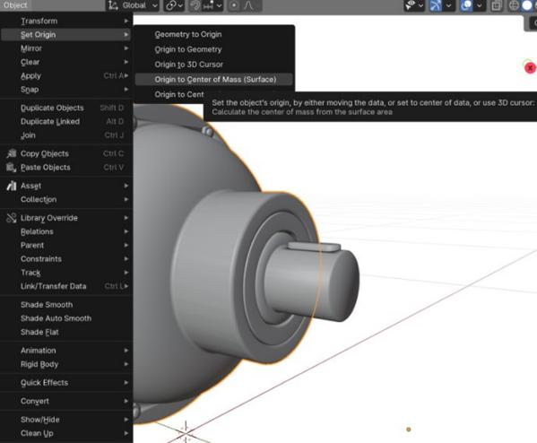
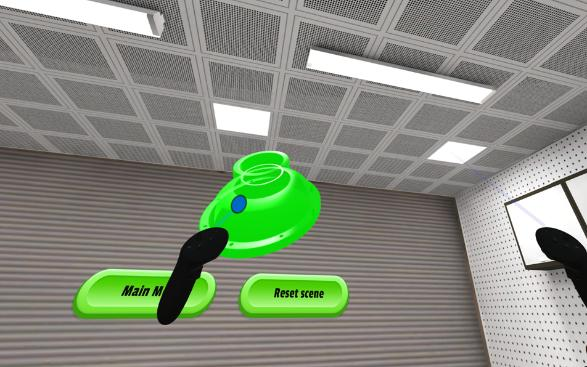
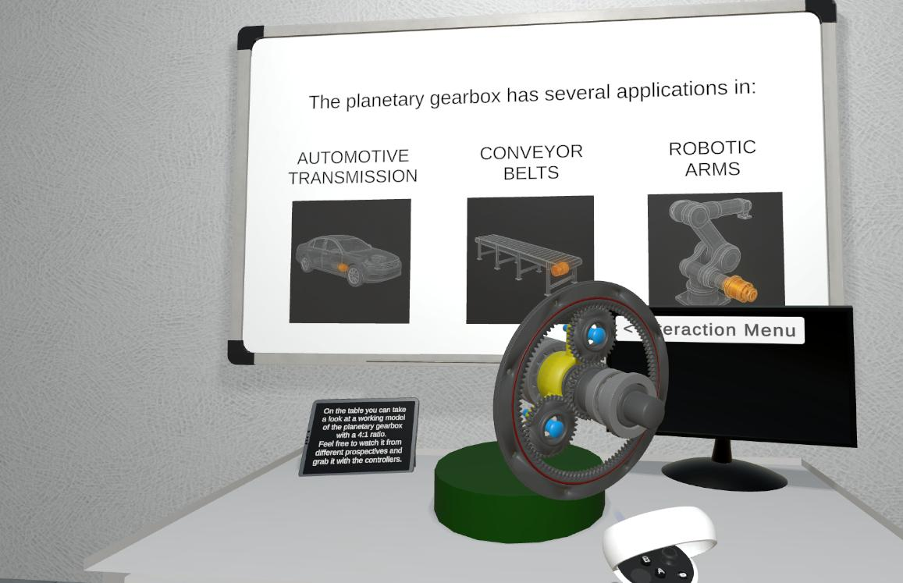
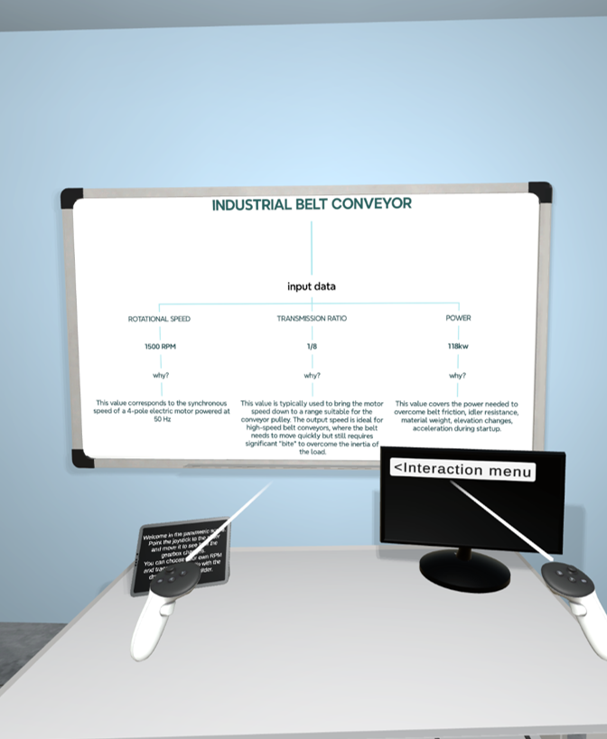

{:.no_toc}

  

    Table of contents
  

  {: .text-delta }
- TOC
{:toc}

# Product Analysis Workflow
{:.no_toc}

Product analysis supports the design of new mechanical products by enabling students to examine an existing reference product that is comparable to their design objective. In an interactive virtual environment, students explore and manipulate a 3D model of the reference product to discover its key features and operational principles. This hands-on analysis provides the information needed to define the features and critical characteristics of a subsequent design.

## 1. Learning Objectives

The learning objectives for this workflow focus on extracting useful design information from an existing mechanical system through XR-supported exploration, inspection, and disassembly.

| **ILO** | **Knowledge Type** | **ILO Description** |
| ----- | ---- | ----- |
| I4 | 1.3 | Comprehend the characteristics and the purpose of XR technologies applied to mechanical design |
| I6 | 2.2 | Extract relevant information from existing mechanical systems to enhance the design of new products |
| I7 | 3.1 | Apply XR tools to interact with virtual prototypes of mechanical systems |
| I8 | 3.2 | Learn to extract useful information from a component or system by exploring a virtual environment |
| I9 | 3.2 | Understand physical constraints and relations among parts in a product by disassembling its components |

Table 1: ILOs addressed by the Product Analysis workflow

## 2. Use Case

The workflow uses the Planetary Gearbox presented in the [Product Design workflow](./W2_product_design.md) as the reference product. Its mechanism and component relationships allow students to explore the product, perform a virtual disassembly, assess dimensions and properties, identify relations and constraints, and define its working principle. The resulting product feature list provides an input to the following product-design activities. The Planetary Gearbox use case is further described in its [page]((../UseCases/U01_gearbox)).

## 3. Learning Activities

Figure 1: Learning Workflow - Product Analysis

| **Task ID** | **Task Name** | **Task Description** | **ILO** |
| ----- | ----- | ----- | ----- |
| T2.1 | Models Gathering | 

 • **Description**: High-fidelity 3D models of reference products are integrated into an interactive virtual environment, creating an immersive learning platform. This carefully crafted virtual scene guides students through a systematic exploration of analogous mechanical systems, enabling them to discover and analyze fundamental working principles. Through strategic decomposition of complex assemblies, interactive animations, and dynamic simulations, students gain hands-on experience with key mechanical concepts, component relationships, and operational sequences. • **Output**: Virtual Scene • **Input**: Domain-specific Knowledge • **Resource**: 3D Model(s) of Sample Product | I6 |
| T2.2 | Product(s) Disassembly | 

 • **Description**: Within the interactive virtual environment, students engage in systematic disassembly procedures to decode the reference product's design architecture. Through this hands-on virtual exploration, students identify and analyze critical functional components and document assembly sequences. This detailed investigation helps students grasp both the hierarchical structure of the assembly and the precise role of each component within the system. • **Output**: Design intent understanding • **Input**: Virtual Scene • **Resources**: XR application, XR device | I4, I6, I7, I8, I9 |
| T2.3 | Product(s) Dimensions and Properties Assessment | 

 • **Description**: In this phase, students utilize advanced digital measurement tools to perform detailed dimensional analysis of critical components. Through precise virtual inspection tools, students capture key geometric parameters, tolerances, and spatial relationships between interacting parts. • **Output**: Critical dimension identification • **Input**: Design intent understanding • **Control**: Technical Specifications • **Resources**: XR application, XR device | I6, I8 |
| T2.4 | Definition of Relations and Constraints | 

 • **Description**: During this phase, the software environment enables students to investigate constraint mechanisms, kinematic relationships, and mechanical interfaces, providing insights into the design rationale behind each component's specifications. This detailed examination helps students understand how assembly constraints influence overall system performance. • **Output**: Mechanical relationship modeling • **Input**: Critical dimension identification • **Control**: Technical Specifications • **Resources**: XR application, XR device | I7, I9 |
| T2.5 | Working Principle Definition | 

 • **Description**: This culminating phase of the Reverse Engineering workflow synthesizes students' analytical findings into a comprehensive understanding of the product's operational principles. Through their virtual disassembly experience and component analysis, students formulate detailed descriptions of system functionality, energy flows, and mechanical relationships. This synthesized knowledge forms the foundation for their own design process, enabling them to extract key engineering principles, identify design opportunities, and develop innovative solutions in the subsequent Conceptual Design phase. Students translate their observations and insights into formal documentation that bridges reverse engineering analysis with forward-looking design activities. • **Output**: Product's Feature List • **Input**: Mechanical relationship modeling • **Resources**: XR application, XR device | I4, I6, I8 |

## 4. Technology

The workflow uses [Autodesk Inventor](../Tools.md#autodesk-inventor), [Blender](../Tools.md#blender), [Unity 3D](../Tools.md#unity), the [Meta XR SDK](../Tools.md#meta-xr-sdk), and a Meta Quest XR device to create an interactive virtual environment for product analysis. [Autodesk Inventor](../Tools.md#autodesk-inventor) provides the detailed CAD representation of the reference planetary gearbox, including its individual components and assembly relationships. These models are prepared for the virtual environment in [Blender](../Tools.md#blender), where their geometry and appearance can be adapted for real-time use.

The prepared 3D models are brought into [Unity 3D](../Tools.md#unity), which integrates them into a virtual scene that supports the exploration of complex assemblies, their decomposition, and the visualization of working principles through animations and simulations. The [Meta XR SDK](../Tools.md#meta-xr-sdk) connects this scene to the Meta Quest headset and provides the hand and controller interactions needed to select, grab and inspect the gearbox components.

The XR application also provides virtual inspection capabilities. Students use the Unity scene and Meta XR interactions to examine components, identify critical geometric parameters, tolerances, and spatial relationships, and investigate constraint mechanisms, kinematic relationships, and mechanical interfaces. The virtual scene is therefore both the resource used for analysis and the environment in which students document their findings.

## 5. User Experience

The user experience is designed around the direct exploration of a reference product in a virtual environment. Students interact with the 3D assembly to inspect components, carry out systematic disassembly procedures, and understand the hierarchical structure of the product and the role of each component.

Figure 7: Student explorating the scene to understand the working principle of the gearbox

During the workflow, students progressively use the virtual environment to assess the product's properties, examine relations and constraints, and synthesize their observations into a description of the working principle. This sequence connects the visual and interactive analysis of the product with concrete learning outputs: design-intent understanding, identification of critical dimensions, mechanical relationship modelling, and the product feature list.
