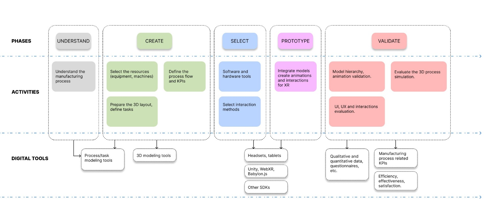
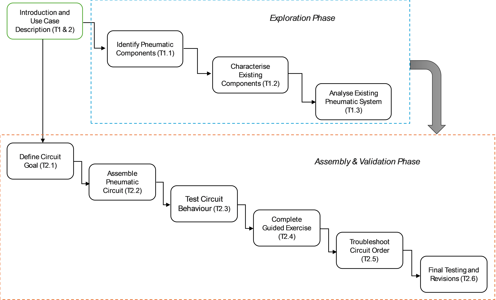
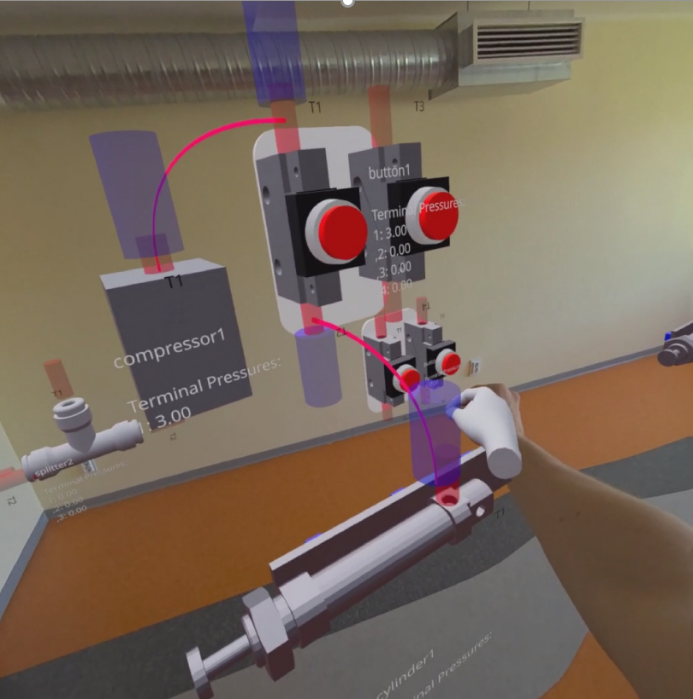
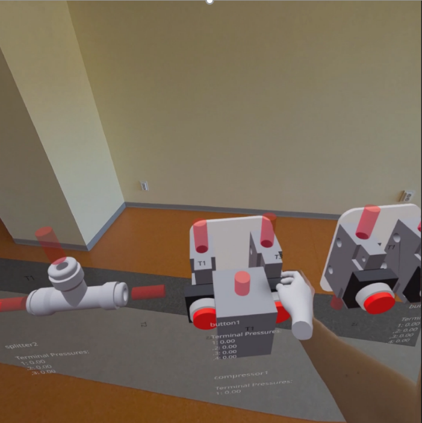
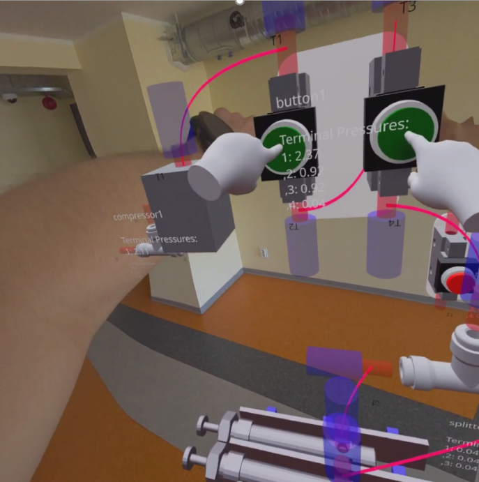
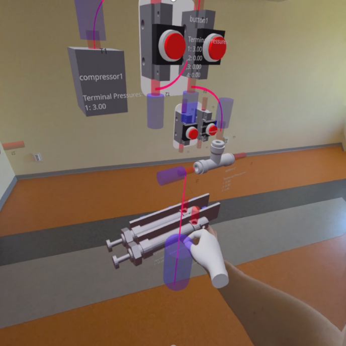
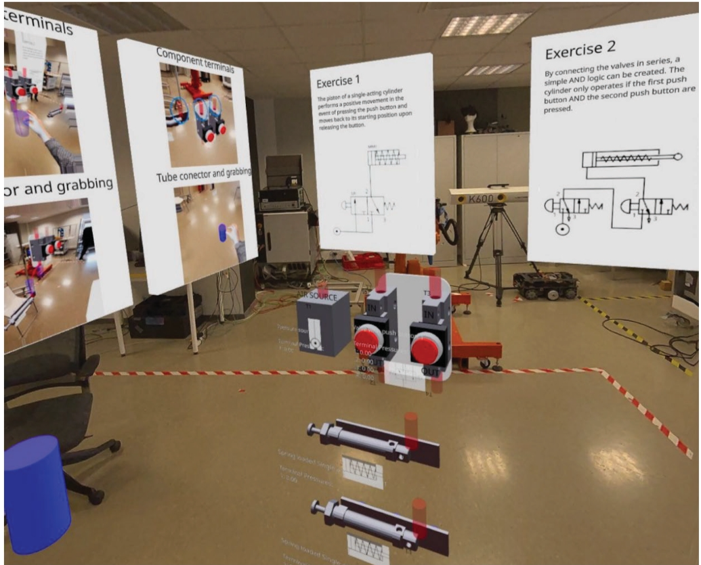

{:.no_toc}

  

    Table of contents
  

  {: .text-delta }
- TOC
{:toc}

# Pneumatic System Assembly Process
{:.no_toc}

This learning workflow is designed to address the challenges of the assembly and operation of pneumatic systems in Augmented Reality (AR). Pneumatic system design and troubleshooting are core competencies not only in Vocational Education and Training (VET) for mechatronics and industrial automation but also in industrial and manufacturing-related curricula at universities, especially the Integrated Engineering curriculum at TalTech (subject: Hydraulics and Pneumatics). The workflow offers a structured approach to mastering these competencies, leveraging AR technologies and web-based 3D simulation. Students engage with virtual pneumatic components: compressors, valves, cylinders, splitters, and tubes in an interactive AR workspace, assembling circuits, testing system behaviour, and completing guided exercises. Through hands-on AR activities, learners develop the skills needed to understand, design, and troubleshoot real pneumatic circuits in a safe, repeatable environment.

# 1. Learning Objectives

**1. Factual Knowledge**

- **1.1** Identify and use the terminology of pneumatic components and AR interface elements (compressor, valve, push button valve, cylinder, splitter, tube, terminal, pressure source, connection point, AR workspace).

- **1.2** Identify the role, properties, and operational states of pneumatic components, including function of the compressor, control role of valves, motion behaviour of the cylinder, distribution role of splitters, and meaning of pressure levels and connection status.

**2. Conceptual Knowledge**

- **2.1** Classify pneumatic components according to their function within a pneumatic circuit (pressure-generating, control, actuating, distribution, and connection components).

- **2.2** Understand how compressed air flows through a pneumatic system and how component arrangement and user interaction influence pressure propagation and cylinder movement.

- **2.3** Understand how pneumatic system behaviour is represented in the digital simulation model through component states, terminal pressures, connection logic, snap-to-connect behaviour, and the relationship between virtual assembly and simulated physical response.

**3. Procedural Knowledge**

- **3.1** Assemble pneumatic circuits in the AR environment, connect components correctly, test system behaviour, interpret pressure values and motion responses, and complete structured exercises.

- **3.2** Apply AR interaction methods to select, place, connect, and manipulate pneumatic components; verify circuit functionality through simulation feedback; and apply guided trial-and-error and validation methods to construct working assemblies.

- **3.3** Analyse circuit behaviour and determine when a pneumatic configuration is incorrect, incomplete, or inefficient; identify faulty connections, missing components, or invalid logic and apply corrective procedures.

**4. Metacognitive Knowledge**

- **4.1** Evaluate one's own confidence in assembling pneumatic circuits, interpreting simulation feedback, solving exercises, and understanding the relationship between circuit design and system behaviour.

***Table 1.** List of specific Intended Learning Objectives (ILOs) with their associated knowledge type*

| **ILO** | **Knowledge Type** | **ILO Description**                                                                                                                                                                                                                                                     |
|---------|--------------------|-------------------------------------------------------------------------------------------------------------------------------------------------------------------------------------------------------------------------------------------------------------------------|
| I1      | 1.1                | Identify and correctly use the terminology of the main pneumatic components and interface elements in the AR environment (compressor, valve, push button valve, single-acting cylinder, splitter, tube, terminal, pressure source, connection point, AR workspace).     |
| I2      | 1.2                | Identify the role, properties, and operational states of pneumatic components, including the function of the compressor as a pressure source, valves as control elements, cylinders as actuators, splitters as distribution elements, and tubes as connection elements. |
| I3      | 2.1                | Classify pneumatic components according to their function within a pneumatic system (pressure-generating, control, actuating, distribution, and connection components).                                                                                                 |
| I4      | 2.2                | Understand how compressed air flows through a pneumatic circuit and how component arrangement and user interaction influence pressure propagation and system response.                                                                                                  |
| I5      | 2.2                | Explain the operating principle of a pneumatic system in which button activation, valve state, pressure transfer, and cylinder movement are functionally related.                                                                                                       |
| I6      | 2.3                | Understand how the behaviour of a pneumatic system is represented in the digital simulation model through component states, terminal pressures, connection logic, and virtual assembly rules.                                                                           |
| I7      | 3.1                | Assemble a basic pneumatic circuit in the AR environment by selecting, placing, and connecting the required components to achieve a defined functional goal.                                                                                                            |
| I8      | 3.1                | Test and interpret the behaviour of a pneumatic circuit using simulation feedback (pressure values, cylinder extension, valve state, connection status).                                                                                                                |
| I9      | 3.1                | Complete guided pneumatic learning exercises, including single-acting cylinder control and simple logic-based configurations, by building circuits that satisfy the required operating conditions.                                                                      |
| I10     | 3.2                | Apply AR interaction techniques to manipulate virtual pneumatic components — selecting, placing, grabbing, moving, rotating, and connecting them within the workspace.                                                                                                  |
| I11     | 3.2                | Use validation, observation, and guided trial-and-error methods to verify whether a pneumatic assembly functions correctly and meets the task requirements.                                                                                                             |
| I12     | 3.3                | Analyse pneumatic system behaviour to determine when a configuration is incorrect, incomplete, or inefficient, and identify the necessary corrective actions.                                                                                                           |
| I13     | 3.3                | Troubleshoot faulty pneumatic assemblies by identifying wrong connections, missing components, or invalid logic and revising the circuit accordingly.                                                                                                                   |
| I14     | 4.1                | Evaluate one's own confidence in assembling pneumatic circuits, interpreting simulation feedback, solving exercises, and understanding the relationship between circuit design and system behaviour.                                                                    |

# 2. Use Case

The learning workflow has been applied to use case of the [pneumatics laboratory](../UseCases/U05_pneumaticslab) located at Tallinn University of Technology (TalTech). The lab is used for hydraulics and pneumatics laboratory teaching. The traditional laboratory procedure for pneumatics circuit assembly is structured as follows: the students assemble the circuit by using the provided components and schematics; the teacher verifies the correctness of the assembly and tests it together with the student; if there is something wrong both go through troubleshooting and a further verification; the class is afterwards concluded.

The XR-based learning workflow guides students through the assembly and operation of pneumatic systems in an AR environment, using a pneumatic circuit assembly task as the central use case. Students interact with a [web-based AR application](#4-technology) that presents virtual pneumatic components: pressure sources, valves, cylinders, splitters, and tubes which can be selected, placed, and connected within a mixed-reality workspace visible through a smartphone, tablet, or AR headset.

By working through structured exercises of increasing complexity, students can learn to assemble correct pneumatic configurations, observe real-time simulation feedback (pressure values, cylinder extension, valve states), and troubleshoot faulty circuits. 

The pneumatic domain is well-suited as a teaching context because it combines clear physical cause-and-effect relationships (pressure → flow → motion) with a discrete set of components that can be mastered progressively.

# 3. Learning Activities

The proposed main workflow is presented in Figure 1. It consists of different phases from the understanding of the system, definition of requirements till the test and evaluation of the proposed XR system integration and related learning activities. The phases go in parallel with specific activities and actions the students should undertake at each step of the workflow being, in this case, generic guidelines that can be customized for each specific use case. Another horizontal layer is constituted by the selection of the tools, mainly digital, to be involved in each step of the process.

The sequential workflow for the design and analysis of the pneumatic system assembly process is organized into two main phases: Exploration and Assembly & Validation, each comprising a series of structured tasks. This task-based workflow is illustrated in Figure 2. 

**Figure 1.** Main workflow

**Figure 2.** Sequential learning activities workflow for pneumatic system assembly

The learning activities are organised into two sequential phases:
* Phase 1 (Components exploration) focuses on identifying and understanding pneumatic components and system behaviour. 
* Phase 2 (Assembly and Validation) covers circuit design, assembly, testing, troubleshooting, and reflection. Each task is associated with specific ILOs as reported in Table 2.

***Table 2**. Pneumatic System Assembly Learning Activities Corresponding to the Workflow*

<table>
<colgroup>
<col style="width: 7%" />
<col style="width: 19%" />
<col style="width: 59%" />
<col style="width: 13%" />
</colgroup>
<thead>
<tr class="header">
<th><strong>Task ID</strong></th>
<th><strong>Task Name</strong></th>
<th><strong>Task Description</strong></th>
<th><strong>ILO</strong></th>
</tr>
</thead>
<tbody>
<tr class="odd">
<td>T1.0</td>
<td>Introduction and Use Case Description</td>
<td>
<strong>Description:</strong> This initial phase introduces students to the fundamental concepts of pneumatic systems and AR-based learning. Students receive an overview of the AR environment, the available components, and the goals of the learning exercises. The use case (pneumatic circuit assembly) is presented with contextual domain knowledge to prepare students for the hands-on activities.

<strong>Output:</strong> Domain-specific Knowledge, Overview of Learning Activities

<strong>Resource:</strong> AR application introduction module, component reference materials
</td>
<td>I1, I2</td>
</tr>
<tr class="even">
<td>T1.1</td>
<td>Identify Pneumatic Components</td>
<td>
<strong>Description:</strong> Students analyse the pneumatic system and identify the relevant components present in the AR environment. Through exploration of the virtual component library, students learn to recognise and name each component type and its AR interface representation.

<strong>Output:</strong> Answers to a questionnaire / component identification exercise

<strong>Input:</strong> Domain-specific Knowledge

<strong>Resource:</strong> AR application (component library), reference materials
</td>
<td>I1</td>
</tr>
<tr class="odd">
<td>T1.2</td>
<td>Characterise Existing Components</td>
<td>
<strong>Description:</strong> Students collect and document the properties and functions of each pneumatic component in the virtual environment. They categorise components by function — pressure-generating, control, actuating, distribution, and connection — and describe their operational states.

<strong>Output:</strong> Answers to a questionnaire or component-function matching task

<strong>Input:</strong> Component identification (T1.1 output)

<strong>Resource:</strong> AR application, component reference materials
</td>
<td>I2, I3</td>
</tr>
<tr class="even">
<td>T1.3</td>
<td>Analyse Existing Pneumatic System</td>
<td>
<strong>Description:</strong> Students analyse system behaviour by observing compressed air flow through a pre-assembled reference circuit in the AR environment. They examine the relationship between circuit configuration, user interaction, pressure propagation, and cylinder motion, and study how the digital simulation model represents these physical relationships.

<strong>Output:</strong> A circuit explanation, annotated diagram, or description showing system behaviour and compressed-air flow

<strong>Input:</strong> Component characterisation (T1.2 output)

<strong>Controls:</strong> Reference circuit configuration

<strong>Resource:</strong> AR application (reference circuit mode)
</td>
<td>I4, I5, I6</td>
</tr>
<tr class="odd">
<td>T2.1</td>
<td>Define Circuit Goal</td>
<td>
<strong>Description:</strong> Before assembling, students define the goal of the assigned pneumatic exercise and plan the component arrangement required to achieve the target behaviour. Students articulate the expected input-output relationships and identify which components and connections are needed.

<strong>Output:</strong> A defined assembly objective and component plan

<strong>Input:</strong> Exercise description, domain knowledge from Phase 1

<strong>Controls:</strong> Exercise requirements
</td>
<td>I7</td>
</tr>
<tr class="even">
<td>T2.2</td>
<td>Assemble Pneumatic Circuit</td>
<td>
<strong>Description:</strong> Students select, place, and connect the required pneumatic components in the AR environment to create a functional circuit. Using hand gestures or device input, students drag components into the workspace, position them, and connect them with tubes using the snap-to-connect system.

<strong>Output:</strong> A completed pneumatic assembly in the AR environment

<strong>Input:</strong> Component plan (T2.1 output)

<strong>Controls:</strong> Exercise requirements, component library

<strong>Resource:</strong> AR application (assembly mode), XR device
</td>
<td>I7, I10</td>
</tr>
<tr class="odd">
<td>T2.3</td>
<td>Test Circuit Behaviour</td>
<td>
<strong>Description:</strong> Students activate the assembled circuit and observe simulation feedback. They interpret real-time data including pressure values at each terminal, cylinder extension percentage, valve states, and connection status indicators to evaluate whether the circuit behaves as expected.

<strong>Output:</strong> Observable simulation results (pressure readings, valve states, cylinder movement)

<strong>Input:</strong> Assembled circuit (T2.2 output)

<strong>Controls:</strong> Expected circuit behaviour (per exercise specification)

<strong>Resource:</strong> AR application (simulation mode), XR device
</td>
<td>I8</td>
</tr>
<tr class="even">
<td>T2.4</td>
<td>Complete Guided Exercise</td>
<td>
<strong>Description:</strong> Students complete the assigned structured exercise — such as the single-acting cylinder control (Exercise 1: Compressor → Valve → Cylinder) or the AND logic circuit (Exercise 2: Compressor → Valve 1 → Valve 2 → Cylinder) — building a configuration that satisfies the stated success criteria. The system validates the assembly and provides feedback.

<strong>Output:</strong> A validated circuit satisfying the assigned exercise requirements

<strong>Input:</strong> Circuit test results (T2.3 output)

<strong>Controls:</strong> Exercise success criteria, product design guidelines

<strong>Resource:</strong> AR application (exercise mode), XR device
</td>
<td>I9, I11</td>
</tr>
<tr class="odd">
<td>T2.5</td>
<td>Troubleshoot Circuit Configuration</td>
<td>
<strong>Description:</strong> Students identify and correct faults in a pneumatic assembly — wrong connections, missing components, or incorrect logic. Using simulation feedback and systematic analysis, students diagnose the problem and apply corrective actions to produce a working circuit.

<strong>Output:</strong> A corrected circuit and a short record of identified errors and revisions

<strong>Input:</strong> Faulty or incomplete circuit

<strong>Controls:</strong> Exercise requirements, expected system behaviour

<strong>Resource:</strong> AR application, XR device
</td>
<td>I12, I13</td>
</tr>
<tr class="even">
<td>T2.6</td>
<td>Final Testing and Revisions</td>
<td>
<strong>Description:</strong> Students perform final testing of the completed circuit and reflect on their learning. They self-assess their understanding of the circuit design, the quality of their solution, and their confidence in pneumatic assembly and troubleshooting. Simulation logs are reviewed to support reflection.

<strong>Output:</strong> Final test result and self-assessment of understanding, correctness, and confidence

<strong>Input:</strong> Completed and validated circuit

<strong>Controls:</strong> Exercise requirements

<strong>Resource:</strong> AR application, simulation logs
</td>
<td>I14</td>
</tr>
</tbody>
</table>

# 4. Technology

The presented workflow leverages a web-based AR stack to provide an accessible and immersive learning experience. 

The accessibility and availability of the XR application are paramount requirements for this learning workflow. Therefore, the developed [XR application](../Tools/T01_arpneumatics) runs in a standard browser on AR-capable devices (smartphones, tablets, AR headsets) without requiring native app installation, thanks to Progressive Web App (PWA) support. A web-based development was chosen to provide access from any location, utilizing JavaScript libraries like NEXT.js, Three.js, and WebXR APIs to integrate XR functionalities. This approach enables access across a variety of hardware solutions, including desktop, headset, or handheld devices.

Using XR application the students can complete both phases of the workflow — the Component Exploration phase and the Assembly & Validation phase — as defined in the proposed workflow. In Phase 1, students’ progress from component identification (T1.1) through characterisation (T1.2) to full system analysis (T1.3). The reference circuit in the AR environment serves as a guided exploration resource throughout this phase.

In Phase 2, students define their circuit goal (T2.1), assemble the circuit (T2.2), test its behaviour (T2.3), complete the guided exercise with validation (T2.4), troubleshoot any faults (T2.5), and perform final testing and self-assessment (T2.6).

The developed AR prototype was tested as shown in Figures 3 and 4 respectively.

**Figure 3.** Application prototype with a single acting cylinder

**Figure 4.** Application prototype with AND logic integration

The images show how the user enables to pick and place the selected components and attach their connector ends to the air source through virtual tubes (left side). The user can operate the button components (right side) to check the correctness of the exercise and schematics assembly, and trigger/visualise the extension of the pistons.

# 5. User Experience

In the AR learning workspace (Figure 5), students explore and interact with virtual pneumatic components overlaid on their physical surroundings. This approach ensures that learners not only understand theoretical pneumatic principles but apply them directly through hands-on assembly and testing in a safe, repeatable context. The learning workflow provides students with several interactive elements to enhance understanding and learning outcomes.

**Figure 5.** AR learning workspace and UI for Pneumatics Circuit Assembly \[2\], \[3\]

## 5.1 Object Interaction
{:.no_toc}

Students engage with 3D models of pneumatic components by selecting and manipulating them within the AR workspace. Key interaction features include:

- Component Information: Selecting a component displays its name, function, and current state (pressure, connection status, cylinder extension).

- Snap-to-Connect: When a tube endpoint is dragged within 0.3 units of a component terminal, it automatically snaps and connects, with visual confirmation (colour change, glow effect) and haptic feedback on supported devices.

- Component Manipulation: Hand gestures (pinch-grab, point-and-click, two-hand rotation) allow intuitive placement and interaction.

## 5.2 Enhanced Immersion and Engagement
{:.no_toc}

The AR environment is designed to mimic realistic pneumatic laboratory conditions. Features include:

- Real-time pressure visualisation at each terminal (bar values displayed above components).

- Animated cylinder extension and valve state changes responding to user interaction.

- Guided exercise prompts leading students through assembly steps with clear success criteria and feedback.

- Alert indicators highlighting improperly connected or missing components.

## 5.3 Expected Task Outcomes
{:.no_toc}

**Table 4** Summary of the expected output for each learning task

| **Task ID** | **Task**                           | **Output**                                                                                                 |
|-------------|------------------------------------|------------------------------------------------------------------------------------------------------------|
| T1.1        | Identify Pneumatic Components      | Answers to a questionnaire.                                                                                |
| T1.2        | Characterise Existing Components   | Answers to a questionnaire or component-function matching task.                                            |
| T1.3        | Analyse Existing Pneumatic System  | A circuit explanation, diagram, or annotated description showing system behaviour and compressed-air flow. |
| T2.1        | Define Circuit Goal                | A defined assembly objective and component plan for the pneumatic exercise.                                |
| T2.2        | Assemble Pneumatic Circuit         | A completed pneumatic assembly in the AR environment.                                                      |
| T2.3        | Test Circuit Behaviour             | Observable simulation results showing pressure, valve states, and cylinder movement.                       |
| T2.4        | Complete Guided Exercise           | A validated circuit satisfying the assigned exercise requirements.                                         |
| T2.5        | Troubleshoot Circuit Configuration | A corrected circuit and a short record of identified errors and revisions.                                 |
| T2.6        | Final Testing and Revisions        | Final test result and self-assessment of understanding, correctness, and confidence.                       |

# References

1.  Pizzagalli, S. L.; Mahmood, K.; Boychuk, R.; Otto, T.; Kuts, V. (2025). A workflow for extended reality-based learning in engineering education. Proceedings of the Estonian Academy of Sciences, 74, 2, 103−108. DOI: 10.3176/proc.2025.2.03.
2.  Mondellini, Marta; Arlati, Sara; Urgo, Marcello; Pizzagalli, Simone Luca; Kashif, Mahmood; Terkaj, Walter (2025). Comparing Traditional and eXtended Reality-based Learning: Effects on Performance, Emotions, and Cognitive Aspects. In: Extended Reality: International Conference, XR Salento 2025, Otranto, Italy, June 17–20, 2025, Proceedings, Part VI. (324−336). Springer. (Lecture Notes in Computer Science; 15742). DOI: 10.1007/978-3-031-97778-7_24.
3.  Boychuk, R.; Symotiuk, I.; Rõbnikov, D.; Kuts, V.; Mahmood, K.; Pizzagalli, S.L.; Otto, T. (2024). Pneumatics-Case: Enhancing Learning through Augmented Reality and Digital Twin Technology. EuroXR 2024: Proceedings of the 21st EuroXR International Conference, 432: 21st EuroXR International Conference, Athens, Greece, November 27th to 29th, 2024. Ed. Helin, K., Michael-Grigoriou, D., Katika, T., Schiavi, B., & Tsaknaki, E. VTT Technical Research Centre of Finland, 261−266. (VTT Technology). DOI: 10.32040/2242-122X.2024.T432.

