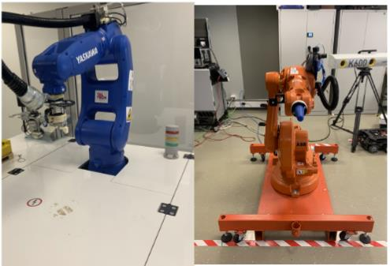
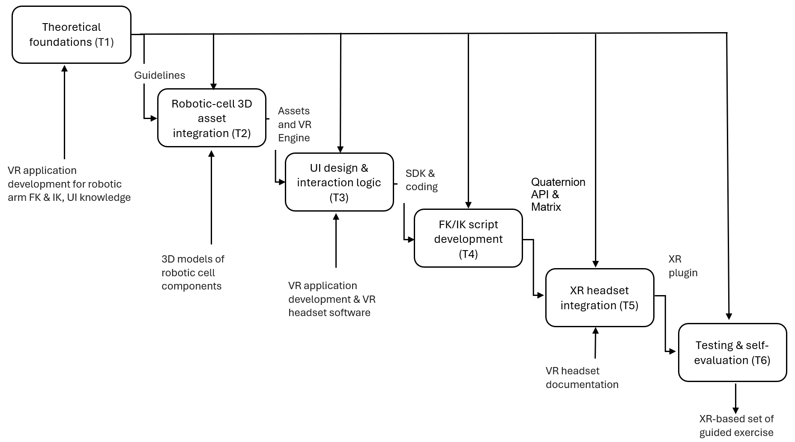
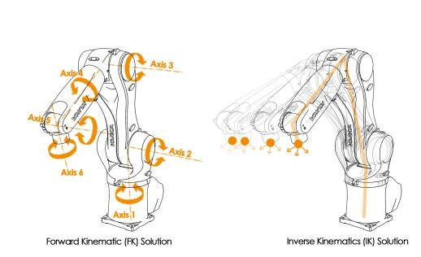
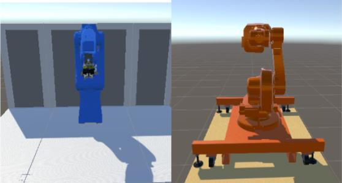
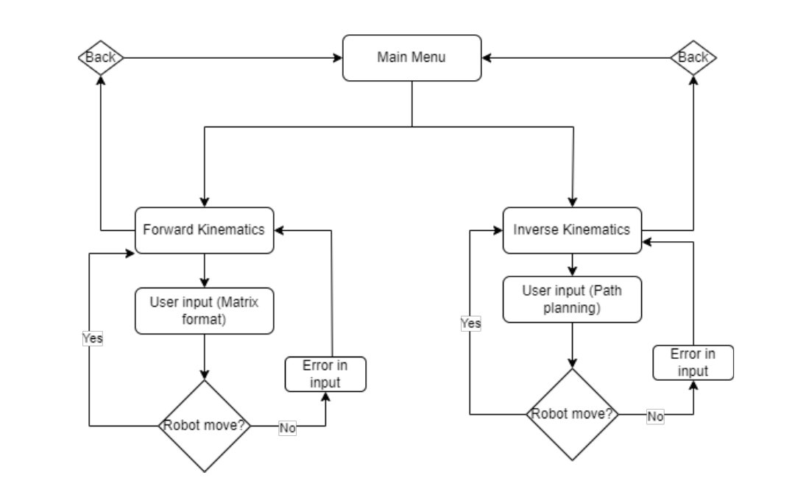
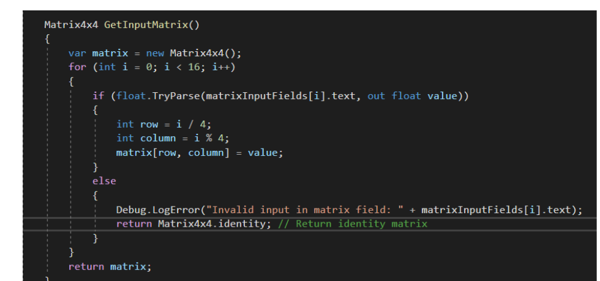
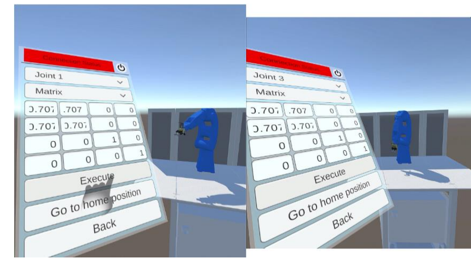
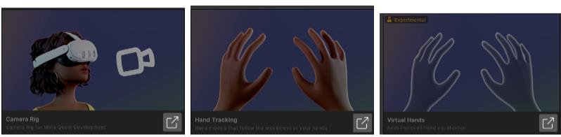
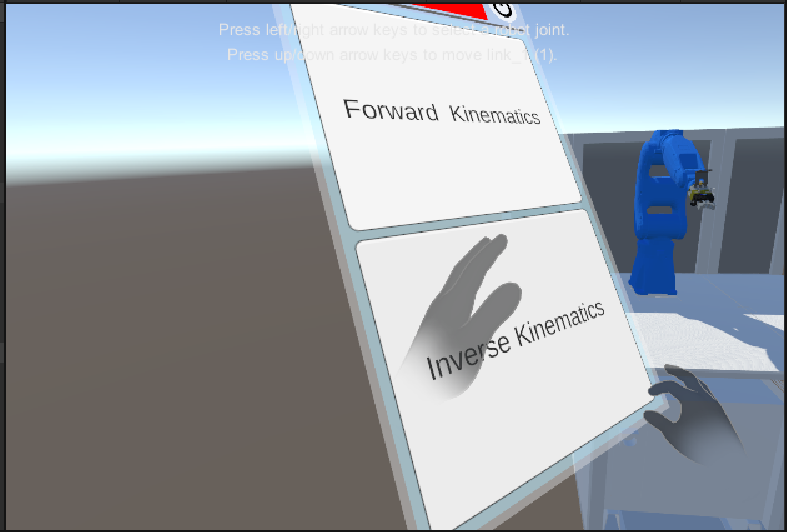

{:.no_toc}

  

    Table of contents
  

  {: .text-delta }
- TOC
{:toc}

# Robotic Arm Kinematics 
{:.no_toc}

Extended Reality (XR) is an umbrella term that for Augmented Reality (AR), Virtual Reality (VR), and the space in between. VR is a fully immersive, simulated experience typically delivered through a headset. AR overlays digital features and elements onto the real world, usually through smartphones, glasses, or other devices \[1\].

This workflow contributes to the WP2 goal of designing, developing and testing learning workflows that integrate XR technologies into engineering education, with a focus on interactive visualisation and hands-on learning activities enabled by AR/VR technology \[2\].

Its specific goal is to provide students with a safe, interactive and accessible environment in which to understand how Forward Kinematics (FK) produces rotations of a robotic arm, how these rotations behave under the Denavit–Hartenberg (D-H) convention \[3 & 4\], and how Inverse Kinematics (IK) can be used to plan an End Effector (EE) path.

To achieve this, the workflow consists of:

1.  Creation of a 3D interactive Unity environment \[5\] including two robotic-arm models (ABB IRB 1600 and Yaskawa Motoman GP8) each with an interactive menu and User Interface (UI)

2.  Development and connection of the scripts that let the robots move through user input, with feedback where needed

3.  Integration of a VR headset for a fully immersive experience

4.  Definition of a use case to test the application

## 1. Learning Objectives

The learning objectives covers the following knowledge types, while the specific Intended Learning Objectives (ILOs) are listed in Table 1:

**1. Factual Knowledge**

- **1.1** Identify the structure of articulated industrial robots, including links, rotational joints and degrees of freedom.

- **1.2** Recognize the D-H parameters used to describe link geometry: joint angle, link offset, link length and twist angle.

- **1.3** Distinguish forward kinematics from inverse kinematics.

**2. Conceptual Knowledge**

- **2.1** Explain the relationship between joint parameters and end-effector position and orientation.

- **2.2** Understand homogeneous transformations and the use of D-H representations in a multi-joint kinematic chain.

- **2.3** Recognize that inverse kinematics can provide more than one valid robot configuration for a target pose.

**3. Procedural Knowledge**

- **3.1** Use the XR interface to select robot functions and provide FK inputs.

- **3.2** Apply matrix- or angle-based inputs to command robot-joint rotations in the simulation.

- **3.3** Use the IK path-planning interaction to define a target/path and observe simulated robot motion.

- **3.4** Operate Meta Quest 2 hand tracking with poke and grab interactions.

**4. Metacognitive Knowledge**

- **4.1** Understanding how the complexity of kinematic computation grows with the number of degrees of freedom;

- **4.2** Self-evaluating one's own understanding of FK/IK by cross-checking matrix-based and angle-based input, and by observing frame-relative rotation behavior across repeated transformations.

***Table 1.** List of specific ILOs with their associated knowledge type*

| **ILO** | **Knowledge Type** | **ILO Description**                                                                                                    |
|---------|--------------------|------------------------------------------------------------------------------------------------------------------------|
| I1      | 1.1, 1.2, 1.3      | Explain the structure of the two industrial robots and describe the role of the D-H convention in kinematic modelling. |
| I2      | 2.1, 2.2, 3.2      | Apply forward-kinematics concepts to control joint rotations and interpret the resulting robot pose.                   |
| I3      | 2.1, 2.3, 3.3      | Use inverse-kinematics/path-planning functions to define and observe end-effector motion.                              |
| I4      | 3.1, 3.4           | Operate the immersive XR interface using hand tracking and the implemented UI interactions.                            |
| I5      | 4.1, 4.2           | Evaluate the correctness of kinematic inputs and simulated outcomes through guided comparison and repeated testing.    |

## 2. Use Case

**Description and Equipment**

The use case focuses on the integration of [two robotic cells](../UseCases/U10_robotsystem) in a [virtual environment](../Tools/T02_xrkinematics) and the implementation of inverse and forward kinematics (IK, FK) interactive visualisation, to provide students with a safe, hands-on and repeatable sandbox to understand the robotic systems and kinematic solver algorithms.

Two robotic cells incorporate the Yaskawa Motoman GP8 and ABB IRB 1600 industrial robotic arms (Figure 1).

***Figure 1.** Yaskawa Motoman GP8 (left) and ABB IRB 1600 (right), available TalTech IVAR lab \[6\]*

As previously mentioned, the selected robots are industrial articulated robots that are widely used across various sectors, particularly manufacturing and logistics, for applications such as assembly, welding, packaging, pick-and-place operations, sorting, material handling, and other precision-demanding tasks. The use of industrial robots offers several advantages, including improved precision, accuracy, productivity, and operational efficiency, as well as increased process speed and enhanced worker safety, particularly when performing repetitive or potentially hazardous tasks.

Forward kinematics and inverse kinematics are used to achieve certain movements of a robot. On one hand, FK involves calculating the position and orientation of the robot's EE based on given joint parameters, such as angles or displacements, to achieve a specific position and orientation of the EE. On the contrary, IK determines the required joints parameters to achieve a specific position and orientation of the EE. 

For the purposes of this study, it is assumed that the reader has prior knowledge and experience with industrial robotics’ FK and IK. More details about the use case can be found [here](../UseCases/U10_robotsystem).

## 3. Learning Activities

The workflow consists of six learning tasks through which students acquire the intended knowledge and learning outcomes. Task T2.0 is performed with existing 3D/URDF assets, tasks T3.0 and T4.0 in Unity, task T5.0 integrates the VR hardware, and task T6.0 requires the completed XR application. Figure 5a and 5b shows the workflow and task flow respectively. Table 2 contains description of the tasks and the ILOs they contribute to.

***Figure 5a.** Learning activities workflow*

<table>
<colgroup>
<col style="width: 13%" />
<col style="width: 13%" />
<col style="width: 13%" />
<col style="width: 13%" />
<col style="width: 18%" />
<col style="width: 13%" />
<col style="width: 13%" />
</colgroup>
<tbody>
<tr class="odd">
<td><strong>Controls</strong></td>
<td><em>Kinematics theory, D-H convention</em></td>
<td><em>URDF import knowledge [8]</em></td>
<td><em>UI/UX guidelines, poke-interaction docs</em></td>
<td><em>FK/IK theory, joint constraints</em></td>
<td><em>Oculus integration documentation</em></td>
<td><em>FK/IK theory, exercise design guidelines</em></td>
</tr>
<tr class="even">
<td><strong>Task</strong></td>
<td>
<strong>T1.0</strong>

Theoretical foundations →
</td>
<td>
<strong>T2.0</strong>

3D asset integration →
</td>
<td>
<strong>T3.0</strong>

UI design &amp; interaction logic →
</td>
<td>
<strong>T4.0</strong>

FK/IK script development →
</td>
<td>
<strong>T5.0</strong>

XR headset integration →
</td>
<td>
<strong>T6.0</strong>

Testing &amp; self-evaluation
</td>
</tr>
<tr class="odd">
<td><strong>Resources</strong></td>
<td><em>Course literature, robotic-arm manuals</em></td>
<td><em>Unity, URDF Importer</em></td>
<td><em>Unity UI, Meta Quest SDK, VS Code</em></td>
<td><em>D-H parameters, Matrix4x4/Quaternion API</em></td>
<td><em>Meta Quest 2, Oculus package</em></td>
<td><em>Guided exercise set, both robot models</em></td>
</tr>
</tbody>
</table>

**Figure 5b**. Learning-activity task flow overview

***Table 2.** Each level consists of tasks associated with specifics ILOs as reported*

<table>
<colgroup>
<col style="width: 7%" />
<col style="width: 16%" />
<col style="width: 67%" />
<col style="width: 8%" />
</colgroup>
<thead>
<tr class="header">
<th><strong>Task ID</strong></th>
<th><strong>Task Name</strong></th>
<th><strong>Task Description</strong></th>
<th><strong>ILO</strong></th>
</tr>
</thead>
<tbody>
<tr class="odd">
<td>T1.0</td>
<td>Theoretical foundations</td>
<td>
<strong>Description</strong>: Students study the XR/AR/VR taxonomy, the classification of industrial robotic-arm joints, and the Denavit–Hartenberg (D-H) convention used to describe link geometry. They review the mathematical distinction between forward kinematics (FK) and inverse kinematics (IK), including the existence of multiple IK solutions ("elbow up"/"elbow down") for a given end-effector pose.

• <strong>Output</strong>: Kinematics and XR development guidelines

• <strong>Controls</strong>: Robot kinematics theory, D-H convention

• <strong>Resources</strong>: Course literature, robotic-arm technical manuals (Yaskawa GP7/GP8, ABB IRB 1600/1660)

</td>
<td>I1</td>
</tr>
<tr class="even">
<td>T2.0</td>
<td>Robotic-cell 3D asset integration</td>
<td>
<strong>Description</strong>: Students import and verify the existing URDF-based 3D models of the Yaskawa Motoman GP8 and ABB IRB 1600 into the Unity scene, together with their stands, matching the physical robots available at the lab.

• <strong>Output</strong>: Unity 3D scene containing both robot models

• <strong>Controls</strong>: URDF import / 3D-asset integration knowledge

• <strong>Resources</strong>: Unity Engine, Unity URDF Importer package, existing robot assets

</td>
<td>I1, I4</td>
</tr>
<tr class="odd">
<td>T3.0</td>
<td>User-interface design and interaction logic</td>
<td>
<strong>Description</strong>: Students design and implement the dynamic canvas system (Main Menu, Forward-Kinematics menu, Inverse-Kinematics menu), including dropdown selectors (joint / full-transformation, matrix / angle input), a numeric input pad, and VR-pokeable surfaces built with the Meta/Oculus building blocks (Camera Rig, Hand Tracking, Virtual Hands, Pointable Canvas Module).

• <strong>Output</strong>: Interactive, VR-ready user interface

• <strong>Controls</strong>: UI/UX design guidelines, Meta Quest poke-interaction documentation

• <strong>Resources</strong>: Unity UI package, Meta Quest SDK, Visual Studio Code

</td>
<td>I4</td>
</tr>
<tr class="even">
<td>T4.0</td>
<td>Forward/inverse kinematics script development</td>
<td>
<strong>Description</strong>: Students develop C# scripts that (a) parse and validate the user's matrix or angle input, (b) for FK, check that the input corresponds to a rotation about the robot's actual joint axis and convert it into a quaternion (via Atan2) to execute the transformation relative to the current frame, and (c) for IK, register path points placed by the user and simulate the resulting end-effector trajectory.

• <strong>Output</strong>: Functional FK and IK control logic

• <strong>Controls</strong>: FK/IK theory, robot joint constraints, D-H parameters

• <strong>Resources</strong>: Robot D-H parameter tables, Unity Matrix4x4 / Quaternion API

</td>
<td>I2, I3</td>
</tr>
<tr class="odd">
<td>T5.0</td>
<td>XR headset integration</td>
<td>
<strong>Description</strong>: Students configure the Meta Quest 2 headset and controllers (Oculus app, Meta Quest Developer Hub, XR Plugin Management), import the hand-tracking and virtual-hands building blocks, and connect the Pointable Canvas Module so the UI can be operated by poke interaction inside the immersive environment.

• <strong>Output</strong>: Immersive, XR-integrated application

• <strong>Controls</strong>: Meta Quest / Oculus integration documentation

• <strong>Resources</strong>: Meta Quest 2 headset and controllers, Oculus package, Unity XR Plugin Management
</td>
<td>I4</td>
</tr>
<tr class="even">
<td>T6.0</td>
<td>Testing and self-evaluation</td>
<td>
<strong>Description</strong>: Students test the application through guided exercises, for example rotating individual joints by specified angles (30°, 45°, 90°) via matrix input and cross-checking the result with the equivalent angle-input mode and repeating a rotation twice from the home position to observe frame-relative behaviour. They compare the simulated outcome with the expected robot pose and return to earlier tasks to correct errors if needed.

• <strong>Output</strong>: Validated XR kinematics learning application

• <strong>Controls</strong>: FK/IK theory, exercise design guidelines

• <strong>Resources</strong>: Guided exercise set, both robot models, Meta Quest 2

</td>
<td>I2, I3, I5</td>
</tr>
</tbody>
</table>

Assessment is based on observable outputs from each learning task and on the learner’s ability to interpret or validate the resulting system behaviour as illustrated below.

| **Task** | **Expected evidence / output**                    | **Assessment focus**                                                                                 |
|----------|---------------------------------------------------|------------------------------------------------------------------------------------------------------|
| T1.0     | Completed kinematics preparation / learning notes | Correct identification of FK, IK, robot structure and D-H concepts.                                  |
| T2.0     | Unity scene with both robot models                | Models are present, navigable and suitable for the subsequent kinematic tasks.                       |
| T3.0     | Working main, FK and IK interfaces                | Menus follow the intended interaction flow and can be used in VR.                                    |
| T4.0     | Functional FK/IK control and visual feedback      | Inputs produce coherent simulated robot behaviour, and feedback is available when input is invalid.  |
| T5.0     | Immersive application with hand interaction       | User can access UI by poke interaction and manipulate the IK path-planning tool by grab interaction. |
| T6.0     | Completed guided exercises and self-evaluation    | Learner compares expected and observed robot behaviour and identifies/corrects errors.               |

## 4. Technology

During the development of the workflow the following technologies are used:

- Robotic cells: Yaskawa Motoman GP8 and ABB IRB 1600;

- Unity Engine: used to set up and display the 3D environment, create the UI (canvas, clickable buttons, dropdown buttons), the 3D model representations of the robots, and to connect the VR headset and its compatibility;

- Unity packages: Unity UI, XR Plugin Management, Oculus XR Plugin, TextMesh Pro, Android Logcat, Unity URDF Importer, Reorderable Unity Events, and ROS – Unity MoveIt integration;

- Visual Studio Code: used to write and edit the C# scripts;

- Meta Quest 2 headset and controllers: hardware used to visualise the application and interact in the virtual environment, providing inside-out tracking and hand-gesture tracking;

- C#: development of the UI-connection logic, matrix-parsing, FK/IK rotation calculation (Atan2 / Quaternion conversion) and error-handling/debug logging.

The XR enviroment developed with Unity is described in a [specific page](../Tools/T02_xrkinematics).

For the VR integration, the Meta/Oculus building blocks: Camera Rig, Hand Tracking, and Virtual Hands were imported to provide the headset visualisation and hand-tracking models as shown in Figure 6. UI elements were made compatible with VR interaction by making the buttons pokable: the default Unity event system was replaced with a Pointable Canvas Module, and a surface area was added to each canvas's parent object so the user can poke it directly.

***Figure 6.** Camera Rig, Hand Tracking, and Virtual Hands building blocks used for the VR integration*

## 5. User Experience

Using the presented workflow, students develop practical competencies in forward and inverse kinematics in an engaging, hands-on way (Figure 7). In addition to mastering the mathematics behind FK and IK, they simultaneously gain experience operating an XR interface and reading real-time simulation feedback, skills that transfer directly to programming and operating physical industrial robots.

***Figure 7.** User's view in the application, with both virtual hands shown selecting between the FK and IK menus*

**1. Dual matrix/angle input for self-checking**

In the FK menu, students choose between a matrix input and an angle input for the same rotation. By entering a rotation both ways and comparing the outcomes, students directly correlate the abstract 4×4 transformation matrix with the physical rotation it produces, reinforcing their understanding of the Denavit–Hartenberg convention.

**2. Immersive, hands-free interaction**

Through the VR implementation, students immerse themselves in the environment, see their own virtual hands, and interact with the UI directly by poking it, while navigating the space with their own physical movement.

**3. Guided error feedback**

As students construct their transformation matrices, the application checks whether every value was entered correctly; if not, a debug message pinpoints the exact row and column of the error, helping students locate and correct mistakes in their own calculations.

**4. Guided testing exercises**

Students consolidate their understanding through two guided exercises: first rotating joint 1, joint 3, and joint 5 by 30, 45, and 90 degrees via matrix input and verifying the result with the angle input; then rotating joint 1 twice from its home position and comparing that to a single combined rotation, to directly observe that the robot rotates relative to its current frame.

## References

\[1\] Milgram, P., & Colquhoun, H. (1999). A taxonomy of real and virtual world display integration. In *Mixed Reality* (pp. 5–30). Springer. https://doi.org/10.1007/978-3-642-87512-0_1

\[2\] Khalif, Z. N., Mousa, A., & Sanmugam, M. (2024). Immersive Extended Reality (XR) technology in engineering education: Opportunities and challenges. *Technology, Knowledge and Learning*. https://doi.org/10.1007/s10758-023-09719-w

\[3\] Spong, M. W., Hutchinson, S., & Vidyasagar, M. (2020). *Robot Modeling and Control*. John Wiley & Sons.

\[4\] Manolescu, D., & Lindo Secco, E. (2022). *Design of a 3-DOF robotic arm and implementation of D-H forward kinematics*.

\[5\] Unity Technologies. *Unity*. <https://unity.com/>

\[6\] Pizzagalli, S. L.; Mahmood, K.; Boychuk, R.; Otto, T.; Kuts, V. (2025). *A workflow for extended reality-based learning in engineering education.* Proceedings of the Estonian Academy of Sciences, 74, 2, 103−108. DOI: 10.3176/proc.2025.2.03.

\[7\] Yaskawa Motoman *GP8 Product Manual and 3D models* <https://www.yaskawa.eu.com/robotics/robots/handling-mounting/productdetail/product/gp8_694>

\[8\] ROS Wiki. *URDF – Unified Robot Description Format*. <https://wiki.ros.org/urdf>

# 
