{:.no_toc}

  

    Table of contents
  

  {: .text-delta }
- TOC
{:toc}

# Sequential Control Systems Synthesis
{:.no_toc}

Control systems of manufacturing equipment that perform simple trajectories such as manipulators, transport systems, different types of presses, assembly cells are as a rule sequential and based on Finite State Machines (FSM). In these systems correct and reliable synthesis of FSM is essential for the seamless implementation and performance of control. Over the years several technics for sequential control systems synthesis were developed \[1\], \[2\], \[3\], \[6\], \[7\]. Regardless of the implemented method, the starting point in FSM synthesis is the generation of state table which describes the behavior of the machine during state changes \[5\]. Once state table is generated, creation of control program in selected programming language is straightforward. Any deficiencies in state table are propagated to the synthesized FSM and generated control system, and lead to erroneous behavior of the machine with all the consequences thereof.

In sequential systems, on a change in sensory signal, system enters an unstable state that invokes the change in actuation signals \[4\], \[5\], \[8\]. When actuation signals reach the required values, and actuators start working as prescribed, system enters stable state and stays in this state until one of sensory signals changes again and invokes a new state change. The behavior of the system is presented through state table in which columns/rows present the states through which machine passes, whereas rows/columns represent values of sensory signals and related changes in actuation signals.

With the increase of number of sensory and actuation signals, as well as states through which machine passes, the complexity of state table increases. Since it is difficult to represent and explain the changes in complex systems using only two-dimensional static representations, teaching the process of state table generation using traditional methods limits the examples to 2-3 sensors and 3-4 actuators. Although suitable for explaining the basics of state diagram generation, such simple examples hinder the complexity of real industrial systems. On the other hand, Virtual Reality (VR) opens the room for the development of new didactic tools in this area.

This workflow contains Virtual Reality (VR) representation of a real-world flexible assembly cell that contains two manipulators with a total of 12 sensors and 7 actuators. The work cell carries out the last operation of step motor assembly, i.e., assembling the Front Endcap to the remaining elements of step motor. In addition to VR representation, workflow includes a real-world flexible assembly cell in which students can get hands-on experience on electropneumatic equipment, control hardware, motion of manipulators’ axes and which is controlled using the developed control system. However, the real-world cell does not enable simultaneous representation of the desired sequence of activities in work cell and state table making it difficult for students to understand the desired functioning of system and its tabular representation. For this purposes VR representation of the work cell is utilized.

# 2. Learning Objectives

The objectives of workflow are to develop in students the following knowledge:

1.  **Factual Knowledge**

    1.  Generation of state table that represents the desired behavior of machine assuming fundamental mode of operation – only one input signal is changed between two states;

    2.  Generation of Sequential Flow Chart (SFC) program for Programmable (Logic) Controller (PLC);

    3.  Implementation of sequential control on PLC.

2.  **Conceptual Knowledge**

    1.  Relation between changes in sensory signals and corresponding changes in actuation signals;

    2.  Relation between actions in PLC program and states and output signals in state table;

    3.  Relation between transitions in PLC program and sensory signals in state table.

3.  **Procedural Knowledge**

<!-- -->

1.  Procedure for generation of state table;

2.  Procedure for creation of SFC program based on generated state table;

3.  Programing and monitoring PLCs using proprietary tools;

4.  Applying VR tools to interact with the manufacturing equipment.

<!-- -->

4.  **Metacognitive Knowledge**

    1.  Understanding the complexity of sequential control systems in manufacturing equipment through experiments in VR;

    2.  Capability to recognize the systems in which sequential control can be applied;

    3.  Self-evaluate the understanding of the methods for sequential control system design.

The listed knowledge is related to the specific Intended Learning Outcomes (ILOs) that are listed in Table 1.

| **ILO** | **Knowledge Type**           | **ILO Description**                                                      |
|---------|------------------------------|--------------------------------------------------------------------------|
| I1      | 1.1, 2.1, 3.1                | Capability to generate the basic structure of state table                |
| I2      | 1.1, 2.1, 4.1, 4.2, 3.1, 3.4 | Understanding the relation between actuators’ outputs and sensory inputs |
| I3      | 1.1, 2.1, 3.1                | Capability to generate state table                                       |
| I4      | 1.2, 2.2, 2.3, 3.2           | Capability to create SFC program                                         |
| I5      | 1.3, 2.2, 2.3, 3.3           | Capability to implement SFC program on PLC and to monitor its execution  |
| I6      | 1.3, 4.3                     | Capability to self-evaluate their own learning achievements              |

Table 1: ILOs with associated knowledge

# 3. Use Case

The developed workflow contains automated assembly work cell that consists of two electropneumatic manipulators (Figure 1). The first manipulator (manipulator M1 – on the left side) has three degrees of freedom (DoF) – two translatory and one rotational, whereas the second manipulator (manipulator M2 – on the right side) has two translatory DoF. All DoF are realized by double-acting pneumatic cylinders (linear and rotary) operated using 5/2-way monostable directional control valves with electropneumatic actuation. The end positions of the cylinders are detected by inductive proximity sensors – one for extracted and one for retracted position of each cylinder. Manipulators are equipped with pneumatic two-finger parallel grippers also controlled using 5/2-way monostable directional control valves. The gripper installed on 3-DoF manipulator has two proximity sensors – one for open and one for closed position, whereas the grasping of objects using 2-DoF manipulator is controlled using actuation signals and timers. The cell contains a total of 12 sensors and 7 actuators. 

a\) 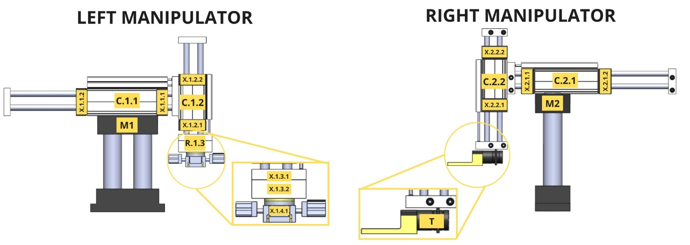

b\) 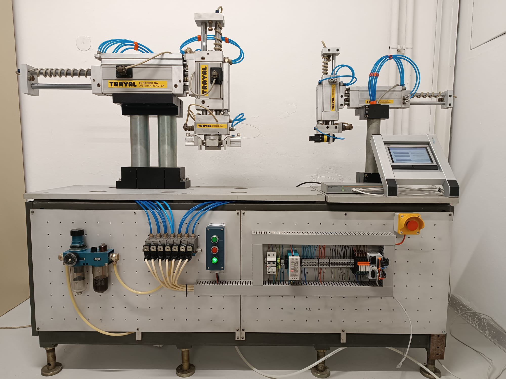

Figure 1: Automated assembly work cell in the workflow: a) 2D representation, b) photo

Within the described cell last but one operation of the assembly of step motor (Figure 2), i.e. joining the Front Endcap to the remaining parts is carried out. In addition to manipulators, VR representation of the cell (Figure 3) contains two linear conveyers that feed unfinished subassemblies/parts and transfer finished subassembly from the cell. Note that the control of the conveyers is not considered in the workflow – it is only used to make the representation more realistic.

At the beginning of the assembly process all linear actuators are retracted, rotary actuator is in the right position and end-effectors are open. During the process, manipulator M1 picks up the subassembly from conveyer (vertical cylinder advances, gripper grips the part, and then vertical cylinder retracts), moves it to the assembly fixture (rotary cylinder rotates for 180° and goes to the left position, horizontal, and subsequently vertical cylinder advance, and gripper releases the part) and retracts to home position (vertical and horizontal cylinder retract, whereas rotary cylinder stays in left position). In the second part of the sequence, manipulator M2 picks up the Front Endcap from the second conveyer (vertical cylinder advances, gripper grips the part, and then vertical cylinder retracts), carries out the assembly (horizontal and afterwards vertical cylinder advance, and gripper releases the part) and retracts to the start position (horizontal and vertical cylinder retract). The last part of the sequence refers to the removal of assembly from the cell. Manipulator M1 takes the finished subassembly from the assembly position (horizontal and vertical cylinders advance, and gripper closes), moves it to the first conveyer (vertical and horizontal cylinders retract, rotary cylinder returns to right position, vertical cylinder advances and gripper releases finished subassembly) and finally returns to the start position (vertical cylinder retracts).

Figure 2: Step motor - product assembled within work cell in the workflow

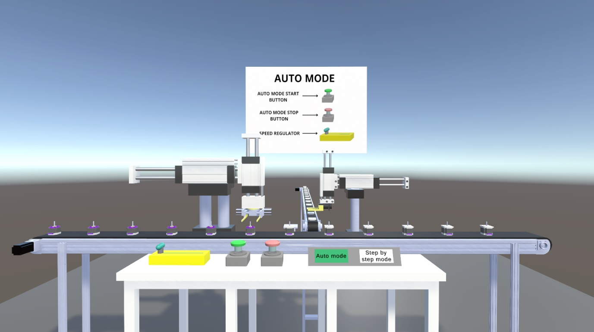

Figure 3: Automatic mode of the workflow

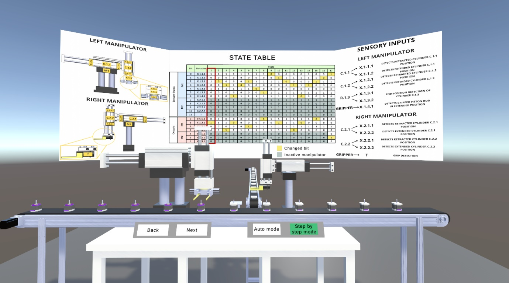

Figure 4: Manual mode of the workflow

Within VR two modes of work-cell operation are created. The first (automatic) mode represents the simulation of work cell and in this mode the described sequence flow repeats in loop. User starts or stops the simulation through switches and can control the speed by slider (Figure 3).

The second (manual) mode goes through states step by step and the transition from one step to the next or previous is carried out using buttons **Next** and **Back** (Figure 4). In this mode in the background of the cell there is a canvas with state table in which current state of the cell is highlighted with red rectangle. When student presses e.g., the button Next, the cell moves to the next state, and the corresponding column in state table in the background is highlighted. The state table contains the sensory and actuator signals presented in Table 2. Since the number of states in state table is large (a total of 47 states), it is split into three state tables – each representing one of three described parts of sequence. In the first and third table, the signals related to manipulator 2 are shaded since in these parts of sequence this manipulator is inactive. The same holds for the second table and manipulator 1

| **Actuator**                         | **Notation** | **Retracted position signal** | **Advanced/closed position signal** | **Actuation signal** |
|--------------------------------------|--------------|-------------------------------|-------------------------------------|----------------------|
| Horizontal cylinder of manipulator 1 | C1.1         | X1.1.1                        | X1.1.2                              | Y1.1.1               |
| Vertical cylinder of manipulator 1   | C1.2         | X1.2.1                        | X1.2.2                              | Y1.2.1               |
| Rotary cylinder of manipulator 1     | C1.3         | X1.3.1                        | X1.3.2                              | Y1.3.1               |
| Gripper of manipulator 1             | C1.4         | \-                            | X1.4.1                              | Y1.4.1               |
| Horizontal cylinder of manipulator 2 | C2.1         | X2.1.1                        | X2.1.2                              | Y2.1.1               |
| Vertical cylinder of manipulator 2   | C2.2         | X2.2.1                        | X2.2.2                              | Y2.2.1               |
| Gripper of manipulator 2             | C2.3         | \-                            | T                                   | Y2.3.1               |

Table 2: Sensory and actuator signals

# 4. Learning Activities

Workflow consists of six learning tasks through which students acquire intended knowledge and learning outcomes. The sequence of tasks along with their inputs and outputs are presented in Figure 5, whereas Table 3 contains the description of tasks and ILOs they contribute to. Task T2.0 is performed both on real-world equipment and in VR, task T3.0 is performed in VR only, task T4.0 is carried out in PLC programming software, whereas tasks T5.0 and T6.0 represent testing of the developed PLC program on real-world work cell.

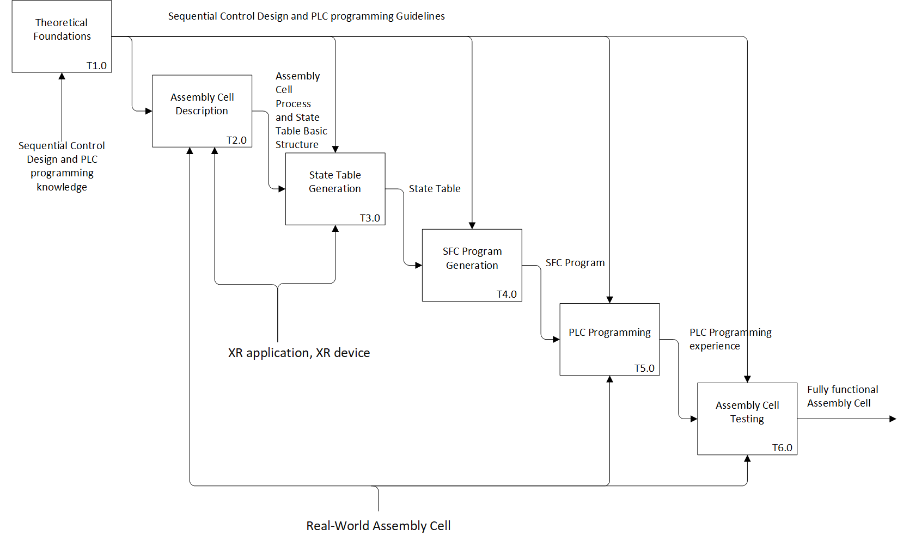

Figure 5: Learning Activities

<table>
<colgroup>
<col style="width: 8%" />
<col style="width: 16%" />
<col style="width: 67%" />
<col style="width: 6%" />
</colgroup>
<thead>
<tr class="header">
<th><strong>Task ID</strong></th>
<th><strong>Task Name</strong></th>
<th><strong>Task Description</strong></th>
<th><strong>ILO</strong></th>
</tr>
</thead>
<tbody>
<tr class="odd">
<td>T1.0</td>
<td>Theoretical Foundations</td>
<td>
• <strong>Description</strong>: Students are introduced to the problem of sequential control system design. The theoretical foundations, i.e., the principles and the methods for generation of sequential systems’ state table and PLC SFC program are presented to students, and in particular:

<ol type="1">
<li>
Sequential systems, unstable and stable states,
</li>
<li>
State table structure and generation,
</li>
<li>
Generation of PLC SFC program based on state table,
</li>
<li>
Downloading program to PLC and operation of real-world system.
</li>
</ol>

• <strong>Output</strong>: Sequential Control System Design Guidelines 
• <strong>Resources</strong>: Sequential Control System Design Knowledge [4], [5], [8]
</td>
<td>
I1

I2

I3

I4
</td>
</tr>
<tr class="even">
<td>T2.0</td>
<td>Assembly Cell Description</td>
<td>
• <strong>Description</strong>: Students are introduced to the assembly cell structure and functioning using real-world cell and its VR replica. In the real-world cell students are introduced to the structure of the cell by moving one by one axis using specially developed interface for jog mode on the machine HMI:

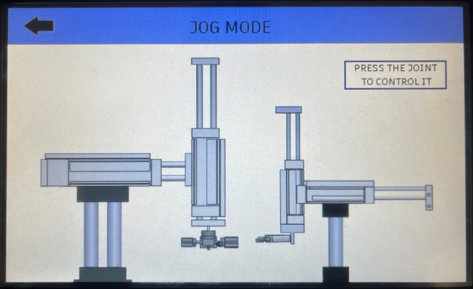

After introduction to the basic structure of the cell, they enter VR where they are introduced to the simulation of assembly process. They thoroughly study the sequence of the manipulators’ axes movement during the process. They can start or stop the simulation using buttons and adjust the speed of simulation using slider.

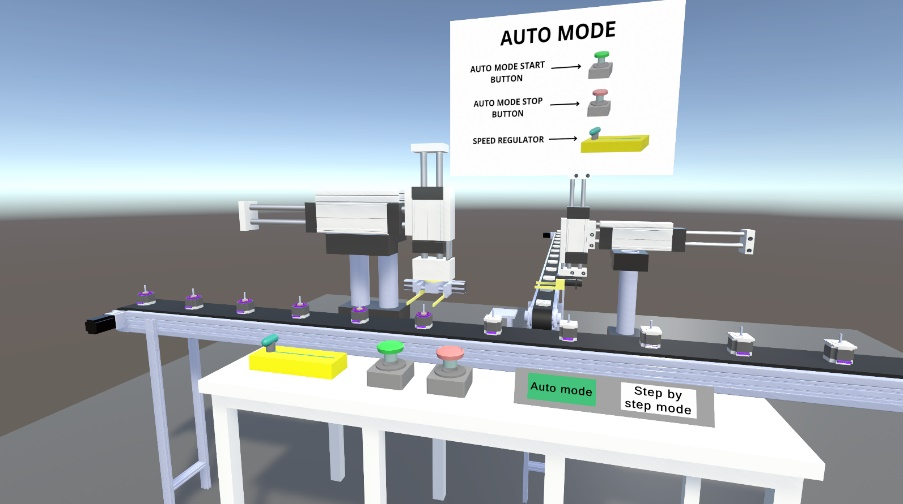

Through virtual experience and adjustment of the process speed students get better insight into the process. Based on the acquired knowledge on the process, they generate the basic structure of the state table that contains sensors and actuators.

<table>
<colgroup>
<col style="width: 31%" />
<col style="width: 13%" />
<col style="width: 13%" />
<col style="width: 13%" />
<col style="width: 13%" />
<col style="width: 13%" />
</colgroup>
<thead>
<tr class="header">
<th rowspan="2">
<strong>Sensor/</strong>

<strong>actuator</strong>
</th>
<th colspan="5"><strong>STATE</strong></th>
</tr>
<tr class="odd">
<th>1</th>
<th>2</th>
<th>3</th>
<th>4</th>
<th>5</th>
</tr>
</thead>
<tbody>
<tr class="odd">
<td>X1.1.1</td>
<td></td>
<td></td>
<td></td>
<td></td>
<td></td>
</tr>
<tr class="even">
<td>X1.1.2</td>
<td></td>
<td></td>
<td></td>
<td></td>
<td></td>
</tr>
<tr class="odd">
<td>X1.2.1</td>
<td></td>
<td></td>
<td></td>
<td></td>
<td></td>
</tr>
<tr class="even">
<td>X1.2.2</td>
<td></td>
<td></td>
<td></td>
<td></td>
<td></td>
</tr>
<tr class="odd">
<td>X1.3.1</td>
<td></td>
<td></td>
<td></td>
<td></td>
<td></td>
</tr>
<tr class="even">
<td>X1.3.2</td>
<td></td>
<td></td>
<td></td>
<td></td>
<td></td>
</tr>
<tr class="odd">
<td>X1.4.1</td>
<td></td>
<td></td>
<td></td>
<td></td>
<td></td>
</tr>
<tr class="even">
<td>X2.1.1</td>
<td></td>
<td></td>
<td></td>
<td></td>
<td></td>
</tr>
<tr class="odd">
<td>X2.1.2</td>
<td></td>
<td></td>
<td></td>
<td></td>
<td></td>
</tr>
<tr class="even">
<td>X2.2.1</td>
<td></td>
<td></td>
<td></td>
<td></td>
<td></td>
</tr>
<tr class="odd">
<td>X2.2.2</td>
<td></td>
<td></td>
<td></td>
<td></td>
<td></td>
</tr>
<tr class="even">
<td>T</td>
<td></td>
<td></td>
<td></td>
<td></td>
<td></td>
</tr>
<tr class="odd">
<td>Y1.1.1</td>
<td></td>
<td></td>
<td></td>
<td></td>
<td></td>
</tr>
<tr class="even">
<td>Y1.2.1</td>
<td></td>
<td></td>
<td></td>
<td></td>
<td></td>
</tr>
<tr class="odd">
<td>Y1.3.1</td>
<td></td>
<td></td>
<td></td>
<td></td>
<td></td>
</tr>
<tr class="even">
<td>Y1.4.1</td>
<td></td>
<td></td>
<td></td>
<td></td>
<td></td>
</tr>
<tr class="odd">
<td>Y2.1.1</td>
<td></td>
<td></td>
<td></td>
<td></td>
<td></td>
</tr>
<tr class="even">
<td>Y2.2.1</td>
<td></td>
<td></td>
<td></td>
<td></td>
<td></td>
</tr>
<tr class="odd">
<td>Y2.3.1</td>
<td></td>
<td></td>
<td></td>
<td></td>
<td></td>
</tr>
</tbody>
</table>

This is the first task in which students enter VR and through this task they are also introduced to the basic principles of its functioning.

• <strong>Output</strong>: Familiarity with the sequence of tasks and state table basic structure 
• <strong>Input</strong>: Sequential Control System Design Guidelines 
• <strong>Resources</strong>: XR application, XR device, real-world equipment
</td>
<td>
I1

I2

I3
</td>
</tr>
<tr class="odd">
<td>T3.0</td>
<td>State Table Generation</td>
<td>
• <strong>Description</strong>: Based on the experiments from T2.0, students generate the first seven states that correspond to manipulator M1 picking up the subassembly from conveyer (vertical cylinder advances, gripper grips the part, vertical cylinder retracts, and rotary cylinder rotates) in sequence table. Afterwards, they enter VR where the whole state table is presented. They move through the system state by state and see the whole state table. They are also able to check the first part of the state table that they generated themselves.

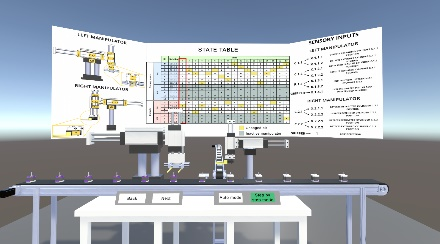 

 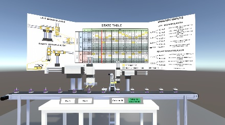

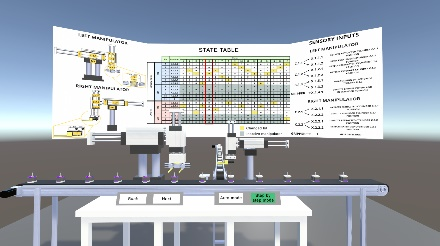 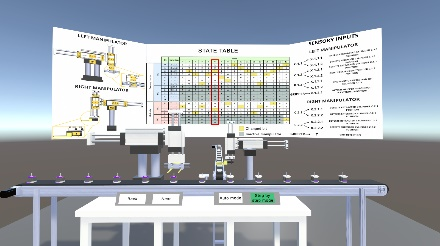

• <strong>Output</strong>: State table 
• <strong>Input</strong>: Familiarity with the sequence of tasks and state table basic structure 
• <strong>Controls</strong>: Sequential Control Design and PLC programming guidelines

• <strong>Resources</strong>: VR application, VR device
</td>
<td>
I3

I6
</td>
</tr>
<tr class="even">
<td>T4.0</td>
<td>SFC program Generation</td>
<td>
• <strong>Description</strong>: For the first seven states in state table (these states correspond to manipulator M1 picking up the subassembly from conveyer and rotation of part) students generate the SFC program in the proprietary software.

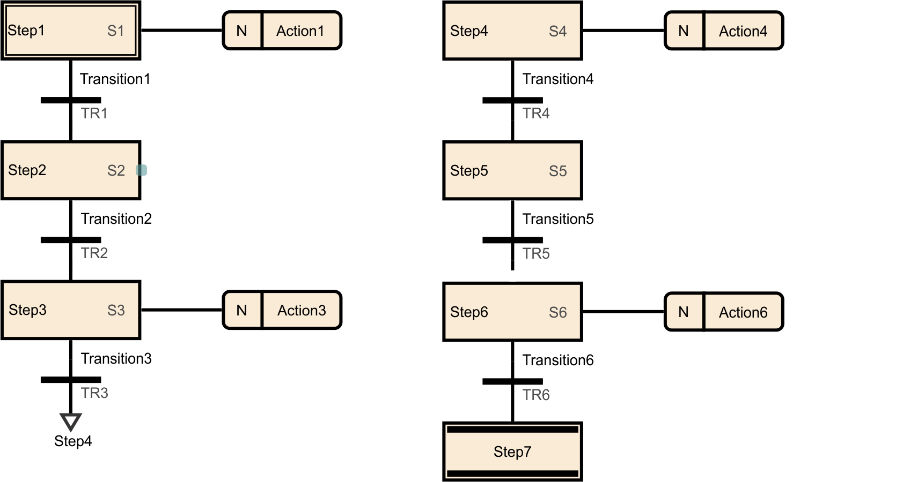

The generated program will be used in task T5.0.

• <strong>Output</strong>: SFC program 
• <strong>Input</strong>: State table 
• <strong>Controls</strong>: Sequential Control Design and PLC programming guidelines 
• <strong>Resource</strong>: PLC programming software
</td>
<td>I4</td>
</tr>
<tr class="odd">
<td>T5.0</td>
<td>PLC Programming</td>
<td>
• <strong>Description</strong>: Students approach the machine where they are introduced to the control system hardware. They download the SFC program generated in T4.0 to the PLC:

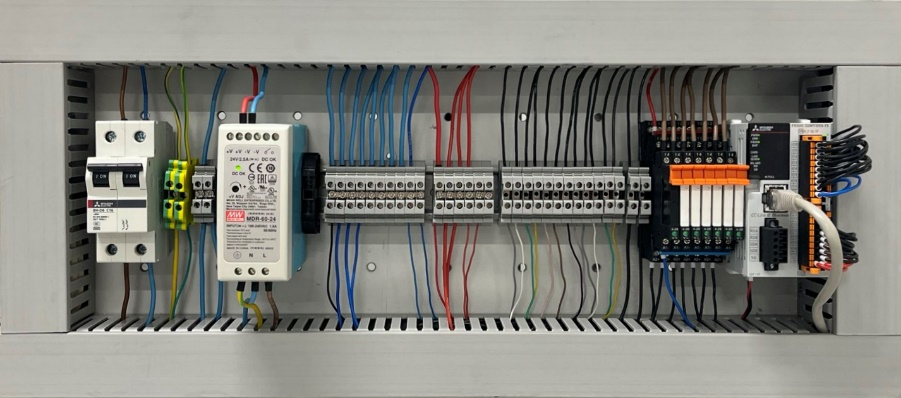

They check if the machine functions as expected. If not, they go back to tasks T2.0 to T4.0 to find the reason for malfunctioning.

• <strong>Output</strong>: PLC programming experience 
• <strong>Input</strong>: SFC Program 
• <strong>Controls</strong>: Sequential Control Design and PLC programming guidelines 
• <strong>Resource</strong>: Real-world assembly cell
</td>
<td>
I5

I6
</td>
</tr>
<tr class="even">
<td>T6.0</td>
<td>Assembly Cell Testing</td>
<td>
• <strong>Description</strong>: In this task, students are introduced to the SFC program that represents the control system for the whole assembly sequence (all 47 states). They program the real-world cell and test its performance.

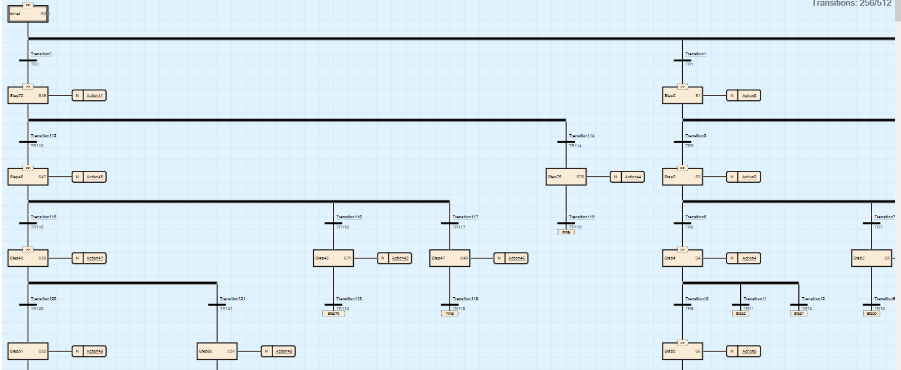

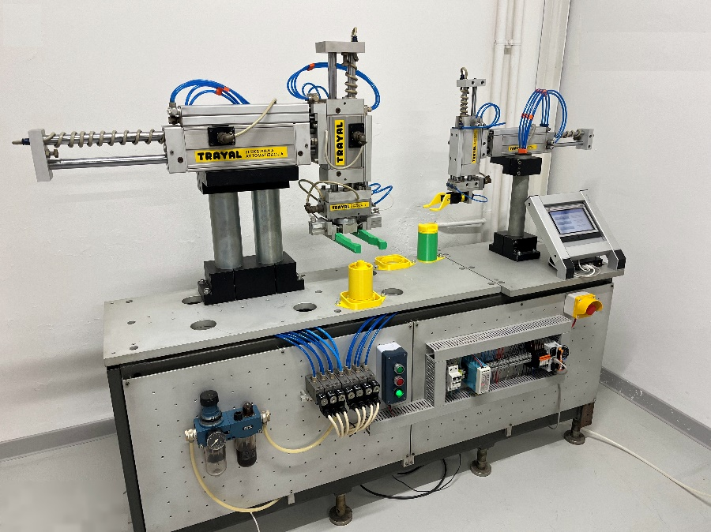

• <strong>Output</strong>: Fully functional assembly cell 
• <strong>Input</strong>: PLC programming experience 
• <strong>Controls</strong>: Sequential Control Design and PLC programming guidelines 
• <strong>Resource</strong>: Real-world assembly cell and SFC program
</td>
<td>
I3

I4

I5

I6
</td>
</tr>
</tbody>
</table>

Table 3: Sequential Control System Synthesis Design Workflow

# 5. Technology

During the development of the workflow the following technologies were utilized:

- Unity3D v6000.0.3f1 as a Virtual Reality (VR) development platform;

- SolidWorks for the generation of work cell 3D CAD model – the model was exported to neutral glTF format, which is lightweight, suitable for real-time rendering and keeps information regarding textures and reflective properties of surfaces assigned in 3D model;

- C# for the development of the following automatic functionalities:

  - Movement of the work cell elements during automatic mode of operation based on the defined sequence;

  - Movement of the work cell elements during step-by-step mode of operation based on the defined sequence;

  - Control of direction of motion during step-by-step mode of operation using Next and Back buttons;

  - Setting the velocity of motion using slider during automatic mode of operation;

  - User interface for the selection of operation mode;

  - Highlighting the current step in state table on canvas during step-by-step mode of operation.

- Oculus Rift S Virtual Reality device including headset with cameras and audio devices, as well as two hand controllers for providing students with immersive and interactive experience (Figure 6).

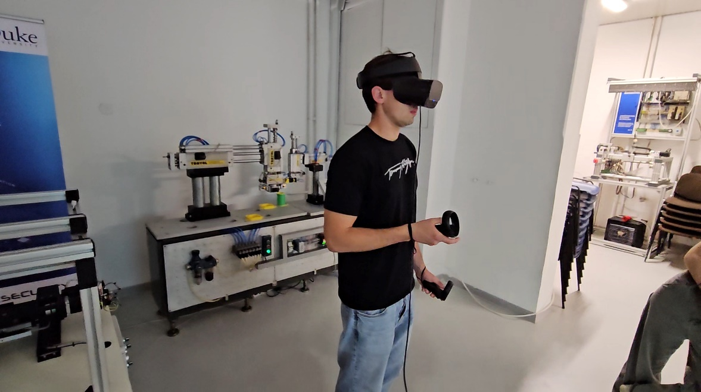 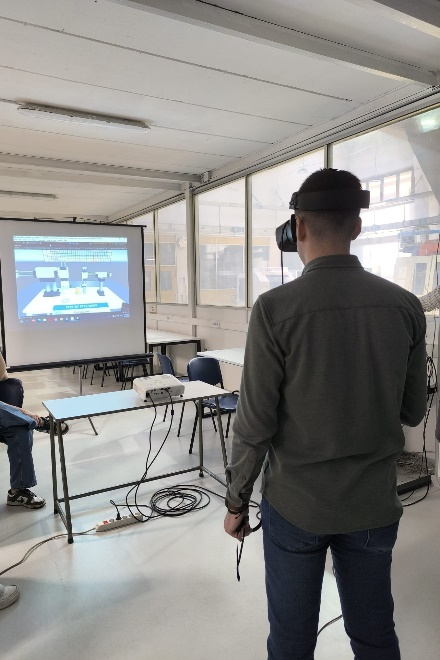

Figure 6: VR device – Oculus Rift S

# 6. User Experience

Based on the students’ survey conducted, the presented VR-based workflow is an excellent addition to learning the synthesis of sequential control systems design. In particular, when compared to traditional teaching approaches, it in an effective way reveals the complexity of real-world industrial systems, as it enables simultaneous representation of complex work cell functioning and corresponding state table.

The workflow provides students with several interactive elements to enhance their understanding of the subject and to contribute to learning outcomes:

**1. Deeper understanding of sequential systems**

In real-world electro-pneumatic systems, the velocity of actuators is, as a rule, very high, and when the length of trajectory is low, the elements can move so fast that it makes it practically impossible to see how the sensory signals change. On the other hand, students can control the speed of work cell elements in automatic mode in the presented virtual environment. This enables them to have clear insight into the motion of the system. Furthermore, in the VR students can move the system step by step forward and backward with simultaneous representation of state table containing the current values of sensory and actuation systems. This significantly improves their understanding of:

- The influence of actuators motion to the changes in sensory signals,

- The influence of the changes in sensory signals to the changes in actuation

as the basis for generation of state table which represents the foundation of sequential control system synthesis.

**2. Capability to implement sequential control in industrial setting**

Presented workflow significantly improves students’ confidence that they are capable of synthesizing and implementing sequential control systems in real industrial practice. Namely, opposite to examples used in traditional teaching methods, the workflow contains complex industrial work cell. Using the workflow, students:

- Generate SGC program for a part of work cell sequence,

- Implement this program in PLC,

- Have insight in the SFC program and its implementation in PLC for the whole work cycle of the work cell.

Through the comparison of the programs they generated themselves and programs for the whole cycle, students can clearly see that the difference between these programs is mainly in length and that the knowledge they obtained is relevant for their future practice.

**3. Easier Self-Evaluation**

Critical and self-critical thinking represent significant outcomes of engineering education. An important part of the workflow in this context are the elements for self-evaluation of students’ work and in particular for:

- State table generation,

- SFC program generation.

# References

1.  Abdelhameed, M.M. and Tolbah, F.A., 2002. A recurrent neural network-based sequential controller for manufacturing automated systems. Mechatronics, 12(4), pp.617-633.

2.  Huffman, D.A., 1954. The synthesis of sequential switching circuits Part 2. Journal of the franklin Institute, 257(4), pp.275-303.

3.  Huffman, D.A., 1954. The synthesis of sequential switching circuits Part 1. Journal of the franklin Institute, 257(3), pp.161-190.

4.  Jakovljevic, Z., 2015. Manufacturing Automation, lectures handouts, University of Belgrade – Faculty of Mechanical Engineering (In Serbian)

5.  Kohavi, Z., Hamming, R. W. and Feigenbaum, E. A., 1986. Switching and finite automata theory, 2nd ed. New York: McGraw-Hill;

6.  Lee, G.B., Zandong, H. and Lee, J.S., 2004. Automatic generation of ladder diagram with control Petri net. Journal of Intelligent Manufacturing, 15(2), pp.245-252.

7.  Lee, J.S. and Hsu, P.L., 2005. A systematic approach for the sequence controller design in manufacturing systems. The International Journal of Advanced Manufacturing Technology, 25(7), pp.754-760.

8.  Pilipovic, M. and Jakovljevic, Z., 2026. Manufacturing Automation, 2nd ed. University of Belgrade – Faculty of Mechanical Engineering (In Serbian)
