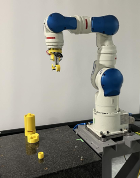
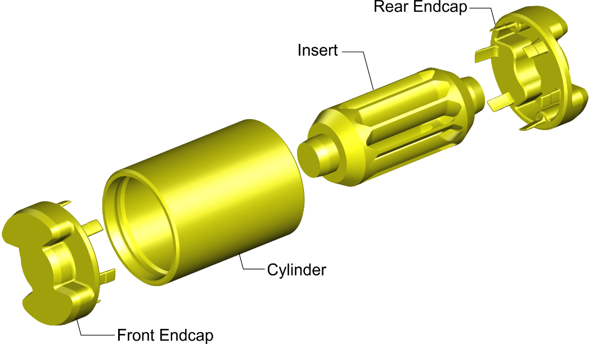
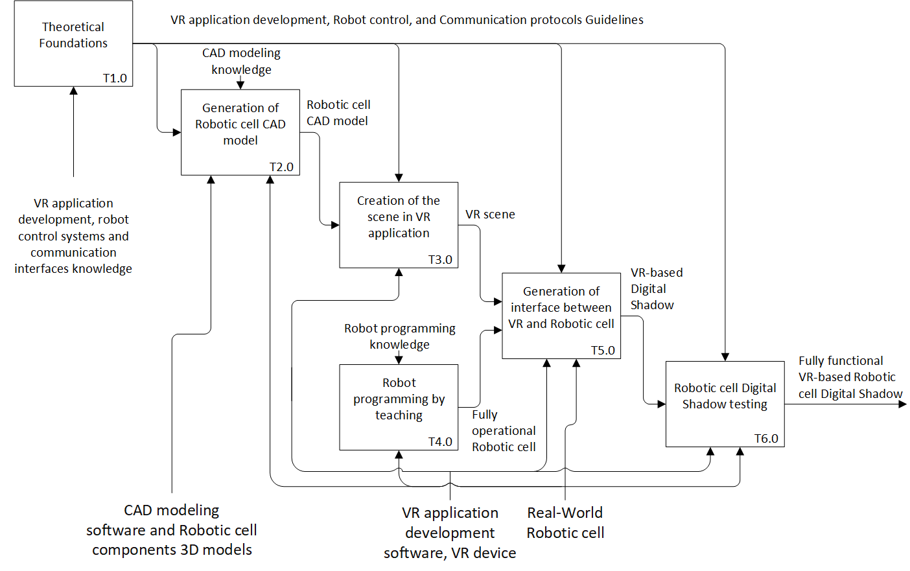
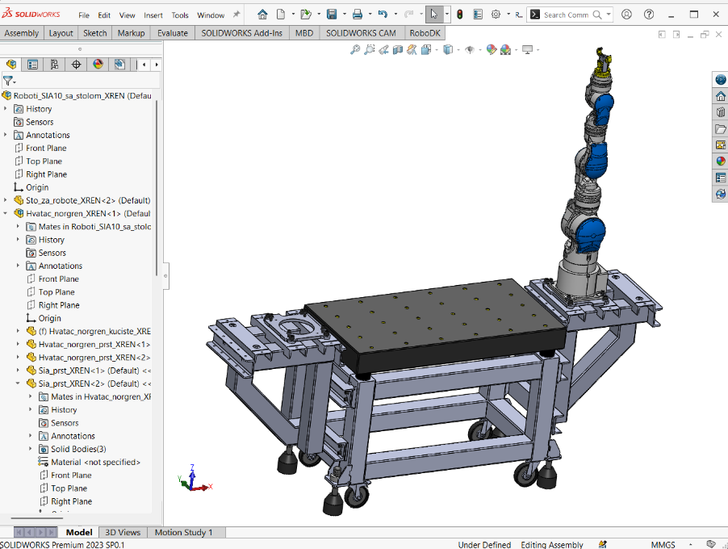
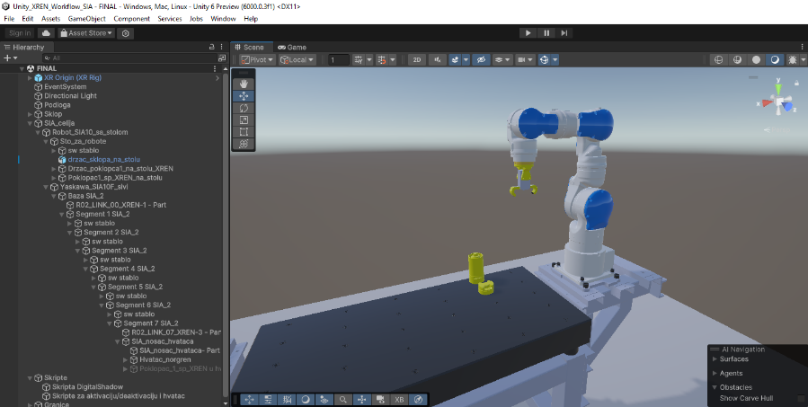
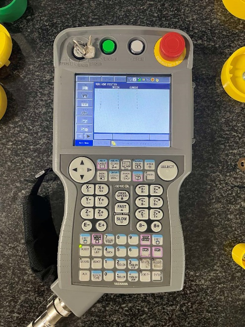
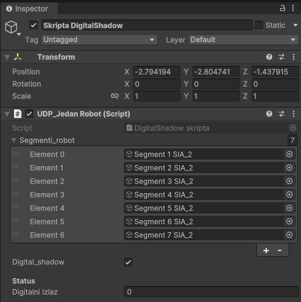
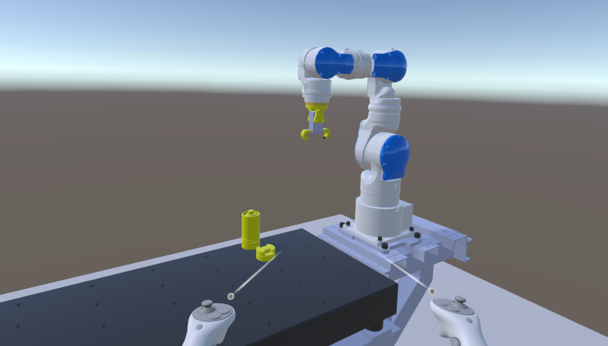
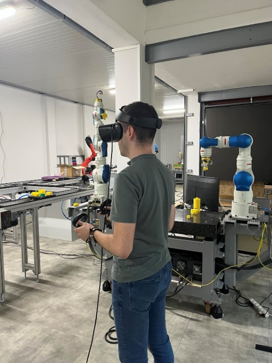

{:.no_toc}

  

    Table of contents
  

  {: .text-delta }
- TOC
{:toc}

# Generation of Robotic Cell Digital Shadow
{:.no_toc}

Digital twins and shadows represent one of the key enablers for the digital transformation in manufacturing systems aligned with the Industry 4.0 principles \[1\]. Using digital shadows, manufacturing data are collected from real world systems and mirrored in their digital models through unidirectional data flow between real-world systems and their digital representation \[1, 2, 3\]. They are based on several enabling technologies \[2, 4\], among which Internet of Things (IoT) and Extended Reality (XR) can be singled out. In this respect, IoT represents a basis for data acquisition, whereas XR, through digital replicas of real-world objects, provides immersive experience to users.

Building digital shadows of manufacturing equipment requires the education of experts in this area. Considering the necessity of domain specific knowledge, it would be beneficial that future mechanical/manufacturing engineers, simultaneously with designing the manufacturing equipment, are capable to generate their digital shadows. This requires competencies in several fields, including modeling of equipment, creation and understanding of its control systems, i.e., underlying operational technologies, acquisition of data from the equipment using different communication protocols within IoT framework, and XR technologies. Whereas mechanical/manufacturing engineering higher education curricula readily cover topics related to generation of various digital models of manufacturing equipment and systems, as well as their control, the topics related to XR and IoT technologies, and generation of digital shadows are not frequently met.

This workflow represents support for teaching and learning of digital shadow creation and can be integrated into courses covering this topic. Through the presented workflow students develop a digital shadow of a robotic assembly cell. It is assumed that students are proficient in CAD modelling and programming of robots by teaching, whereas through this workflow the skills and competencies in XR and IoT based data acquisition are obtained. In particular, through this workflow students generate Virtual Reality (VR) representation of the robotic cell and the interface between robot controller and robotic-cell digital replica.

## 1. Learning Objectives

The objectives of workflow are to develop in students the following knowledge:

1.  **Factual Knowledge**

    1.  UDP-based communication in Client-Server configuration (connectionless datagram type socket);

    2.  Recalling robot programming by teaching;

    3.  Development of VR-based digital shadow of manufacturing systems.

2.  **Conceptual Knowledge**

    1.  Communication between digital shadows and controllers;

    2.  Relation between robot and gripper motion and changes in robot controller registries containing encoder and digital output data;

    3.  Relation between robot programmed motion and changes in robot controller registries;

3.  **Procedural Knowledge**

<!-- -->

1.  Acquisition of data from controllers using UDP socket;

2.  Procedure for creation manufacturing system digital shadow in VR;

3.  Applying VR programming tools for unidirectional communication with a robot controller.

<!-- -->

4.  **Metacognitive Knowledge**

    1.  Understanding the complexity of manufacturing systems digital shadows generation;

    2.  Self-evaluate the understanding of methods for generation of robotic cell VR-based digital shadow.

The listed knowledge is related to the specific Intended Learning Outcomes (ILOs) that are listed in Table 1.

| **ILO** | **Knowledge Type**                | **ILO Description**                                                                                            |
|---------|-----------------------------------|----------------------------------------------------------------------------------------------------------------|
| I1      | 1.3, 3.2, 4.1                     | Capability to generate VR representation of manufacturing systems                                              |
| I2      | 1.2, 1.3. 2.3                     | Capability to program robot by teaching                                                                        |
| I3      | 1.1, 2.1, 2.2, 3.1, 3.2, 3.3, 4.1 | Capability to carry out data acquisition using communication protocols within IoT framework                    |
| I4      | 1.3, 2.1, 2.2, 2.3, 3.1, 3.2, 3.3 | Capability to generate VR-based digital shadow of manufacturing systems                                        |
| I5      | 1.1, 1.2, 1.3, 2.2, 2.3, 3.1, 4.1 | Understanding the relationship between robot programs, robot motion and changes in robot controller registries |
| I6      | 3.3, 4.1, 4.2                     | Capability to self-evaluate their own learning achievements                                                    |

Table 1: ILOs with associated knowledge

## 2. Use Case

The workflow is applied to develop a digital shadow of a [robotic cell](../UseCases/U09_roboticcell) (Figure 1)  that carries out the last operation of assembly of a simple product, i.e. joining the Front Endcap to the remaining parts (Figure 2). 

Figure 1: The robotic cell whose digital shadow is created in the workflow

Figure 2: Product assembled within robotic cell in the workflow

## 3. Learning Activities

Workflow consists of six learning tasks through which students acquire intended knowledge and learning outcomes. The sequence of tasks along with their inputs and outputs is presented in Figure 3, whereas Table 2 contains the description of tasks and ILOs they contribute to. Task T2.0 is performed in CAD modelling software, task T3.0 in VR only, task T4.0 on the real-world robotic cell, whereas tasks T5.0 and T6.0 require both - the real-world robotic cell and its VR representation.

Figure 3: Learning Activities

<table>
<colgroup>
<col style="width: 8%" />
<col style="width: 16%" />
<col style="width: 67%" />
<col style="width: 6%" />
</colgroup>
<thead>
<tr class="header">
<th><strong>Task ID</strong></th>
<th><strong>Task Name</strong></th>
<th><strong>Task Description</strong></th>
<th><strong>ILO</strong></th>
</tr>
</thead>
<tbody>
<tr class="odd">
<td>T1.0</td>
<td>Theoretical foundations</td>
<td>
• <strong>Description</strong>: Students are introduced to the underling theoretical foundations, methods and principles. In particular, the following topics are covered:

<ol type="1">
<li>
Digital shadows and their role in the digitalized manufacturing within Industry 4.0 framework;
</li>
<li>
The principles and the methods for generation of mechanical systems models in Virtual Reality including the development of C# applications within the selected VR software – <em>Unity</em>;
</li>
<li>
Industrial communication protocols with emphasis on TCP and UDP protocols;
</li>
<li>
Robot control system including pose and digital I/O information storing.
</li>
</ol>

Furthermore, students are recalled robot programming by teaching.

• <strong>Output</strong>: VR application development, Robot control and Communication protocols guidelines 
• <strong>Resources</strong>: VR application development, robot programming, robot control systems and communication interfaces knowledge [5, 6, 7, 8]
</td>
<td>
I1

I2

I5
</td>
</tr>
<tr class="even">
<td>T2.0</td>
<td>Generation of robotic cell CAD model</td>
<td>
• <strong>Description</strong>: Students generate the 3D model of robotic cell. They are introduced to robotic cell structure and functioning. For these purposes the real-world cell can be used. They are also provided with 3D CAD models of cell components if available.

Students enter CAD software (<em>Solid Works</em>) and create the 3D model of robotic cell. They assign texture, color and spectral characteristics to components to assure their photorealistic presentation downstream.

To preserve spectral characteristics, students export the robotic cell CAD model in glTF (Graphics Library Transmission Format) format for utilization in VR.

• <strong>Output</strong>: Robotic cell CAD model 
• <strong>Controls</strong>: CAD modeling knowledge 
• <strong>Resources</strong>: CAD modeling software, robotic cell components 3D models (optional), real-world robotic cell (optional)
</td>
<td>I1</td>
</tr>
<tr class="odd">
<td>T3.0</td>
<td>Creation of the scene in VR application</td>
<td>
• <strong>Description</strong>: Students enter VR application development software (<em>Unity</em>) and generate a scene that contains the robotic cell. Particular attention should be paid to adequately organize robot’s segments using parent/child relationships to enable appropriate movement of axes downstream.

• <strong>Output</strong>: VR scene 
• <strong>Input</strong>: Robotic cell 3D model 
• <strong>Controls</strong>: VR application development guidelines

• <strong>Resources</strong>: VR application development software, VR device
</td>
<td>I1</td>
</tr>
<tr class="even">
<td>T4.0</td>
<td>Robot programming by teaching</td>
<td>
• <strong>Description</strong>: Students are introduced to the structure and operation of the real-world robotic cell, and they program its functioning using robot programming pendant.

• <strong>Output</strong>: Fully operational robotic cell 
• <strong>Controls</strong>: Robot programming knowledge 
• <strong>Resource</strong>: Real-world robotic cell
</td>
<td>I2 I5</td>
</tr>
<tr class="odd">
<td>T5.0</td>
<td>Generation of interface between VR and robotic cell</td>
<td>
• <strong>Description</strong>: Students enter VR application development software and generated VR scene that contains robotic cell and develop C# scripts for unidirectional communication between robot controller and VR application, as well as for motion of robotic cell elements based on the received data. The communication is based on UDP protocol and utilizes <em>MotoPlus</em> <em>TCP/IP socket</em> library. In particular the following <em>MotoPlus</em> processes are used:

MpReadIO and MpGetFBPulsePos

and they are implemented using the functions ReadIO and GetFBPulsePos that are called from C# script using codes 2 and 17:

//===========================================

// Pulses reading

//===========================================

private async Task&lt;Int32[]&gt; Impulsi_iz_FS100()

{

try

{

string komanda = "cmd=17;a1=0;a2=1;";

byte[] sendBytes = Encoding.ASCII.GetBytes(komanda);

await udp.SendAsync(sendBytes, sendBytes.Length);

string txt = "";

do

{

var odgovor = await udp.ReceiveAsync();

txt = Encoding.ASCII.GetString(odgovor.Buffer);

} while (txt.Contains("10012="));

Int32[] impulsi = txt

.Split(';')

.Where(s =&gt; !string.IsNullOrWhiteSpace(s))

.Select(Int32.Parse)

.ToArray();

return impulsi;

}

catch (Exception ex)

{

Debug.LogError("Error in pulse reading: " + ex.Message);

return null;

}

}

//===========================================

// Digital Output reading

//===========================================

private async Task&lt;int&gt; ProcitajDigitalniIzlaz()

{

try

{

string komanda = "cmd=2;a1=1;a2=3;a3=1;";

byte[] sendBytes = Encoding.ASCII.GetBytes(komanda);

await udp.SendAsync(sendBytes, sendBytes.Length);

string txt = "";

do

{

var odgovor = await udp.ReceiveAsync();

txt = Encoding.ASCII.GetString(odgovor.Buffer);

} while (!txt.Contains("10012="));

int indeks = txt.IndexOf('=');

if (indeks &gt;= 0)

{

string vrijednost = txt.Substring(indeks + 1).Trim();

Debug.Log(vrijednost);

if (int.TryParse(vrijednost, out int stanje))

{

return stanje;

}

}

return 0;

}

catch (Exception ex)

{

Debug.LogError("Error in DigitalIO reading: " + ex.Message);

return 0;

}

}

Based on the data received from robot controller registers, students include into C# scripts code lines for robotic cell motion including robot axes movement, opening/closing of gripper and movement of parts during assembly process. These code lines require the definition of robots’ joints in <em>Unity Inspector</em>.

• <strong>Output</strong>: VR-based digital shadow of robotic cell 
• <strong>Input</strong>: VR scene, Fully operational robotic cell 
• <strong>Controls</strong>: VR application development, Robot control, and Communication protocols Guidelines 
• <strong>Resources</strong>: VR application development software, VR device, Real-world assembly cell
</td>
<td>
I3

I4

I5
</td>
</tr>
<tr class="even">
<td>T6.0</td>
<td>Robotic cell digital shadow testing</td>
<td>
• <strong>Description</strong>: Students immerse the developed VR-based digital shadow of the robotic cell and test its performance. They evaluate if the performance of the digital shadow is in accordance with real-world cell functioning and return to previous tasks to make corrections if necessary.

• <strong>Output</strong>: Fully functional VR-based robotic cell digital shadow 
• <strong>Input</strong>: VR-based digital shadow 
• <strong>Controls</strong>: VR application development, Robot control, and Communication protocols Guidelines 
• <strong>Resources</strong>: VR application development software, VR device, Real-world assembly cell
</td>
<td>
I3

I4

I5

I6
</td>
</tr>
</tbody>
</table>

Table 2: Workflow for the generation of Robotic cell Digital Shadow

## 4. Technology

During the development of the workflow the following technologies are utilized:

- Robotic assembly cell based on SIA10F robot controlled by FS100 robot controller;

- *MotoPlus* Yaskawa software solution;

- *Unity3D* v6000.0.3f1 as a Virtual Reality (VR) development platform;

- *SolidWorks* for the generation of work cell 3D CAD model – the model was exported to neutral glTF format, which is lightweight, suitable for real-time rendering and keeps information regarding textures and reflective properties of surfaces assigned in 3D model;

- C# for the development of the following functionalities:

  - Acquisition of pose and digital output data from robot controller using UDP;

  - Movement of robotic work cell elements;

- *Oculus Rift S* Virtual Reality device including headset with cameras and audio devices, as well as two hand controllers for providing students with immersive and interactive experience (Figure 4).

Figure 4: VR device – Oculus Rift S

## 5. User Experience

Using the presented workflow students can develop competencies in digital shadow generation in an attractive way. In addition to mastering digital shadow generation, they simultaneously develop skills in IoT and VR as cutting-edge technologies. Furthermore, they recall the programming of robots by teaching and this workflow represents an excellent addition to learning robot programming.

The workflow enhances students’ understanding of the subject and contributes to the following learning outcomes:

**1. Generation of manufacturing systems VR representation**

Using the presented workflow students master the creation of manufacturing systems VR representation. The simultaneous motion of real-world robotic cell and its VR-based replica significantly improves the students’ understanding of relation between motion of elements in VR and their real-world counterparts. Namely, through the development of digital shadow students can directly correlate the commanded motion in robot controller with the commanded motion in VR.

**2. Deeper understanding of IoT in industrial applications**

Within the workflow students utilize industrial internet of things to connect the PC running the VR-based digital shadow and real-world robot controller. They gain indispensable hands-on experience in establishing communication through UDP/IP protocol. In addition to mastering this protocol, students get experience with service-based client/server architecture that is frequently met in industrial applications and understand better the underling theoretical concepts. Finaly, they obtain skills related to preparing and parsing data streams.

**3. Generation of manufacturing systems digital shadow**

Through combination of VR and IoT tools, students get skilled in generation of manufacturing systems’ digital shadow. Although the workflow includes communication with only one controller, students can extrapolate this knowledge to multiple controllers through connection to different devices using the network layer of TCP/IP model.

**4. Easier Self-Evaluation**

Critical and self-critical thinking represent significant outcomes of engineering education. An important part of the workflow in this context represents the self-evaluation of the developed digital shadow - through immersion into VR students can test the correctness of the VR-based digital shadow and spot errors if they exist.

# References

1.  Kritzinger W, Karner M, Traar G, Henjes J, Sihn W, *Digital Twin in manufacturing: A categorical literature review and classification*, IFAC-PapersOnLine, Vol. 51, No. 11, pp. 1016-1022, 2018

2.  Attaran M, Celik B. G, *Digital Twin: Benefits, use cases, challenges, and opportunities*, Decision Analytics Journal, Vol. 6, art. no. 100165, 2023

3.  Brecher C, Dalibor M, Rumpe B, Schilling K, Wortmann A, *An Ecosystem for Digital Shadows in Manufacturing*, Procedia CIRP, Vol. 104, pp. 833-838, 2021

4.  Javaid M, Haleem A, Suman R, *Digital Twin applications toward Industry 4.0: A Review*, Cognitive Robotics, Vol. 3, pp. 71-92, 2023
