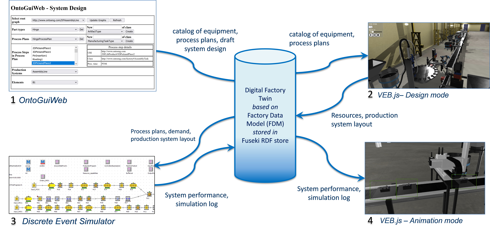

{:.no_toc}

  

    Table of contents
  

  {: .text-delta }
- TOC
{:toc}

# Design and Analysis of Manufacturing Systems
{:.no_toc}

The guidelines outlined in the previous sections can be applied to the design and analysis of manufacturing systems. This process typically presents a complex engineering challenge, requiring multidisciplinary expertise to meet production objectives. Manufacturing systems comprise production resources with distinct functionalities and capabilities, which are defined by their characteristics. However, how these resources are integrated also significantly affects the overall system capabilities. The design of manufacturing systems is guided by key performance indicators (KPIs), which necessitate specific methodologies and tools for accurate evaluation.

## 1. Learning Objectives

Taking as a reference the taxonomy proposed by Anderson et al. (see Sect.3.1), the types of knowledge that are relevant for manufacturing system design and analysis can be instantiated as follows:

1.  **Factual Knowledge**

    1.  *Knowledge of terminology*: Ability to recognize and differentiate between various types of equipment. 

    2.  *Knowledge of specific details and elements*: Ability to identify the properties of objects.

2.  **Conceptual Knowledge**

    1.  *Knowledge of classifications and categories*: Ability to classify equipment based on its function, such as production resources, transportation resources, or buffers.

    2.  *Knowledge of principles and generalizations*: Ability to comprehend the movement of parts within manufacturing cells in the virtual environment.

    3.  *Knowledge of theories, models, and structures*: Ability to recognize different types of manufacturing system architectures, such as flow shop, job shop, and others.

3.  **Procedural Knowledge**

    1.  *Knowledge of subject-specific skills and algorithms*: Ability to apply performance evaluation techniques (e.g., discrete event simulation) to model and assess the performance of a manufacturing system.

    2.  *Knowledge of subject-specific techniques and methods*: 1) Ability to analyze manufacturing system behavior and evaluate functional parameters. 2) Ability to develop a performance evaluation model based on the conceptual model of the manufacturing system.

    3.  *Knowledge of criteria for determining when to use appropriate procedures*: Ability to formulate accurate hypotheses and generate a conceptual model of the manufacturing system being studied.

4.  **D. Metacognitive Knowledge**

    1.  *Self-knowledge*: Ability to evaluate one's own confidence in responses to questions or solutions to exercises.

Table 1 reports the specific ILOs with the associated type of knowledge.

| **ILO** | **Knowledge type** | **ILO description**                                                                                                                                                  |
|---------|--------------------|----------------------------------------------------------------------------------------------------------------------------------------------------------------------|
| I1      | 1.1                | Identify different types of equipment.                                                                                                                               |
| I2      | 1.1                | Identify the product undergoing the manufacturing process and its components.                                                                                        |
| I3      | 1.2                | Identify the attributes of an object in the virtual environment.                                                                                                     |
| I4      | 2.1                | Classify the pieces of equipment according to their class.                                                                                                           |
| I5      | 2.2                | Identify the flow of parts within the manufacturing system in the virtual environment.                                                                               |
| I6      | 2.3                | Identify the type of manufacturing system architecture.                                                                                                              |
| I7      | 3.2.1              | Analyse the behaviour of manufacturing systems and assess functional parameters.                                                                                     |
| I8      | 3.3                | Make proper hypotheses and generate a conceptual model of the manufacturing system under study.                                                                      |
| I9      | 3.2.2              | Develop a performance evaluation model based on a conceptual model of the manufacturing system.                                                                      |
| I10     | 3.1                | Evaluate the performance of a manufacturing system.                                                                                                                  |
| I11     | 4.1                | Self-assess the replies. Students will be asked to provide an estimation of the confidence they have with respect to their replies and numerical solutions provided. |

Table 1: ILOs with associated knowledge type 

## 2. Use Case

The learning workflow was applied to an industrial case involving an [assembly line](../UseCases/U04_assemblyline) that produces self-closing concealed cabinet hinges. The assembly line includes 19 workstations, each performing specific tasks (e.g., pick and place, screw tightening, riveting) to assemble the components of the self-closing concealed cabinet hinge. These components are shown in Figure 5.

Figure 5: Hinge components

## 3. Learning Activities

The learning activities are organized into three levels of increasing difficulty: 1) What a factory is made of; 2) How a factory works; 3) Performance of a factory.

Each level consists of tasks associated with specifics ILOs as reported in Table 2.

| **Task ID** | **Task name**                   | **Task description**                                                                                                                                                                                                         | **ILO** |
|-------------|---------------------------------|------------------------------------------------------------------------------------------------------------------------------------------------------------------------------------------------------------------------------|---------|
| T1.1        | Count the equipment pieces      | Players are tasked with counting the number of instances of a specific type of equipment shown in an image (e.g., conveyor, robot, or rotary table) along with related details like its name, classification, and functions. | I1      |
| T1.2        | Search for equipment            | The challenge asks players to verify if at least one instance of a particular equipment exists in the environment, simplifying the task from Challenge 1.1 while focusing on the same learning objective.                    | I1      |
| T1.3        | Identify objects in the factory | Players are shown a factory view and provided with a set of labels, which they must drag and drop onto the correct equipment.                                                                                                | I1      |
| T1.4        | Report object properties        | Players must identify and report specific properties of an object or compute a derived measure, such as the distance between two stations. The properties are accessible through the user interface.                         | I3      |
| T2.1        | Identify processed parts        | Players must recognize the type of part being processed in the system, and if it's an assembly, identify the components involved.                                                                                            | I2      |
| T2.2        | Classify factory objects        | Participants classify objects in the factory by interacting with parts and choosing from a set of options like buffering, transporting, or processing.                                                                       | I4      |
| T2.3        | Trace part routing              | Players are required to determine the movement of parts within the system (e.g. tracking the stations that a part passes through).                                                                                           | I5      |
| T2.4        | Locate assembly points          | Participants must find where a part and a component are combined in the system.                                                                                                                                              | I2, I5  |
| T2.5        | Identify system architecture    | Players must identify the type of manufacturing system architecture, such as flow shop or job shop.                                                                                                                          | I6      |
| T2.6        | List workstations               | Participants must provide a list of the workstations involved in the manufacturing process.                                                                                                                                  | I5, I6  |
| T3.1        | Estimate processing times       | Players need to estimate the processing time for a station by either observing an animation or analyzing additional data, like log files.                                                                                    | I7      |
| T3.2        | Estimate failure metrics        | Participants analyze data (such as log files) to estimate failure-related metrics like Mean Time to Failure (MTTF) and Mean Time to Repair (MTTR) for a workstation.                                                         | I7      |
| T3.3        | Validate hypotheses             | Players are given a hypothesis, which they must verify as either true or false.                                                                                                                                              | I8      |
| T3.4        | Choose appropriate methods      | Participants select from a set of suggested tools or methods that are applicable to the system being studied.                                                                                                                | I8      |
| T3.5        | Estimate model parameters       | Based on the selected method, players estimate various model parameters, such as the number of servers in a queue, buffer size, or routing probabilities.                                                                    | I9      |
| T3.6        | Evaluate performance            | Using a selected tool or method, players assess the system's performance and make conclusions, such as determining maximum daily output or the required buffer capacity to meet demand.                                      | I10     |
| TS          | Self-assess answers             | Players assess their confidence in the correctness of their responses to the given questions.                                                                                                                                | I11     |

Table 2: Tasks of learning activities with related ILO

## 4. Technology

A digital twin of the assembly line has been developed to support research and teaching activities. Digital resources are [available online](../UseCases/U04_assemblyline#online-resources), including the 3D models of the assets in gLFT format and the scene configuration defined in a JSON file according to a specific [schema](https://virtualfactory.gitbook.io/vlft/kb/instantiation/assets/json).

Virtual reality (VR) technology has been selected to deliver the necessary level of realism, allowing students to immerse themselves in a virtual walkthrough of the factory, simulating an actual factory visit. The workflow can be explored using [VEB.js prototype tool](../Tools#vebjs). Figure 6 illustrates how the industrial environment, including the assembly line, is rendered within VEB.js.

Figure 6: Screenshot of VEB.js application showing the assembly line use case

The presentation of the learning tasks and corresponding assessments has been implemented using the [Moodle platform](https://moodle.org/), an online learning management system that offers a variety of tools for designing forms and conducting assessments. 

Alongside the front-end VR application, a set of digital tools (see Figure 7) has been employed to model the industrial case depicted in the virtual environment. Factory objects, their placement in the virtual scene, their 3D representation, and attributes were defined using [OntoGuiWeb](../Tools#ontoguiweb), a graphical interface designed for creating factory models based on an ontology data model. Event generation for animating the virtual scene was facilitated by a Discrete Event Simulator (e.g. [Java Modelling Tools](https://jmt.sourceforge.net/)).

Figure 7: Integrated digital tools and data repository

## 5. User Experience

In the VR environment, users are able to freely explore an industrial setting while accessing supplementary data necessary for solving learning tasks. The graphical user interface (GUI) provides interactive elements that enhance learning and comprehension. Specifically, the interface offers the following capabilities:

- *Object Interaction*. Users can click on various objects within the virtual environment, allowing them to retrieve details such as:

  - The name and ID of the object.

  - Its dimensions and position within the factory.

  - A brief description of the object.

  - Relationships with other objects in the environment, enabling users to understand the system’s complexity and connectivity.

- *Access to Additional Resources*. For more in-depth information, users can access links to files that are attached to objects in the virtual environment. These files could include:

  - Slides for educational purposes.

  - Data sheets and 3D models for technical understanding.

  - Logs and reports such as failure logs for troubleshooting tasks.

  - Processing times or other operational data related to equipment and workstations, enabling users to analyze system performance.

This interactive approach enhances learning by allowing students to engage directly with a simulated production system, offering both a hands-on exploration of the environment and immediate access to relevant data. The combination of object-level interaction and resource access within the virtual environment makes the system an effective tool for immersive education in industrial domains.

The assessment can be performed through a questionnaire using the Moodle platform. Various types of questions can be utilized, such as numerical, multiple-choice, label assignment in images, and word selection in sentences. Additionally, a conferencing platform can be integrated during the execution for lectures, online support, or collaboration in multiplayer mode.

