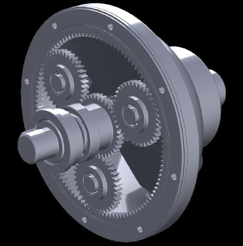
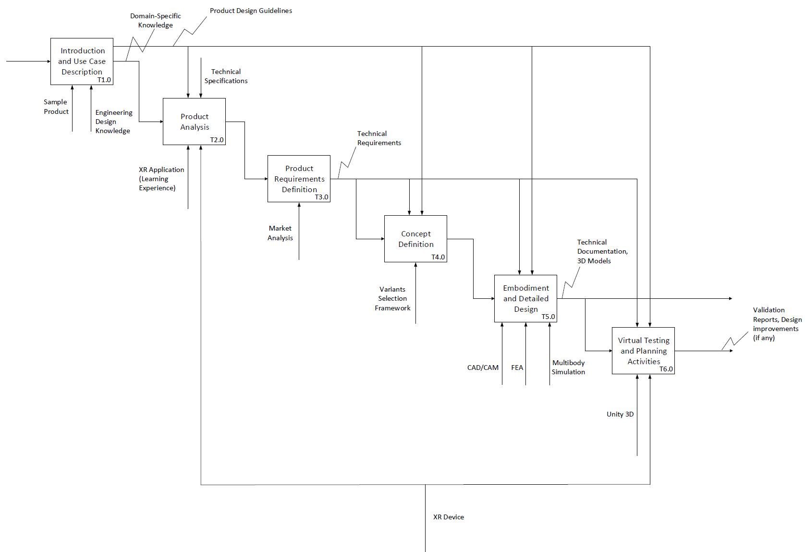
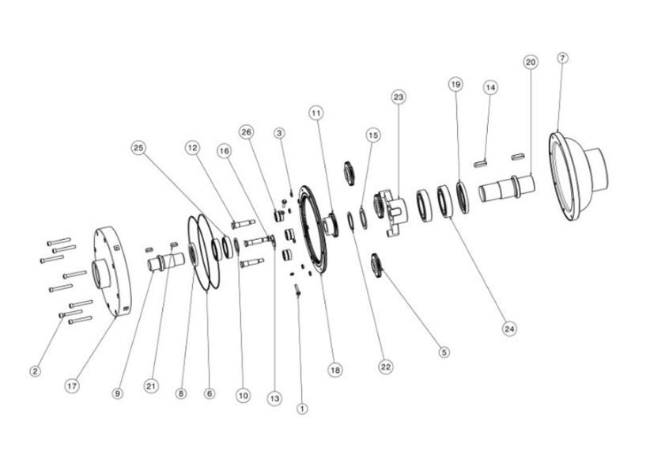
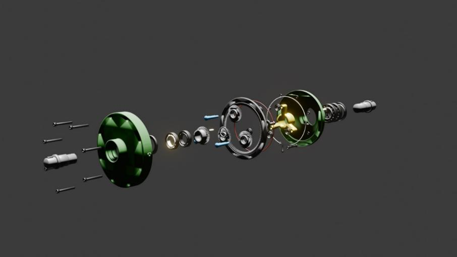
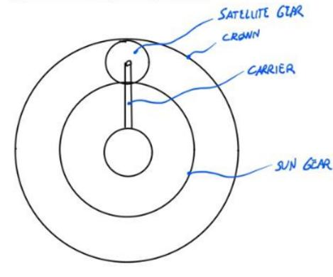
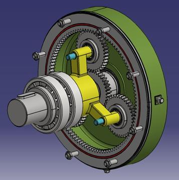
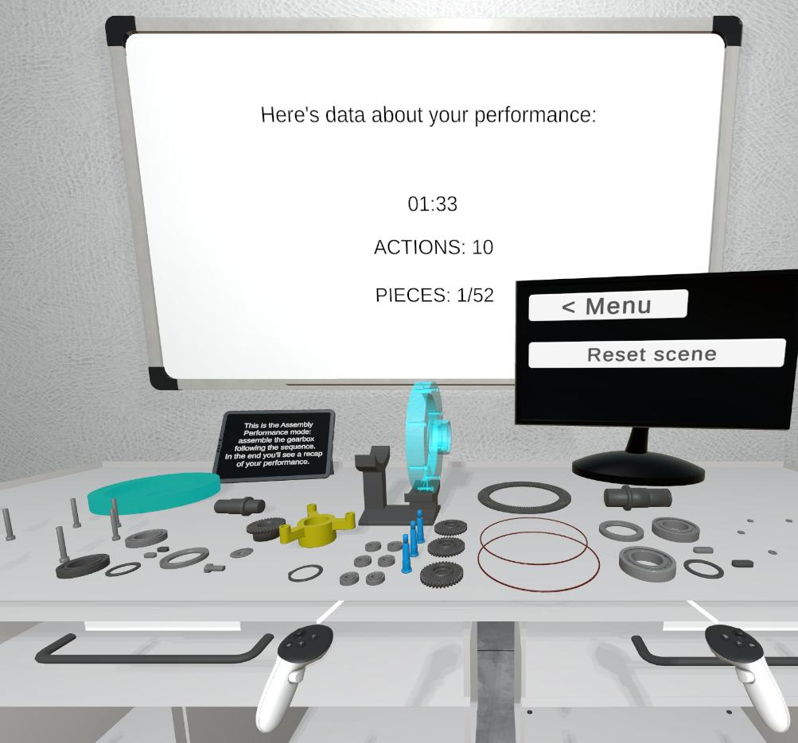

{:.no_toc}

  

    Table of contents
  

  {: .text-delta }
- TOC
{:toc}

# XR Learning Workflow for the design of mechanical products
{:.no_toc}

## 1. Introduction

The guidelines highlighted in document D2.1 can be applied to create a learning workflow related to the design of mechanical components. Mechanical product design involves not only the development of innovative solutions to meet specific functional requirements but also the integration of components into cohesive systems that balance performance, manufacturability, and cost-effectiveness. This workflow offers a structured approach to mastering these complexities, leveraging advanced tools like CAD software, XR technologies, and simulation techniques. Students will engage in iterative design processes, from concept development to virtual prototyping, guided by engineering principles and key performance metrics. Through hands-on activities and real-world case studies, learners will develop the skills needed to navigate the multidisciplinary demands of modern mechanical design.

## 2. Learning Objectives

1. **Factual Knowledge**
    1. Learn fundamental concepts of mechanical product design and engineering principles.
    2. Recall the operational mechanics and functional characteristics of mechanical systems.
    3. Describe the purpose and tools used in the product development process and XR technologies.
2. **Conceptual Knowledge**
    1. Explain the relationship between product features, technical requirements, and design principles.
    2. Conceptualize the link between reverse engineering insights and the creation of innovative design solutions.
3. **Procedural Knowledge**
    1. Apply XR tools to interact with, analyze, and manipulate virtual prototypes of mechanical systems.
    2. Perform 3D model exploration, disassembly, and dimensional analysis.
    3. Develop comprehensive product requirements and technical specifications based on market analysis and design goals.
    4. Design detailed 3D models using CAD software and validate them through virtual prototyping and simulations.
4. **Metacognitive Knowledge**
    1. Reflect on the iterative design process to identify areas for improvement in product development.
    2. Evaluate the alignment of design decisions with technical requirements and user needs.
    3. Monitor personal understanding of complex systems and adapt learning strategies for better engagement with XR technologies.

Table 1 lists the specific Intended Learning Objectives (ILOs) with their associated knowledge type.

| **ILO** | **Knowledge Type** | **ILO Description** |
| ----- | ---- | ----- |
| I1 | 1.1 | Acquire basic knowledge about mechanical design and engineering principles |
| I2 | 1.2 | Recall functional characteristics of mechanical systems |
| I3 | 1.3 | Describe the tools (both digital and physical) used in product development process and their purpose |
| I4 | 1.3 | Comprehend the characteristics and the purpose of XR technologies applied to mechanical design |
| I5 | 2.1 | Understand the importance of product requirements to define final product’s features |
| I6 | 2.2 | Extract relevant information from existing mechanical systems to enhance the design of new products |
| I7 | 3.1 | Apply XR tools to interact with virtual prototypes of mechanical systems |
| I8 | 3.2 | Learn to extract useful information from a component or system by exploring a virtual environment |
| I9 | 3.2 | Understand physical constraints and relations among parts in a product by disassembling its components |
| I10 | 3.3 | Acquire a complete understanding of the technical and economic landscape in which the product will be designed |
| I11 | 3.4 | Apply CAD software to develop 3D models of designed components and optimize them for their use in virtual environments |
| I12 | 4.1 | Develop a performance evaluation framework (using the virtual prototype) for the designed part |
| I13 | 4.2 | Optimize the product design by identifying potential improvements and correcting inefficiencies before production. |
| I14 | 4.2 | Test the virtual prototype to validate the proposed design |

Table 1: ILOs with associated knowledge type

## 3. Use Case

This comprehensive workflow guides engineering students through the product development process, utilizing a Planetary Gearbox as a real-world case study (Figure 1). By examining this complex mechanical system, students gain hands-on experience with essential product design principles and methodologies, from initial concept to final implementation. The Planetary Gearbox's sophisticated mechanism and wide industrial applications make it an ideal teaching tool for demonstrating the practical challenges and considerations in mechanical engineering design.

Figure 1: Planetary Gearbox (Use Case)

## 4. Learning Activities

The learning activities are organized into six sequential activities leading to the complete product design. Each level consists of tasks associated with specifics ILOs as reported in Table 2. All the activities of the Reverse Engineering task (T3.0) are further described in Table 3.

### 4.1 Main Learning Workflow

Figure 2: XR Learning Workflow for the design of mechanical components

| **Task ID** | **Task Name** | **Task Description** | **ILO** |
| ----- | ----- | ----- | ----- |
| T1.0 | Introduction and Use Case Description | 

  • **Description**: This initial phase of the workflow introduces students to fundamental Engineering Design concepts, providing them with the essential theoretical foundation needed to navigate the entire design process effectively. Additionally, students receive a comprehensive overview of the upcoming activities within the learning experience, ensuring they grasp both the purpose and significance of each step they will undertake. Then, the proposed Use Case is introduced to students. This critical step aims to equip them with comprehensive domain-specific knowledge essential for designing a complex mechanical system. The learning module provides a thorough exploration of technology’s fundamental principles, operational mechanics, and technical specifications • **Output**: Product Design Guidelines, Domain-specific Knowledge  • **Resource**: Engineering Design Knowledge and a sample product, which will be used as Use Case | I1, I2 |
| T2.0 | [Product Analysis](./W3_product_analysis.md) | 

 • **Description**: Students are immersed in an interactive virtual environment where they can explore and manipulate a 3D model of a reference product which is like their design objective. Through hands-on experimentation with this digital prototype, students discover key features and operational principles, gaining valuable insights that inform their own design conceptualization. This experiential learning approach enables students to develop a deeper understanding of product functionality while beginning to envision their unique solutions and critical design characteristics. • **Output**: Product's Features List • **Input**: Domain-specific Knowledge • **Controls**: Product Design guidelines and technical specifications of the sample product • **Resources**: XR application (Learning Experience), XR device | I4, I6, I7, I8, I9 |
| T3.0 | Product Requirements Definition | • **Description**: In this phase, students embark on the task clarification stage of product development, systematically identifying and analyzing the core objectives and constraints associated with the reference product. Through the development of a comprehensive requirements list, students establish critical technical specifications that will serve as essential benchmarks throughout the subsequent mechanical design phases and XR learning workflow. This foundational documentation ensures all design decisions remain aligned with project goals while providing clear evaluation criteria for validating design outcomes. • **Output**: Technical Requirements List • **Input**: Product's Features List • **Controls**: Product Design guidelines • **Resource**: Market Analysis | I5, I10 |
| T4.0 | Concept Definition | 

 • **Description**: During the Conceptual Design phase, students develop fundamental solution principles that will shape their design approach. This crucial stage begins with a systematic analysis of the requirements list to identify key design challenges and technical constraints. Students then define the system's core functionalities and propose innovative technical solutions to achieve these objectives. Through detailed sketches, drawings, and preliminary assembly concepts, students articulate their understanding of the system's working principles and demonstrate how their proposed solutions address the identified challenges. This phase establishes the foundational framework that will guide subsequent detailed design decisions. • **Output**: Concept • **Input**: Technical Requirements • **Control**: Product Design Guidelines, Technical Requirements • **Resource**: Variants Selection Framework | I10, I11 |
| T5.0 | Embodiment and Detailed Design | 

 • **Description**: In the Embodiment and Detailed Design phase, students transform their conceptual framework into a comprehensive technical solution. Starting from their initial concept, they develop the complete product layout while rigorously evaluating design choices against both technical feasibility and economic viability criteria. Using advanced design software, students define precise specifications including component geometries, dimensional requirements, material selections, and surface characteristics for each system element. This phase also encompasses manufacturing strategy development and cost analysis, ensuring producibility and economic efficiency. The process culminates in the creation of detailed technical documentation that captures all essential design specifications, manufacturing requirements, and assembly instructions. • **Output**: Technical Documentation, 3D models of the product • **Input**: Concept • **Controls**: Product Design guidelines, Technical Requirements • **Resources**: CAD/CAM software, Finite Element Analyses (FEA), Multibody Simulations | I11 |
| T6.0 | [Virtual Testing and Planning Activities](./W4_virtual_testing.md) | 

• **Description**: In this phase students leverage XR technologies to create an immersive testing environment for their mechanical system design. This interactive virtual platform enables students to engage with their product in multiple ways: manipulating components, performing assembly operations, and evaluating functionality across various use scenarios. This interactive platform serves multiple purposes: demonstrating proper product operation, illustrating its working principle, highlighting safety protocols, and visualizing troubleshooting scenarios. Through immersive simulations, users can practice assembly/disassembly sequences, understand component interactions, and master operational procedures in a risk-free virtual environment. This approach not only replaces traditional text-heavy manuals but also accelerates skill acquisition through hands-on learning, reducing training time and potential user errors while improving knowledge retention. Finally, students develop a comprehensive maintenance strategy that leverages XR technologies to optimize product support and service operations. This phase integrates remote collaboration capabilities and assisted maintenance solutions to ensure efficient product upkeep throughout its lifecycle. Through XR-enabled platforms, maintenance technicians can receive real-time expert guidance, access interactive repair procedures, and visualize complex maintenance sequences. • **Output**: Virtual prototype validation report, functionality test outcomes, design improvement recommendations (if any) • **Input**: Technical Documentation, 3D models of the product • **Controls**: Product Design guidelines, Technical Requirements • **Resources**: Unity3D, XR device | I4, I7, I8, I12, I13, I14 |