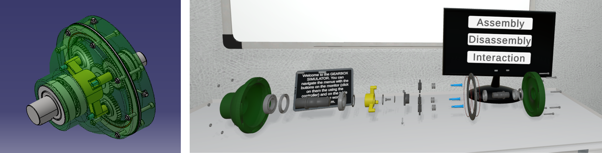

{:.no_toc}

  

    Table of contents
  

  {: .text-delta }
- TOC
{:toc}

# Virtual Testing and Planning Activities Workflow
{:.no_toc}

Virtual testing and planning activities support the validation of a designed mechanical product before production. Students prepare CAD models for use in a virtual scene, create an interactive testing experience, and use it to inspect the product, test its functionality, and verify assembly and disassembly procedures. The workflow also supports the development of guided training and maintenance procedures, using the virtual prototype to identify possible design improvements.

## 1. Learning Objectives

The learning objectives for this workflow focus on preparing a virtual prototype, interacting with it through XR, and using test results to validate and improve the product design.

| **ILO** | **Knowledge Type** | **ILO Description** |
| ----- | ---- | ----- |
| I4 | 1.3 | Comprehend the characteristics and the purpose of XR technologies applied to mechanical design |
| I7 | 3.1 | Apply XR tools to interact with virtual prototypes of mechanical systems |
| I8 | 3.2 | Learn to extract useful information from a component or system by exploring a virtual environment |
| I11 | 3.4 | Apply CAD software to develop 3D models of designed components and optimize them for their use in virtual environments |
| I12 | 4.1 | Develop a performance evaluation framework (using the virtual prototype) for the designed part |
| I13 | 4.2 | Optimize the product design by identifying potential improvements and correcting inefficiencies before production. |
| I14 | 4.2 | Test the virtual prototype to validate the proposed design |

Table 1: ILOs addressed by the Virtual Testing and Planning Activities workflow

## 2. Use Case

The workflow uses the designed product developed in the Product Design workflow for virtual testing and planning activities. In the Planetary Gearbox use case, CAD models are optimized and integrated into an interactive virtual scene, where students can inspect the assembly, test component relationships and functionality, and evaluate assembly, disassembly, training, and maintenance procedures. The findings are documented in validation and performance assessment reports and can result in design improvements.

## 3. Learning Activities

Figure 1: Learning Workflow - Virtual Testing and Planning Activities

| **Task ID** | **Task Name** | **Task Description** | **ILO** |
| ----- | ----- | ----- | ----- | 
| T6.1 | Models Optimization | 

 • **Description**: CAD software generates precise models using geometric representations like B-rep (Boundary Representation). However, these native CAD formats are not directly compatible with game engines such as Unity3D. Game engines require polygonal meshes for rendering. The process of translating a CAD model into this mesh format can sometimes produce highly detailed geometry, resulting in meshes composed of numerous triangles. This high level of detail, while accurate and useful in design, increases the computational cost required by the game engine to render the model efficiently. Performance optimization is essential when preparing CAD-based assets for use in virtual scenes, especially those involving edge devices like VR HMDs, as these devices often have limited computational power. Software like Blender provides powerful tools to manually simplify high-detail models by reducing the number of vertices and faces, thereby decreasing the triangle count. • **Output**: Optimized Models • **Input**: CAD Models of Designed Product(s) • **Control**: Rendering Engine Compatibility • **Output**: Product Design Guidelines • **Resource**: Blender | I11 |
| T6.2 | Scene Generation | 

 • **Description**: This phase requires students to develop a virtual scene where they can simulate the operation of their designed product. The goal is to replicate its real-world environment as accurately as possible to test how it performs under actual conditions. Furthermore, students must create an interactive model of their specific design within this scene. This interactivity allows them to verify crucial aspects of the assembly process, such as confirming that parts fit together correctly and identifying the necessary tools for easy assembly. The virtual setup should be constructed with sufficient detail and usability in mind so it can be effectively used for future tasks or applications involving the designed product. • **Output**: XR Application (Testing Experience) • **Control**: Device Computational Power • **Input**: Optimized Models • **Resources**: Meta SDK, Unity3D, Blender | I7, I11 |
| T6.3 | Product Inspection and Functional Testing | 

  • **Description**: In this phase, students will upload their product design into the virtual space to conduct hands-on evaluation and confirm if their design choices are verified in terms of product usage and mechanics. The virtual experience must integrate features that allow users to directly manipulate the product, test the kinematic relationships among parts, and ensure their appropriateness under simulated load or operation. Crucially, the user can test the full assembly and disassembly procedures, utilizing specific tools. This interaction detects inefficiencies, difficult maneuvers, or ergonomic issues that could impede an operator, thereby ensuring the product's maintainability and serviceability. The objective is to bridge theory and practice by actively validating the design's function, clearances, and operational workflow. • **Output**: Validation Report • **Input**: Design intent understanding • **Control**: Product Design Guidelines, Technical Requirements • **Resources**: XR application (Testing Experience), XR device | I13, I14 |
| T6.4 | Guided Training Procedure | 

  • **Description**: This phase focuses on transitioning from product design to operator readiness by creating a specific XR-based virtual training module using the validated product. This approach is essential for fields where training on the physical product is expensive, time-consuming, or dangerous. Students are tasked with designing a guided procedure that trains future operators to achieve defined objectives such as correct operation, complex assembly, or critical maintenance in the safest and most effective way possible. The experience must incorporate instructional scaffolding with clear prompts, provide real-time performance feedback on speed and accuracy, and safely replicate hazard simulations or equipment failure modes too risky for real-world practice. The result is a robust virtual training workflow that ensures operator competence before the product enters production. • **Output**: Operator Training Procedure • **Input**: Validation Report • **Control**: Technical Requirements, Product Design Guidelines, Mounting Logic • **Resources**: XR application (Testing Experience), XR device | I13, I14 |
| T6.5 | User Performance Assessment | 

  • **Description**: User Performance Assessment is crucial to understanding not only the user's proficiency but also the inherent quality of the product's design. By analyzing operator performance metrics, such as task completion time, error rates, and required steps, students gain crucial insights into how well the design accommodates human factors across the product's entire lifecycle. In this stage, students can test and compare different product alternatives within the simulation environment. This rigorous comparison allows them to quantify and determine the optimal trade-off that simultaneously satisfies all critical technical requirements while optimizing production and assembly costs. This data-driven approach ensures the final product is not just functionally sound, but also cost-effective and human-centric. • **Output**: Performance Assessment Report  • **Controls**: Technical Requirements, Product Design Guidelines • **Input**: Training Procedure • **Resources**: XR application (Testing Experience), XR device | I12, I13, I14 |
| T6.6 | Maintenance Procedures Development | • **Description**: This stage enables students to critically evaluate their design's susceptibility to maintenance challenges throughout its operational life. Using the virtual model, students could simulate various remote maintenance scenarios, focusing specifically on the ease of diagnosis, repair, and parts replacement. By implementing and testing concepts for XR-based support devices (such as overlays for guidance or remote telepresence tools), students aim to significantly reduce the effort and time required for servicing. The core objective is to ensure the product's architecture facilitates efficient, often remote, maintenance interventions, thereby guaranteeing high operational uptimes and minimizing costly service disruptions. • **Output**: Design Improvements (If any) • **Controls**: Technical Requirements, Product Design Guidelines • **Input**: Performance Assessment Report • **Resources**: XR application (Testing Experience), XR device | I14 |

## 4. Technology

The workflow combines CAD software, Blender, Unity3D, the Meta SDK, an XR application, and an XR device to prepare and test a designed product in a virtual scene. CAD models provide the precise geometric representation of the product, while Blender is used to reduce the number of vertices and faces when the conversion to polygonal meshes produces geometry that is too detailed for efficient real-time rendering.

Figure 7: Gearbox model views: assembled CAD model (left) and exploded view in Unity 3D (right).

The optimized models are used to create an interactive XR testing experience in Unity3D. This virtual scene supports product manipulation, functional testing, assembly and disassembly procedures, and the development of guided training and maintenance activities. Optimizing the models is particularly important for XR head-mounted displays and other edge devices with limited computational power.

## 5. User Experience

The virtual testing experience allows users to interact directly with the designed product in a simulated operational environment. Users can manipulate the product, test kinematic relationships among parts, and carry out complete assembly and disassembly procedures using the required tools. These interactions help identify inefficiencies, difficult manoeuvres, ergonomic issues, and design choices that require improvement.

The experience can also guide future operators through procedures for correct operation, complex assembly, or maintenance. Clear prompts and real-time feedback on speed and accuracy support the training activity, while simulated hazards or equipment failures allow users to practise scenarios that may be expensive, time-consuming, or dangerous to reproduce with the physical product. Performance measures such as completion time, error rates, and required steps support the comparison of product alternatives and the assessment of the final design.
