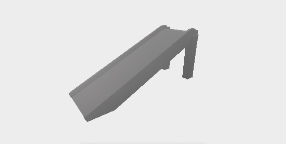
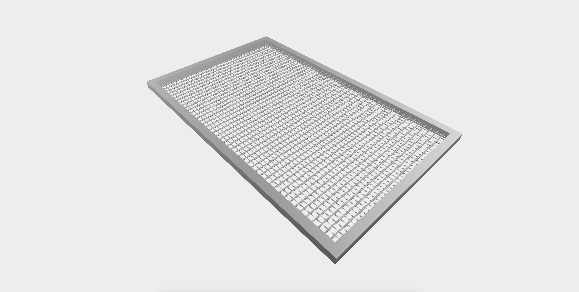
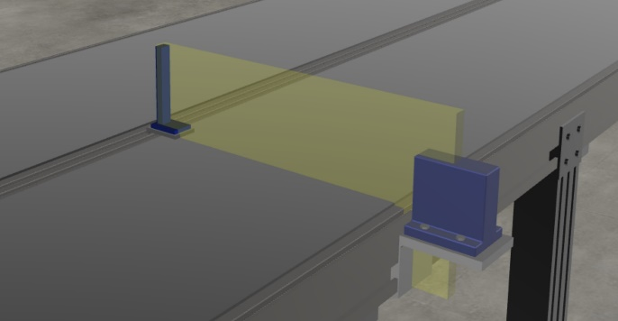
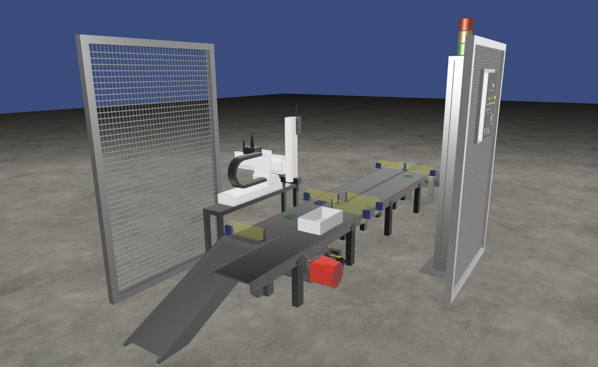

{:.no_toc}

  

    Table of contents
  

  {: .text-delta }
- TOC
{:toc}

# Design and Control of Manufacturing Systems
{:.no_toc}

This learning workflow is designed to address the challenges of designing and controlling a manufacturing system using modern digital technologies, with a specific focus on Extended Reality (XR). The workflow is structured to guide students through a practical, hands-on experience by leveraging a realistic virtual environment (VE) of a manufacturing facility. This approach aims to foster a deep understanding of industrial engineering principles by integrating pedagogical and technical aspects.

The core of this workflow is the application of a framework that utilizes a digital twin of a pick&place cell. The use of open and multi-platform technologies is recommended to enhance the democratization of this XR-based learning approach in higher education.

## 1. Learning Objectives

The types of knowledge that are relevant for this learning workflow can be instantiated as follows:

1.  **Factual Knowledge**

*1.1 Knowledge of terminology*: ability to recognize and differentiate between various types of equipment and components within a manufacturing system. This includes knowing terms such as conveyor, robot, sensor, actuator, control panel, etc.

*1.2 Knowledge of specific details and elements*: ability to identify the role and properties of assets, e.g. functioning states of an actuator, range of action of a sensor, source and destination of parts.

2.  **Conceptual Knowledge**

*2.1 Knowledge of classifications and categories*: ability to classify equipment based on its function within the manufacturing system, such as a Cartesian robot for handling and a conveyor for transportation.

2*.2 Knowledge of principles and generalizations*: ability to comprehend how the parts are moved within the manufacturing system, specifically the event-driven logic where sensors and actuators interact to control the system's response.

*2.3 Knowledge of theories, models, and structures*: ability to understand how the system's behavior is defined via UML statecharts.

3.  **Procedural Knowledge**

*3.1 Knowledge of subject-specific skills and algorithms:* ability to define goals and process plans of a manufacturing system*;* ability to apply performance evaluation techniques; ability to use a communication protocol like MQTT to control a manufacturing system; ability to program the behavior of actuators.

*3.2 Knowledge of subject-specific techniques and methods:* ability to model the behavior of sensors and actuators using UML statecharts; ability to design an integrated manufacturing system considering the behavior of the single assets.

*3.3 Knowledge of criteria for determining when to use appropriate procedures*: ability to analyze system behavior and identify when a component is not performing as expected, allowing the student to troubleshoot and apply corrective procedures.

4.  **Metacognitive Knowledge**

*4.1 Self-knowledge:* ability to evaluate one's own confidence in the responses and solutions to the exercises.

Table 1 reports the specific ILOs with the associated type of knowledge.

| **ILO** | **Knowledge type** | **ILO description**                                                                                                                                                                               |
|---------|--------------------|---------------------------------------------------------------------------------------------------------------------------------------------------------------------------------------------------|
| I1      | 1.1                | Identify sensors, actuators, and control panels                                                                                                                                                   |
| I2      | 1.2                | Understand the properties of assets, e.g. functioning states of an actuator, range of action of a sensor, source and destination of parts.                                                        |
| I3      | 2.1                | Understand the role of assets within the manufacturing system based on their function, such as a Cartesian robot for handling and a conveyor for transportation.                                  |
| I4      | 2.2                | Identify the flow of parts within the manufacturing system in the virtual environment, specifically the event-driven logic where sensors and actuators interact to control the system's response. |
| I5      | 2.3                | Understand the system's behavior by modeling UML statecharts.                                                                                                                                     |
| I6      | 3.1                | Define the goals and processes of a manufacturing system.                                                                                                                                         |
| I7      | 3.1                | Apply performance evaluation techniques to assess the performance of the system                                                                                                                   |
| I8      | 3.1                | Control a manufacturing system using a communication protocol like MQTT                                                                                                                           |
| I9      | 3.2                | Design the behavior of sensors and actuators using UML statecharts                                                                                                                                |
| I10     | 3.2                | Design an integrated manufacturing system considering the behavior of the single assets in a conceptual model of the system.                                                                      |
| I11     | 3.3                | Identify when an asset is not performing as expected and apply corrective procedures.                                                                                                             |
| I12     | 4.1                | Estimate the confidence with respect to replies and numerical solutions provided.                                                                                                                 |

Table 1: ILOs with associated knowledge type

## 2. Use Case

The learning workflow can be applied to a use case involving a pick&place cell, an automated manufacturing system designed to execute handling, sorting, and transfer operations in a discrete production environment. This use case serves as a testbed for validating the modularity, reusability, and immersive potential of the XR learning framework.

The cell's behavior is governed by event-driven logic where sensors and digital actuators interact to determine the system's response to operating conditions. Communication within the system can be managed through industrial protocols like Modbus TCP/IP or MQTT.

The virtual pick&place cell consists of several assets (see Figure 1-Figure 9):

- Conveyors: The scene includes two main conveyor belts, Conveyor 1 and Conveyor 2. Conveyor 1 carries boxes to be filled, while Conveyor 2 transports the items that will be picked up.

- Detection Barriers: Both conveyors are equipped with sensor-receiver pairs that detect the presence, passage, and correct positioning of objects.

- Cartesian Robot: A programmable robotic arm is primarily aimed at picking individual items from Conveyor 2 and place them into boxes on Conveyor 1.

- Objects: The system manipulates two types of objects, i.e. items (Simple-shaped parts that are picked from Conveyor 2 and placed into boxes) and boxes (containers that move along Conveyor 1 to be filled with items by the robot).

- Control Panel: the main user interface. It is equipped with four physical buttons (Start, Stop, Initialization, Emergency) and a three-position State Selector for choosing the operational mode. A potentiometer is also included to select the number of items to be placed in each box.

- Signal Pole: A vertical pole with three lights (red, yellow, green) provides visual feedback on the system's operational status.

- Unloading Slides: Located at the end of each conveyor, these slides enable the physical evacuation of materials once processing is complete.

- Protective Grids: The cell also includes solid grids to protect critical areas and perforated grids that support functional elements like the Control Panel.

Figure 1: Cartesian robotic arm used for pick and place operations.

Figure 2: Basic item shape manipulated by the robot.

Figure 3: Transport box used for item collection.

Figure 4: Control Panel with physical interface (buttons, selectors)

Figure 5: Slide used for unloading processed items

Figure 6: Conveyor belt with motor for item transport

Figure 7: Signal pole indicating system state.

Figure 8: Perforated protective grid supporting the Control Panel

Figure 9: Barrier sensors for object detection on conveyors

The whole cell and each of its assets are shown in Figure 10 and Figure 11.

Figure 10: Full view of the Pick&Place cell.

Figure 11: Full view of the Pick&Place cell, including labels of each asset.

The basic system configuration is designed to operate in distinct production modes:

- State 0: parts enter Conveyor2; parts go through Conveyor2; parts are evacuated if the Mode0 stops.

- State 1: boxes enter Conveyor1; boxes are picked and placed on Conveyor2; boxes exit from Conveyor2.

- State 2: the user selects the number of parts to be put in the box; parts and boxes appear on Conveyor2 and Conveyor1, respectively; both conveyors move; sensors detect parts and boxes; parts picked from Conveyor2 and placed in a box on Conveyor1; Conveyor1 moves.

## 3. Learning Activities

The learning activities are organized into two levels of increasing difficulty:

1)  *How a manufacturing system works and is controlled*. The student is provided with an existing manufacturing system. Sensors and actuators are characterized by UML statecharts. A sequence of control actions is predefined to demonstrate the capability of the system to perform a mission, i.e. moving assets from a source position to a target position while executing operations.

2)  *Design a manufacturing system reconfiguration and control its behavior*. The student is asked to design a reconfiguration of the existing manufacturing system to meet new requirements in terms of missions to be executed. The assets already available can be reused and new assets can be included, either duplicating existing assets or defining new asset types with related properties.

Each level consists of tasks associated with specifics ILOs as reported in Table 4.

| **Task ID** | **Task name**                               | **Task description**                                                                                                                                                                                                                                                                                                          | **ILO** |
|-------------|---------------------------------------------|-------------------------------------------------------------------------------------------------------------------------------------------------------------------------------------------------------------------------------------------------------------------------------------------------------------------------------|---------|
| T1.1        | Identify Assets in the Manufacturing System | Analyze the existing manufacturing system and identify relevant assets.                                                                                                                                                                                                                                                       | I1      |
| T1.2        | Characterize Existing Assets                | Collect the properties of assets that are used in the manufacturing system, including sensors and actuators, based on their function in the virtual environment. This involves identifying the purpose of components like the Cartesian robot for handling and the conveyors for transportation.                              | I2, I3  |
| T1.3        | Analyze Existing Manufacturing System       | Understand the system's behavior and the flow of parts. Model the system layout with diagrams and its behavior with UML statecharts. Evaluate the system performance.                                                                                                                                                         | I4, I5  |
| T2.1        | Define Process Plan                         | Define the process plan with final goal and operations for the reconfigured manufacturing system                                                                                                                                                                                                                              | I6      |
| T2.2        | Design Asset Behavior                       | Identify which assets are needed in the reconfigured manufacturing system, including sensors and actuators, and design their behavior using UML statecharts.                                                                                                                                                                  | I9      |
| T2.3        | Design Integrated System                    | Design the configuration of the manufacturing system by integrating single assets and their behaviors into a complete system. This includes ensuring proper placement of components and understanding their interactions, defining the operational modes and programming the system to respond to user input and sensor data. | I10     |
| T2.4        | Assess the system performance               | Evaluate the manufacturing system performance.                                                                                                                                                                                                                                                                                | I7      |
| T2.5        | Virtual Commissioning                       | Test the integrated system in the virtual environment. This involves using VR tools to operate the control panel, trigger system events, and verify that the system functions correctly according to the predefined modes and logic. In addition, an MQTT-based controller is tested to achieve production goals.             | I8, I9  |
| T2.6        | Final Testing and Revisions                 | Perform final testing of the entire system and identify any required revisions. During this task, students should self-assess their understanding of the system's design and their ability to troubleshoot issues, estimating their confidence in the solutions they have implemented.                                        | I9, I10 |

Table 4: Tasks of learning activities with related ILO

## 4. Technology

Virtual reality (VR) technology has been selected to deliver the necessary level of realism, allowing students to immerse themselves in a virtual manufacturing system.

**Assets and scene configuration**

A digital twin of the lab has been developed to support research and teaching activities. The 3D models of the assets are available on a [GitHub repository](https://github.com/difactory/repository/tree/main/models/PickPlaceCell) in gLFT format, specifically the binary version .glb. The scene configuration is defined in a [JSON file](https://difactory.github.io/repository/scenes/UC/PickPlaceCell.json) according to a specific [schema](https://virtualfactory.gitbook.io/vlft/kb/instantiation/assets/json).

**Visualization in VR environment**

The visualization of the use case in a VR environment is supported by [VEB.js](../Tools#vebjs), a prototype web-based VR tool, taking advantage of its reconfigurable model-driven approach. 

Any browser can be used to visualize the [Pick&Place cell](https://difactory.github.io/DF/scenes/UC/PickPlaceCell.html) with VEB.js[^5].

**OntoGuiWeb**

Data authoring of the Pick&Place cell use case has been supported by [OntoGuiWeb](../Tools#ontoguiweb), a web application providing a graphical user interface for the instantiation and exploration of digital models as OWL ontologies.

**MQTT Communication**

MQTT (Message Queuing Telemetry Transport)[^6] is a lightweight, publish-subscribe messaging protocol that is commonly used in the Internet of Things (IoT) and other applications.

MQTT can be exploited for bi-directional communications with controller of the manufacturing system:

- sending feedback about the state of the sensors (published messages)

- receiving commands for the execution of the actuators (messages receveived to subscribed topics)

VEB.js can play the role of both publisher and subscriber[^7], exchanging messages that are structured according to a json schema. Therefore, the virtual environment (VE) can be connected with an external controller that receives that current state of the assets in the VE and controls the actions in the VE.

## 5. User Experience

The user experience (UX) in this learning workflow is designed to be intuitive and immersive. The virtual environment represents a simplified version of a real-world manufacturing facility, created to provide a sense of presence and a learning experience that closely mirrors reality.

The virtual environment provides an industrial setting that students can freely explore. This immersive approach allows for learning through direct interaction with a simulated production system. A key feature of the interface is the ability to retrieve supplementary data directly from objects in the environment. Users can select various objects within the virtual environment to access detailed information. This includes the object's name, ID, dimensions, position, a brief description, and its relationships with other components.

Users interact with the virtual environment using mouse/keyboard in the desktop mode or with VR controllers in immersive mode. The main interaction method is a virtual ray cast, which functions as a laser pointer, allowing users to select and activate buttons and switches from a distance. In addition to the ray cast, users can also grab and move virtual objects like boxes and items. To ensure precision and reduce frustration, the system may use snap zones.

The assessment of the learning task is carried out by analyzing the output of the various tasks, as defined in Table 5.

| **Task ID** | **Task**                                    | **Output**                                                                                                                                                                                                                                         |
|-------------|---------------------------------------------|----------------------------------------------------------------------------------------------------------------------------------------------------------------------------------------------------------------------------------------------------|
| T1.1        | Identify Assets in the Manufacturing System | Answers to a questionnaire.                                                                                                                                                                                                                        |
| T1.2        | Characterize Existing Assets                | Answers to a questionnaire.                                                                                                                                                                                                                        |
| T1.3        | Analyze Existing Manufacturing System       | UML statecharts are tested for logical correctness and coherence with the system's behavior.                                                                                                                                                       |
| T2.1        | Define Process Plan                         | The process plan is formalized (e.g. as an ontology or json document) and automatically checked if it contains the needed process steps and sequences. A visual check of The process plan, rendered as a diagram, can be visually checked as well. |
| T2.2        | Design Asset Behavior                       | UML statecharts are tested for logical correctness and coherence with the system's behavior.                                                                                                                                                       |
| T2.3        | Design Integrated System                    | The system configuration is formalized (e.g. as an ontology or json document) and automatically checked in terms of logical consistency, component interactions, and alignment with the production goals.                                          |
| T2.4        | Assess the system performance               | The performance data can be automatically compared against a benchmark to assess the student's design efficiency.                                                                                                                                  |
| T2.5        | Virtual Commissioning                       | The student can generate animations that can be re-executed and a video to demonstrate the behavior of the system in the VR environment.                                                                                                           |
| T2.6        | Final Testing and Revisions                 | A final report, including troubleshooting process, is assessed. The student's self-assessment can also be reviewed to gauge the metacognitive awareness.                                                                                           |

Table 5: Expected outcome of the learning tasks

