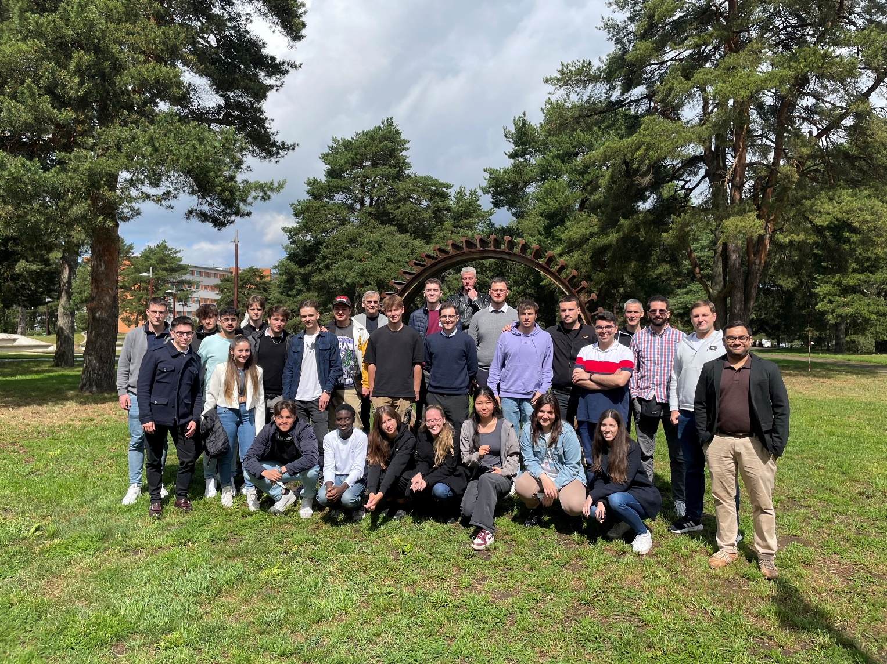
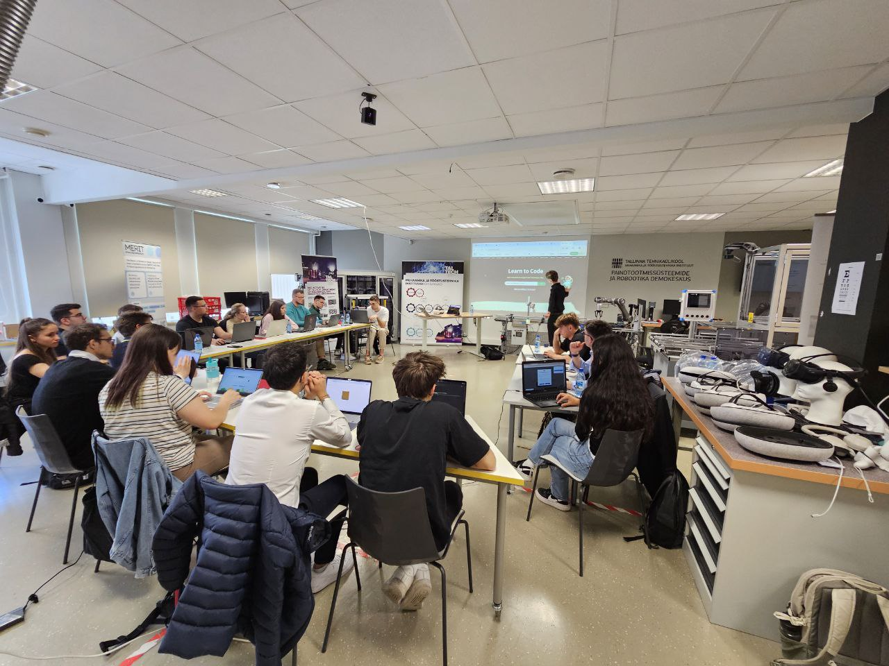
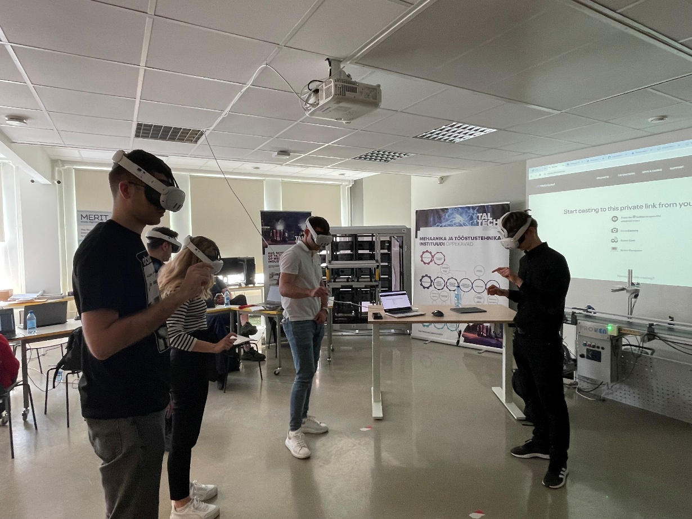
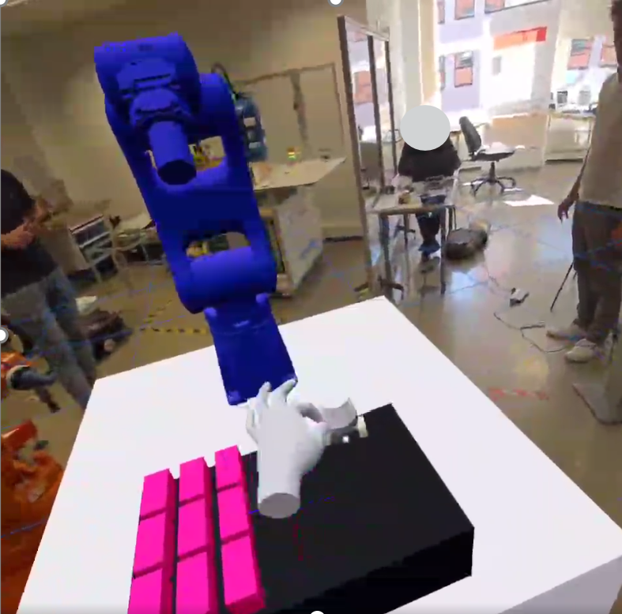
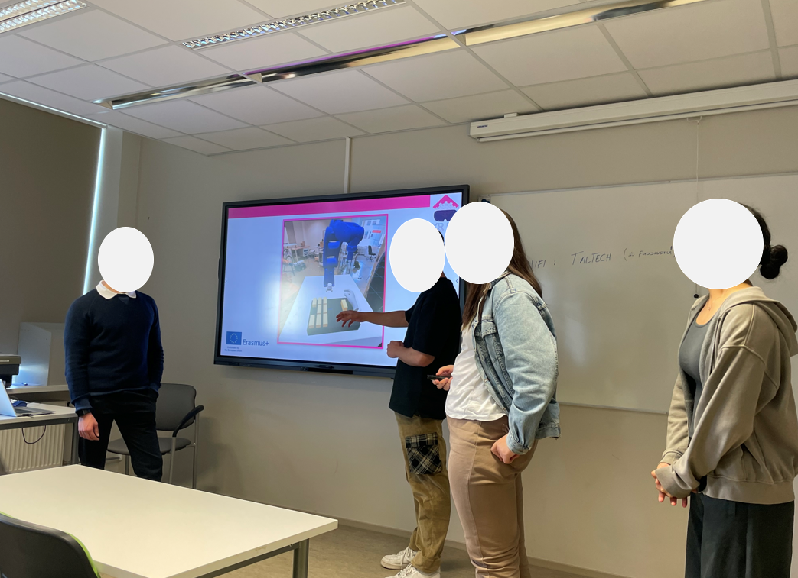
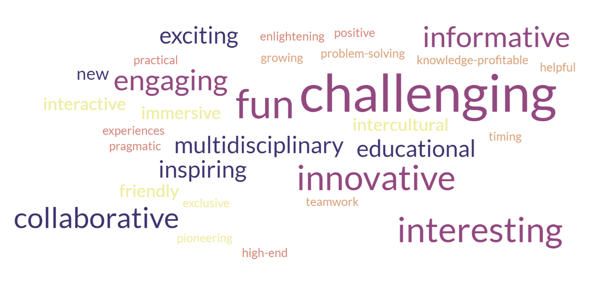
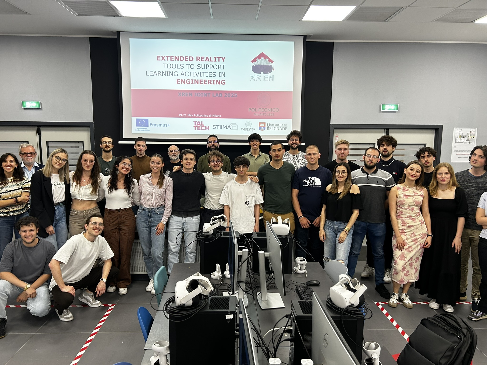
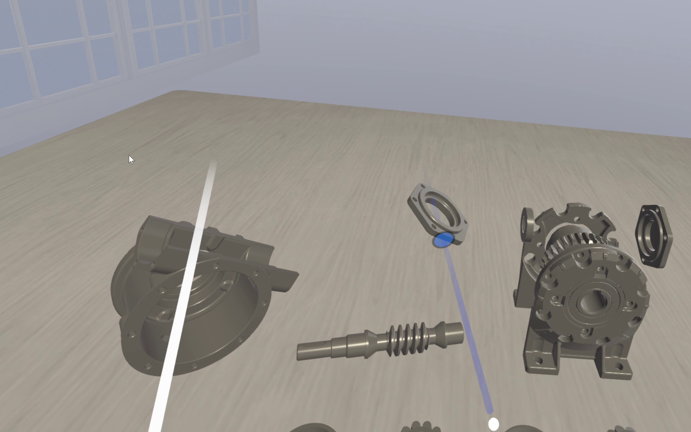
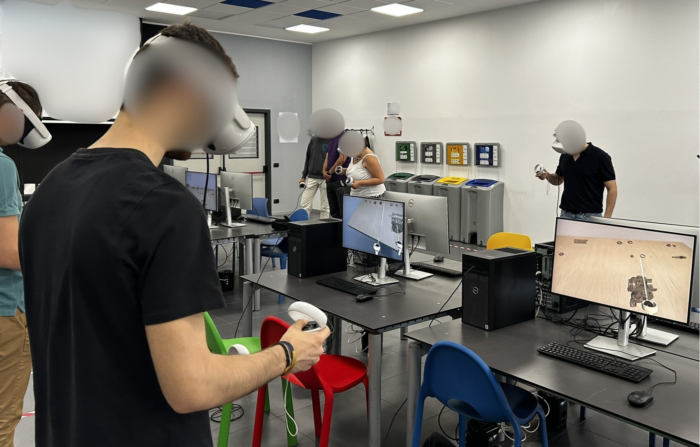
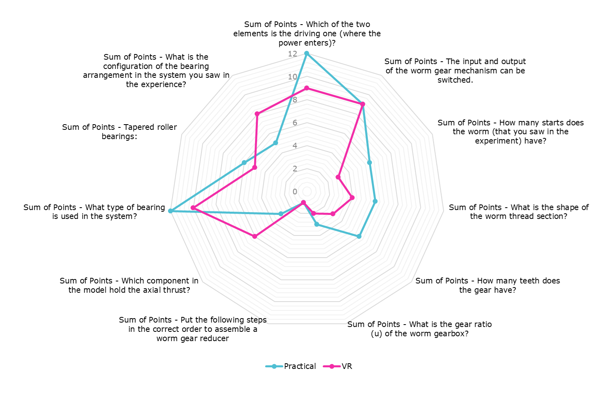

{:.no_toc}

 
  

    Table of contents
  

  {: .text-delta }
- TOC
{:toc}

# XR Learning Workshops
{:.no_toc}

## Workshop in Tallin (10-12 June 2024)

The first XR Learning Workshop of the XREN project was held at Tallinn University of Technology (TalTech) in Tallinn, Estonia, from 10 to 12 June 2024. The event marked an important milestone in our journey towards advancing technology-enhanced engineering education within the framework of the Erasmus+ project *Extended Reality Tools to Support Learning Activities in Engineering (XREN)*. The workshop brought together students and tutors from XREN consortium partners, including TalTech, Politecnico di Milano (Polimi), the University of Belgrade, and CNR-STIIMA. The workshop provided a collaborative and engaging environment in which participants could exchange knowledge, explore XR-supported learning approaches, and work together on innovative learning activities.

### Activities
{:.no_toc}

The workshop activities were organised into the following modules.

1. **Introduction and team building** 

    The workshop began with an introduction to the XR Learning Workshop and an overview of the Joint Lab task, *“Development of an AR Platform for Robot Interaction and Path Planning.”* Participants were introduced to the objectives, expected outcomes, and working approach, followed by team-building activities.

    

2. **XR tools and software setup** 

    Students gained practical experience with XR-related tools and the required software environment. The activities covered user interface interaction in VR, design guidelines, and the possibilities offered by immersive technologies. The technological stack for the WebXR environment included Next.js, API calls, Hooks, and Three.js. 
    

3. **Robot connectivity and AR platform development** 

    Students tested robot connectivity and communication using the selected XR tools and software. Throughout the Joint Lab activities conducted in the TalTech IVAR Lab, students worked in teams to develop an AR platform using the Meta Quest 3 headset. The developed platform enables users to monitor the current state of the Yaskawa Motoman GP8 robot, directly control its operation, and create robot path plans, thereby supporting spatial understanding and enhancing the overall user experience.
    

4. **Teamwork and practical demonstration** 

    Each team successfully developed and executed a robot recipe for constructing structures from wooden blocks, simulating a pick-and-place process. At the end of the activity, the teams presented their solutions, individual and collective contributions, and key learning experiences.

    

5. **Parallel learning activity – pneumatic system assembly**

    As a parallel activity, students tested and experienced an AR-supported learning environment for the assembly and operation of pneumatic systems. They completed a pneumatic circuit assembly task as a hands-on learning exercise and experienced two different learning modes: first, assembling the circuit in the physical laboratory using a traditional paper-based guide; and second, performing the learning activity with support from an immersive AR-based environment. This provided students with practical experience of both conventional and XR-supported approaches to engineering learning.

### Assessment
{:.no_toc}

A total of 20 students responded to questions regarding their expectations for the workshop in Tallinn. The responses were collected through a questionnaire consisting of open-ended questions. As part of the expectations survey, students were asked to provide “five adjectives that you associate with the workshop experience.” The adjectives reported by the students, reflecting their anticipated perceptions and expectations of the workshop, are illustrated in the figure below.

Students’ engagement during the workshop was also assessed through a questionnaire comprising seven items, each rated on a five-point Likert scale (1–5). The results provide insights into the students’ level of engagement throughout the workshop and are presented in the graph below.

The results indicate that participants feel highly committed, successful, and motivated, but their alertness, confidence, performance, and control are moderate to low. This suggests that while they are driven and feel successful, there might be areas to improve regarding their confidence and perceived control over tasks [1].

## Workshop in Milan (19-21 May 2025)

The second XR Learning Workshop of the XREN project was held at the
Politecnico di Milano in Milan, Italy, from 19 to 21 May 2025. The event,
titled *Extended Reality Tools to Support Learning Activities in
Engineering*, brought together students and project partners to explore how
extended reality (XR) can support engineering education.

The workshop contributed to the objectives of the XREN Erasmus+ project by
connecting the project’s XR learning workflows and applications with a
hands-on educational setting. It gave participants the opportunity to compare
physical and virtual learning experiences, apply good practices for designing
XR-based learning activities, and collaboratively improve an existing learning
application. In this way, the event linked technical development with the
project’s broader aim of making engineering learning more interactive,
practice-oriented, and accessible through XR.

### Activities
{:.no_toc}

The workshop activities were organised around three complementary strands:

1. **Technical workshops**

   - Introduction to the software and tools used for XR development.
   - Practical introduction to Unity for virtual-reality development.
   - Design of user interfaces and interaction in VR.
   - Discussion of XR design methodologies and good practices.
   - Definition of learning objectives and structuring of XR-based learning
     workflows.
   - Team work to apply the learning-workflow concepts and improve the XR
     learning experience.

2. **Laboratory activity: VR versus hands-on product analysis**

   Students worked with a worm gearbox in two parallel modes: disassembly of
   a physical prototype and disassembly of the same product in a VR
   application. 
   
   

   The activity included a pre-assessment, two rounds in which
   groups exchanged experiences, learning and post-activity questionnaires,
   and a final focus-group discussion. Its objective was to examine the
   effectiveness of XR in supporting the learning of an engineering topic in
   comparison with direct practical experience.

   

3. **Final student challenge**

   After testing the application, the students formed teams and identified
   opportunities to improve its XR interaction and learning experience. They
   then developed and deployed their proposed improvements, prepared a final
   presentation, and discussed their work during a shared wrap-up session with
   questions and answers.

### Assessment
{:.no_toc}

The laboratory assessment measured the number of questions answered correctly
about the gearbox and its operation. In the reported results, the physical
experience group achieved 69 correct answers in total, while the VR experience
group achieved 60. The physical experience therefore produced the higher raw
total in this activity. The comparison should be interpreted descriptively,
since the reported groups were not the same size (13 students in the physical
condition and 10 in the VR condition).

The item-level results also showed a mixed pattern rather than a uniform
advantage for one mode. The physical condition performed better on several
questions concerning the driving element, the number of gear teeth, the worm
thread, the number of worm starts, and the gear ratio. The VR condition scored
higher on identifying the bearing arrangement and the component carrying the
axial thrust, while both conditions obtained the same result for whether the
worm mechanism’s input and output could be switched and for ordering the
assembly steps [2].

## Workshop in Lecco (02-05 July 2025)
### Activities
{:.no_toc}
### Assessment
{:.no_toc}
[3].

## Workshop in Belgrade (25-27 May 2026)
### Activities
{:.no_toc}
### Assessment
{:.no_toc}

## References
[1] Mondellini M, Arlati S, Urgo M, Pizzagalli S, Mahmood K, Terkaj W (2026) Comparing Traditional and eXtended Reality-Based Learning: Effects on Performance, Emotions, and Cognitive Aspects. In: De Paolis LT, Arpaia P, Sacco M (eds) Extended Reality. XR Salento 2025. Lecture Notes in Computer Science, 15742:324–336. Springer, Cham. https://doi.org/10.1007/978-3-031-97778-7_24
[2] Mondellini M, Arlati S, Stefanone A, Lucania E, Colombo G, Urgo M, Terkaj W (2027) Teaching product assembly with VR: advantages, shortcomings, and student perceptions. In: De Paolis, L.T., Arpaia, P., Sacco, M. (eds) Extended Reality. XR Salento 2026. Lecture Notes in Computer Science, 16837:323-336. Springer, Cham. https://doi.org/10.1007/978-3-032-33500-5_22
[3] Terkaj W, Arlati S, Mondellini M, Dindic A, Sacco M (2027) XR Experiential Learning in Higher Education: A Framework and Full-Immersion Workshop Experience. To appear in Springer Proceedings in Business and Economics.