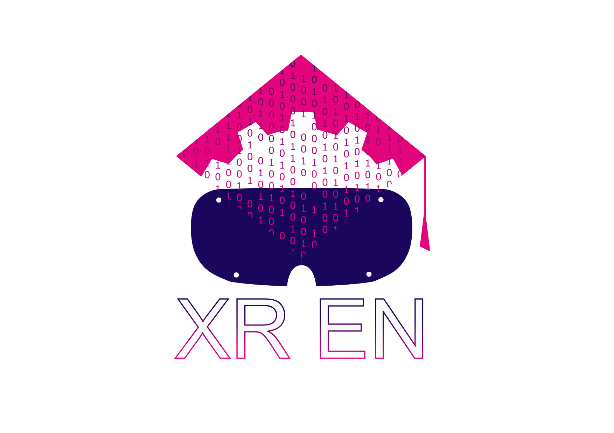

[comment]: # ()

# XREN Book

XREN is a project [funded by the European Commission’s Erasmus + programme](https://erasmus-plus.ec.europa.eu/projects). Starting in September 2023, the project involves four partners:

* **Tallinn University of Technology** (TalTech), Department of Mechanical and Industrial Engineering ([DMIE](https://taltech.ee/en/department-mechanical-and-industrial-engineering)) 
* **Politecnico di Milano** (Polimi), Department of Mechanical Engineering ([DMEC](https://www.mecc.polimi.it/))
* **Consiglio Nazionale delle Ricerche** (CNR), Institute of Intelligent Industrial Technologies and Systems for Advanced Manufacturing ([STIIMA](https://www.stiima.cnr.it/?lang=en))
* **University of Belgrade** (UBelg), Faculty of Mechanical Engineering ([FME](http://arhiva.rect.bg.ac.rs/en/members/faculties/FME.php))

The European Commission's support for the production of this publication does not constitute an endorsement of the contents, which reflect the views only of the authors, and the Commission cannot be held responsible for any use which may be made of the information contained therein.

This book will present the main results of the project.

## Table of Contents
1. [XR Learning Workflows](docs/LearningWorkflows)
2. [XR Learning Workflows](docs/Tools)
3. [Use Cases](docs/UseCases)

